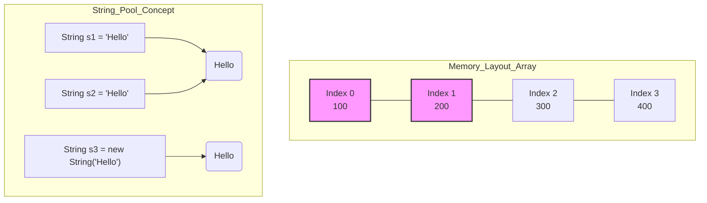

# Arrays & Strings

## Learning Objectives
- Array এবং String এর মেমোরি রিপ্রেজেন্টেশন বোঝা।
- Array এর ক্ষেত্রে Time Complexity (Access, Insert, Delete) কীভাবে কাজ করে তা জানা।
- Dynamic Array (যেমন: Java এর `ArrayList`) কীভাবে সাইজ বৃদ্ধি করে তা বোঝা।
- String Immutability এবং `StringBuilder` এর প্রয়োজনীয়তা সম্পর্কে ক্লিয়ার ধারণা লাভ।

## Core Concept
**Array** হলো একই ধরনের (same data type) ডেটার একটি কালেকশন, যা মেমোরিতে পাশাপাশি (contiguous) ব্লক হিসেবে সেভ থাকে। যেহেতু এরা পাশাপাশি থাকে, তাই আমরা ইনডেক্স (Index) ব্যবহার করে খুব দ্রুত ($O(1)$) যেকোনো এলিমেন্ট অ্যাক্সেস করতে পারি।
**String** হলো মূলত ক্যারেক্টার (Character) এর একটি Array। তবে Java-তে String একটু বিশেষ, কারণ এটি Immutable (অপরিবর্তনশীল)।

**অ্যানালজি (Analogy):** 
Array কে একটি ট্রেনের বগিগুলোর সাথে তুলনা করতে পারেন। প্রতিটি বগি পরপর সাজানো থাকে এবং প্রতিটির একটি সিরিয়াল নম্বর (Index) থাকে। আপনি চাইলে সরাসরি ৫ নম্বর বগিতে (Index 4) চলে যেতে পারেন, সব বগি পার হওয়ার দরকার নেই। 

> **Interview/MCQ Angle:** ইন্টারভিউতে প্রায়ই Array এর Insert/Delete অপারেশন নিয়ে প্রশ্ন আসে। Array এর মাঝখানে কোনো এলিমেন্ট ইনসার্ট বা ডিলিট করতে হলে বাকি এলিমেন্টগুলোকে সরাতে (shift) হয়, যার টাইম কমপ্লেক্সিটি $O(n)$। অনেকেই ভুল করে এটিকে $O(1)$ বলে ফেলে।

## Deep Dive / Gotchas

### ১. Dynamic Array (ArrayList) এর Growth Mechanism
সাধারণ Array এর সাইজ ফিক্সড থাকে। কিন্তু `ArrayList` এর সাইজ ডায়নামিক। 
যখন একটি `ArrayList` ফুল হয়ে যায় এবং আপনি নতুন ডেটা ইনসার্ট করতে যান, তখন এটি ব্যাকগ্রাউন্ডে আগের চেয়ে বড় (সাধারণত 1.5x বা 2x) নতুন একটি Array তৈরি করে এবং পুরনো ডেটা সেখানে কপি করে। এই রিশেপিং (Resizing) অপারেশনের টাইম কমপ্লেক্সিটি $O(n)$ হলেও, গড় (Amortized) ইনসার্শন টাইম $O(1)$ থাকে।

### ২. String Immutability & String Pool
Java-তে String একবার তৈরি হলে তার মান আর পরিবর্তন করা যায় না (Immutable)। 
```java
String s = "Hello";
s = s + " World";
```
এখানে `s` পরিবর্তন হয়নি, বরং "Hello World" নামে সম্পূর্ণ নতুন একটি String মেমোরিতে তৈরি হয়েছে এবং `s` এখন সেটিকে পয়েন্ট করছে। 
লুপের ভেতরে এভাবে String কনক্যাটিনেট (Concatenate) করলে মেমোরি এবং টাইম দুটোই অনেক বেশি নষ্ট হয় ($O(n^2)$)। এর সমাধান হলো `StringBuilder` ব্যবহার করা, যা মিউটেবল (Mutable) এবং $O(1)$ টাইমে অ্যাপেন্ড করতে পারে।

> **Interview/MCQ Angle:** MCQ তে "লুপের ভেতর String concat করলে টাইম কমপ্লেক্সিটি কত?" জিজ্ঞেস করা হয়। উত্তর হলো $O(n^2)$। আর মেমোরি অপটিমাইজেশনের জন্য Java-তে String Pool ব্যবহার করা হয়, যাতে একই ভ্যালুর String বারবার তৈরি না হয়।

## Code Example(s)

```java
import java.util.ArrayList;

public class ArrayStringExample {
    public static void main(String[] args) {
        // 1. Array Example (Fixed Size)
        int[] numbers = new int[5]; // O(1) time
        numbers[0] = 10; // O(1) Access & Update
        
        // Array এর মাঝখানে ইনসার্ট করতে হলে শিফট করতে হয় (O(n))
        // Java's raw array doesn't have an insert method, so we use ArrayList for dynamic sizing
        
        // 2. Dynamic Array Example
        ArrayList<Integer> list = new ArrayList<>();
        list.add(10); // Amortized O(1)
        list.add(0, 20); // O(n) Time, because 10 is shifted to index 1
        
        // 3. String vs StringBuilder (O(n^2) vs O(n))
        
        // Bad Practice inside loop
        String badStr = "";
        for (int i = 0; i < 100; i++) {
            badStr += i; // O(n^2) time complexity due to creating new strings every iteration
        }
        
        // Good Practice
        StringBuilder goodStr = new StringBuilder();
        for (int i = 0; i < 100; i++) {
            goodStr.append(i); // O(1) per append, Total O(n)
        }
    }
}
```

## Diagram



## Quick Recap
- **Array** হলো contiguous memory block, তাই ইনডেক্সিং $O(1)$।
- **Array**-তে মাঝখানে Insert/Delete করতে $O(n)$ সময় লাগে কারণ শিফটিং করতে হয়।
- **Dynamic Array (ArrayList)** ফুল হয়ে গেলে ডাবল সাইজের নতুন Array তৈরি করে ডেটা কপি করে।
- Java-তে **String Immutable**। তাই লুপের ভেতর `+` দিয়ে স্ট্রিং জোড়া লাগানো উচিত নয়, `StringBuilder` ব্যবহার করা উচিত।

## Practice MCQs (20 Questions)

**Q1. মেমোরিতে একটি Array এর এলিমেন্টগুলো কীভাবে সংরক্ষিত থাকে?**
A) র্যান্ডম (Random) ব্লকে
B) কন্টিগুয়াস বা পাশাপাশি (Contiguous) ব্লকে
C) নোডের মাধ্যমে লিংক করে
D) ট্রি স্ট্রাকচারে

<details>
<summary>✅ Answer & Explanation</summary>

**Answer: B**

ব্যাখ্যা: Array এর প্রধান বৈশিষ্ট্যই হলো এর এলিমেন্টগুলো মেমোরিতে পাশাপাশি (Contiguous) অবস্থান করে। এই কারণেই ইনডেক্স ব্যবহার করে সরাসরি $O(1)$ টাইমে ডেটা অ্যাক্সেস করা যায়।
</details>

---

**Q2. ইনডেক্স জানা থাকলে একটি Array থেকে ডেটা রিড করার টাইম কমপ্লেক্সিটি কত?**
A) $O(1)$
B) $O(n)$
C) $O(\log n)$
D) $O(n^2)$

<details>
<summary>✅ Answer & Explanation</summary>

**Answer: A**

ব্যাখ্যা: মেমোরির প্রথম অ্যাড্রেসের সাথে ইনডেক্স এবং ডেটা টাইপের সাইজ গুণ করে সরাসরি নির্দিষ্ট ব্লকে পৌঁছানো যায়। তাই টাইম কমপ্লেক্সিটি $O(1)$।
</details>

---

**Q3. Array এর একেবারে শুরুতে (Index 0) একটি নতুন এলিমেন্ট ইনসার্ট করার টাইম কমপ্লেক্সিটি কত?**
A) $O(1)$
B) $O(n)$
C) $O(\log n)$
D) $O(n \log n)$

<details>
<summary>✅ Answer & Explanation</summary>

**Answer: B**

ব্যাখ্যা: শুরুতে নতুন এলিমেন্ট বসাতে হলে Array এর বাকি সমস্ত এলিমেন্টকে এক ঘর করে ডানদিকে সরাতে (shift) হবে। তাই এটি $O(n)$ অপারেশন।
</details>

---

**Q4. Java-তে `ArrayList` (Dynamic Array) যখন ফুল হয়ে যায়, তখন এর ক্যাপাসিটি সাধারণত কীভাবে বৃদ্ধি পায়?**
A) এটি আর বৃদ্ধি পায় না, Error দেয়
B) পুরনো সাইজের সাথে ১ যোগ করে
C) একটি নতুন এবং বড় (সাধারণত দেড় বা দ্বিগুণ সাইজের) Array তৈরি করে পুরনো ডেটা সেখানে কপি করে
D) হার্ডডিস্কে ডেটা সেভ করা শুরু করে

<details>
<summary>✅ Answer & Explanation</summary>

**Answer: C**

ব্যাখ্যা: Dynamic Array আন্ডার-দ্য-হুড একটি ফিক্সড সাইজ Array ব্যবহার করে। ফুল হয়ে গেলে এটি মেমোরিতে নতুন বড় একটি Array তৈরি করে এবং সব ডেটা সেখানে কপি (Resizing) করে।
</details>

---

**Q5. Dynamic Array-তে একটি এলিমেন্ট সবার শেষে (Append) যুক্ত করার Amortized (গড়) টাইম কমপ্লেক্সিটি কত?**
A) $O(n)$
B) $O(1)$
C) $O(n^2)$
D) $O(\log n)$

<details>
<summary>✅ Answer & Explanation</summary>

**Answer: B**

ব্যাখ্যা: বেশিরভাগ সময় Append $O(1)$ টাইমে হয়। যখন ফুল হয়ে যায় শুধু তখনই রি-সাইজ করার জন্য $O(n)$ সময় লাগে। গড়ে হিসাব করলে (Amortized analysis) এটি $O(1)$ হয়।
</details>

---

**Q6. নিচের কোন কাজটি Array-তে সবচেয়ে দ্রুত ($O(1)$) সম্পন্ন হয়?**
A) Array-র মাঝখান থেকে কোনো ভ্যালু ডিলিট করা
B) Array-র কোনো একটি ভ্যালু সার্চ করা (লিনিয়ার)
C) নির্দিষ্ট ইনডেক্সের ভ্যালু আপডেট করা
D) Array-র শুরুতে ইনসার্ট করা

<details>
<summary>✅ Answer & Explanation</summary>

**Answer: C**

ব্যাখ্যা: নির্দিষ্ট ইনডেক্সে অ্যাক্সেস করা এবং ভ্যালু পরিবর্তন করা Array-র সবচেয়ে ফাস্ট অপারেশন।
</details>

---

**Q7. Java-তে "String is Immutable" কথাটির মানে কী?**
A) String-কে অন্য কোনো ভেরিয়েবলে অ্যাসাইন করা যায় না
B) একবার তৈরি হওয়ার পর String এর ভেতরের ভ্যালু পরিবর্তন করা যায় না
C) String এর সাইজ সব সময় সমান থাকতে হয়
D) String শুধু মেথডের আর্গুমেন্ট হিসেবে পাস করা যায়

<details>
<summary>✅ Answer & Explanation</summary>

**Answer: B**

ব্যাখ্যা: Java-তে String অবজেক্ট একবার মেমোরিতে তৈরি হলে তা আর পরিবর্তন (modify) করা যায় না। নতুন কিছু যোগ করলে সম্পূর্ণ নতুন একটি অবজেক্ট তৈরি হয়।
</details>

---

**Q8. নিচের কোডটির আউটপুট কী হবে?**
```java
String a = "Test";
String b = "Test";
System.out.println(a == b);
```
A) `false`
B) `true`
C) `Compilation Error`
D) `Runtime Error`

<details>
<summary>✅ Answer & Explanation</summary>

**Answer: B**

ব্যাখ্যা: Java এর "String Pool" মেকানিজমের কারণে, একই ভ্যালুর String লিটারেলগুলো মেমোরির একই অবজেক্টকে পয়েন্ট করে। তাই `a` এবং `b` এর রেফারেন্স একই, ফলে `a == b` এর মান `true` হবে।
</details>

---

**Q9. নিচের কোডটির আউটপুট কী হবে?**
```java
String a = "Test";
String c = new String("Test");
System.out.println(a == c);
```
A) `false`
B) `true`
C) `Compilation Error`
D) `Runtime Error`

<details>
<summary>✅ Answer & Explanation</summary>

**Answer: A**

ব্যাখ্যা: `new String(...)` ব্যবহার করলে Java সব সময় Heap মেমোরিতে নতুন একটি অবজেক্ট তৈরি করে, এটি String Pool থেকে রেফারেন্স নেয় না। তাই `a` এবং `c` এর মেমোরি রেফারেন্স আলাদা।
</details>

---

**Q10. একটি `for` লুপের মাধ্যমে ১ থেকে ১০০০০ পর্যন্ত সংখ্যা String এর সাথে কনক্যাটিনেট (`+` দিয়ে যোগ) করলে কী সমস্যা হবে?**
A) কোনো সমস্যা নেই, এটি সবচেয়ে ফাস্ট পদ্ধতি
B) টাইম কমপ্লেক্সিটি $O(n^2)$ হয়ে যাবে এবং মেমোরিতে অনেক গার্বেজ অবজেক্ট তৈরি হবে
C) String-এর সাইজ লিমিট পার হয়ে যাবে
D) 컴পাইল এরর (Compile error) আসবে

<details>
<summary>✅ Answer & Explanation</summary>

**Answer: B**

ব্যাখ্যা: যেহেতু String Immutable, প্রতিবার লুপ চলার সময় নতুন একটি String অবজেক্ট তৈরি হয় এবং আগের ক্যারেক্টারগুলো কপি হয়। এর ফলে টাইম কমপ্লেক্সিটি $O(n^2)$ হয় এবং প্রচুর গার্বেজ অবজেক্ট মেমোরি দখল করে।
</details>

---

**Q11. লুপের ভেতরে String ম্যানিপুলেশন করার জন্য Java-তে কোনটি ব্যবহার করা বেস্ট প্র্যাকটিস?**
A) `String` (with `+` operator)
B) `char[]`
C) `StringBuilder` বা `StringBuffer`
D) `ArrayList<String>`

<details>
<summary>✅ Answer & Explanation</summary>

**Answer: C**

ব্যাখ্যা: `StringBuilder` হলো Mutable (পরিবর্তনশীল)। এর ভেতরে থাকা Array-টি ডাইনামিক, তাই প্রতিবার অ্যাপেন্ড করার সময় নতুন অবজেক্ট তৈরি হয় না। এর টাইম কমপ্লেক্সিটি $O(n)$।
</details>

---

**Q12. `StringBuilder` এবং `StringBuffer` এর মধ্যে মূল পার্থক্য কী?**
A) `StringBuilder` ফাস্ট, কিন্তু Thread-safe নয়; আর `StringBuffer` Thread-safe
B) `StringBuilder` Immutable, আর `StringBuffer` Mutable
C) `StringBuffer` শুধু ফাইলের সাথে কাজ করে
D) এ দুটির মধ্যে কোনো পার্থক্য নেই

<details>
<summary>✅ Answer & Explanation</summary>

**Answer: A**

ব্যাখ্যা: `StringBuffer` এর মেথডগুলো `synchronized`, তাই মাল্টি-থ্রেডিং এনভায়রনমেন্টে এটি সেফ। তবে সিঙ্গেল-থ্রেড প্রোগ্রামের জন্য `StringBuilder` অনেক ফাস্ট।
</details>

---

**Q13. একটি unsorted Array-তে কোনো একটি এলিমেন্ট খুঁজতে (Search) টাইম কমপ্লেক্সিটি কত?**
A) $O(1)$
B) $O(\log n)$
C) $O(n)$
D) $O(n^2)$

<details>
<summary>✅ Answer & Explanation</summary>

**Answer: C**

ব্যাখ্যা: যেহেতু Array টি সর্ট করা নেই, তাই আপনাকে লিনিয়ার সার্চ করে এক এক করে চেক করতে হবে। Worst case এ পুরো Array চেক করতে হবে, তাই $O(n)$।
</details>

---

**Q14. একটি Array-কে মেমোরিতে contiguous হতে হয় কেন?**
A) যাতে এটি কম মেমোরি স্পেস ব্যবহার করে
B) ইনডেক্সিং করার সময় গাণিতিক হিসাব করে সরাসরি মেমোরি অ্যাড্রেসে যাওয়া যায় বলে
C) এটি Java-র নিয়ম
D) গার্বেজ কালেকশন ফাস্ট করার জন্য

<details>
<summary>✅ Answer & Explanation</summary>

**Answer: B**

ব্যাখ্যা: মেমোরি অ্যাড্রেসগুলো পরপর থাকলে আমরা `Base Address + (Index * Data Size)` সূত্র দিয়ে সরাসরি যেকোনো ইনডেক্সের ভৌত ঠিকানায় পৌঁছে যেতে পারি $O(1)$ সময়ে।
</details>

---

**Q15. [Applied] একটি Array-এর সমস্ত এলিমেন্টকে রিভার্স (Reverse) করতে হলে টাইম কমপ্লেক্সিটি ও স্পেস কমপ্লেক্সিটি কত হবে (in-place এ)?**
A) Time: $O(n)$, Space: $O(n)$
B) Time: $O(n^2)$, Space: $O(1)$
C) Time: $O(n)$, Space: $O(1)$
D) Time: $O(\log n)$, Space: $O(1)$

<details>
<summary>✅ Answer & Explanation</summary>

**Answer: C**

ব্যাখ্যা: Two-pointer (প্রথম ও শেষ ইনডেক্স থেকে শুরু করে সোয়াপ করা) অ্যাপ্রোচ ব্যবহার করলে Time $O(n)$ লাগবে এবং কোনো অতিরিক্ত Array তৈরি না করায় Space $O(1)$ হবে।
</details>

---

**Q16. একটি 2D Array `int[][] matrix = new int[5][10]` মেমোরিতে কীভাবে থাকে?**
A) একটি টানা 50 সাইজের Array হিসেবে
B) 5 সাইজের একটি Array যার প্রতিটি এলিমেন্ট 10 সাইজের আলাদা Array এর রেফারেন্স ধরে রাখে (Array of Arrays)
C) গ্রাফ স্ট্রাকচারে
D) লিংকড লিস্ট হিসেবে

<details>
<summary>✅ Answer & Explanation</summary>

**Answer: B**

ব্যাখ্যা: Java-তে 2D Array মূলত "Array of Arrays"। মূল Array-টি Heap-এ থাকে এবং এর প্রতিটি ইনডেক্স অন্য আরেকটি 1D Array এর রেফারেন্স পয়েন্ট করে। C/C++ এর মতো এটি একটি সিঙ্গেল contiguous ব্লক নয়।
</details>

---

**Q17. নিচের কোডের টাইম কমপ্লেক্সিটি কত?**
```java
void printMatrix(int[][] matrix, int n) {
    for (int i = 0; i < n; i++) {
        for (int j = 0; j < n; j++) {
            System.out.println(matrix[i][j]);
        }
    }
}
```
A) $O(n)$
B) $O(n^2)$
C) $O(n \log n)$
D) $O(1)$

<details>
<summary>✅ Answer & Explanation</summary>

**Answer: B**

ব্যাখ্যা: ম্যাট্রিক্সের প্রতিটি সেল একবার করে প্রিন্ট হচ্ছে। মোট সেল সংখ্যা $n \times n = n^2$। তাই টাইম কমপ্লেক্সিটি $O(n^2)$।
</details>

---

**Q18. [Tricky] একটি স্ট্রিং এর ক্যারেক্টারগুলোকে সর্ট (Sort) করতে কত সময় লাগবে (যদি স্ট্রিং এর দৈর্ঘ্য $N$ হয়)?**
A) $O(N)$
B) $O(N \log N)$
C) $O(N^2)$
D) $O(1)$

<details>
<summary>✅ Answer & Explanation</summary>

**Answer: B**

ব্যাখ্যা: স্ট্রিং সর্ট করার জন্য সাধারণত একে char Array-তে কনভার্ট করে সর্ট করা হয়। যেকোনো অপটিমাল কম্পারিজন বেইজড সর্টিং এর টাইম কমপ্লেক্সিটি $O(N \log N)$।
⚠️ Common trap: অনেকেই $O(N)$ মনে করে। তবে ক্যারেক্টার সেট যদি ফিক্সড (যেমন: শুধু a-z) হয়, তবে Counting Sort দিয়ে $O(N)$ এ করা সম্ভব। কিন্তু জেনেরিক কেসে $O(N \log N)$ হবে।
</details>

---

**Q19. String Pool এর প্রধান সুবিধা কী?**
A) এটি স্ট্রিংকে মিউটেবল করে দেয়
B) এটি সিকিউরিটি বাড়ায়
C) এটি একই স্ট্রিং এর পুনরাবৃত্তি রোধ করে মেমোরি (RAM) সেভ করে
D) এটি টাইপিং স্পিড বাড়ায়

<details>
<summary>✅ Answer & Explanation</summary>

**Answer: C**

ব্যাখ্যা: একই লিটারেলের স্ট্রিং যদি প্রোগ্রামে বারবার ব্যবহার হয়, তবে String Pool একটি মাত্র অবজেক্ট তৈরি করে তার রেফারেন্স শেয়ার করে, ফলে মেমোরি বাঁচে।
</details>

---

**Q20. [Gotcha] Java-তে `String.substring()` মেথডের টাইম কমপ্লেক্সিটি কত (Java 7 update 6 এর পর থেকে)?**
A) $O(1)$
B) $O(\log n)$
C) $O(n)$
D) $O(n^2)$

<details>
<summary>✅ Answer & Explanation</summary>

**Answer: C**

ব্যাখ্যা: পুরনো Java ভার্সনে এটি $O(1)$ ছিল কারণ এটি মূল char array-র রেফারেন্স শেয়ার করত। কিন্তু এতে মেমোরি লিক (Memory leak) এর সমস্যা থাকায় নতুন ভার্সনগুলোতে `substring()` নতুন char array তৈরি করে ডেটা কপি করে। তাই এর টাইম কমপ্লেক্সিটি এখন $O(n)$ (যেখানে $n$ হলো সাবস্ট্রিং এর দৈর্ঘ্য)।
</details>
