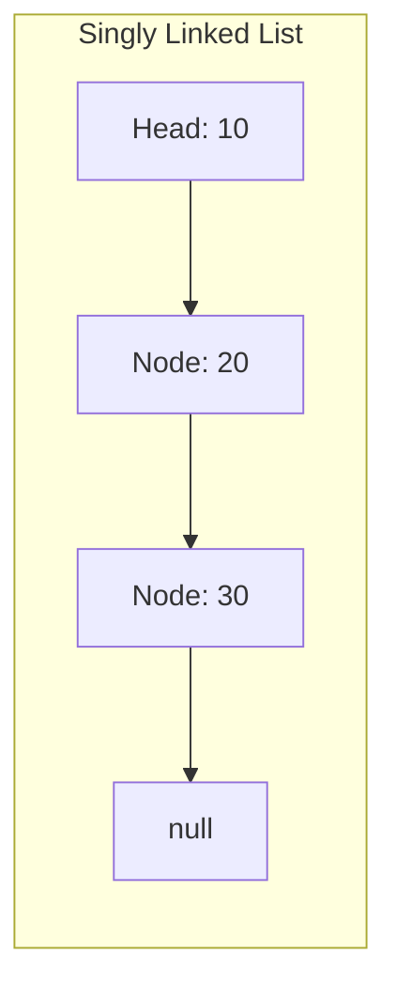
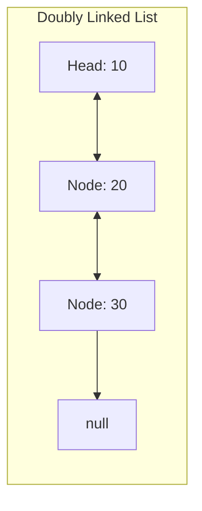

# Linked Lists

## Learning Objectives
- Linked List এর ইন্টারনাল আর্কিটেকচার (Nodes, Pointers) বোঝা।
- Array এবং Linked List এর মধ্যে পার্থক্য এবং কোথায় কোনটি ব্যবহার করতে হবে তা জানা।
- Singly, Doubly এবং Circular Linked List এর পার্থক্য বোঝা।
- Time Complexity (Insert, Delete, Search) বিশ্লেষণ করা।

## Core Concept
**Linked List** হলো একটি লিনিয়ার ডেটা স্ট্রাকচার, যার এলিমেন্টগুলো মেমোরিতে পাশাপাশি (contiguous) থাকে না। এর প্রতিটি এলিমেন্টকে বলা হয় **Node**। প্রতিটি Node-এ দুটি জিনিস থাকে: 
১. ডেটা (Data)
২. পরবর্তী Node এর মেমোরি অ্যাড্রেস বা রেফারেন্স (Next pointer)

প্রথম Node-কে বলা হয় **Head**। আর সবশেষ Node এর Next pointer থাকে `null`, যা দিয়ে বোঝা যায় লিস্ট শেষ।

**অ্যানালজি (Analogy):** 
Linked List কে একটি "ট্রেজার হান্ট (Treasure Hunt)" গেমের সাথে তুলনা করতে পারেন। প্রথম ক্লু (Head) আপনাকে বলে দেবে পরবর্তী ক্লু কোথায় আছে। আপনি সরাসরি ৩ নম্বর ক্লুতে যেতে পারবেন না। আপনাকে ১ নম্বর থেকে শুরু করে একে একে ২ নম্বর, তারপর ৩ নম্বরে যেতে হবে।

> **Interview/MCQ Angle:** Array-তে ইনডেক্স দিয়ে যেকোনো এলিমেন্টে যাওয়া যায় ($O(1)$), কিন্তু Linked List-এ সব সময় Head থেকে শুরু করে ট্রাভার্স (Traverse) করে যেতে হয়, তাই Search টাইম $O(n)$। ইন্টারভিউতে প্রায়ই "Reversing a Linked List" বা "Finding Middle Node" নিয়ে প্রশ্ন আসে, যেখানে Two-Pointer (Slow/Fast) টেকনিক ব্যবহার করা হয়।

## Deep Dive / Gotchas

### ১. Insert এবং Delete অপারেশন (Array vs Linked List)
Linked List এর সবচেয়ে বড় সুবিধা হলো এর Insert এবং Delete স্পিড। Array-তে মাঝখানে ডেটা ঢোকাতে হলে বাকি সব ডেটা সরাতে হয় ($O(n)$)। কিন্তু Linked List-এ শুধু Pointer বা রেফারেন্স চেঞ্জ করে দিলেই হয়।
- যদি আপনি ঠিক জানেন কোথায় ইনসার্ট/ডিলিট করতে হবে (পয়েন্টার আগে থেকেই থাকে), তাহলে টাইম কমপ্লেক্সিটি $O(1)$।
- কিন্তু যদি নির্দিষ্ট কোনো ভ্যালু ডিলিট করতে হয়, তবে আগে তাকে খুঁজতে ($O(n)$) হবে, তারপর ডিলিট করতে হবে।

### ২. Doubly Linked List
Singly Linked List-এ শুধু সামনের দিকে (Next) যাওয়া যায়। **Doubly Linked List**-এ প্রতিটি Node-এ `Prev` নামের আরেকটি পয়েন্টার থাকে যা পেছনের Node কে পয়েন্ট করে। এতে পেছনের দিকে আসা সহজ হয়, কিন্তু প্রতিটি Node মেমোরিতে অতিরিক্ত জায়গা (Space) দখল করে।

### ৩. Caching / Locality of Reference
Array মেমোরিতে পাশাপাশি থাকে বলে CPU Cache খুব দ্রুত এগুলো প্রসেস করতে পারে (Spatial Locality)। কিন্তু Linked List এর Node গুলো মেমোরির বিভিন্ন জায়গায় ছড়ানো থাকে, ফলে CPU Cache Miss রেট বেশি হয় এবং প্র্যাকটিক্যালি Array এর চেয়ে একটু স্লো কাজ করে। 

## Code Example(s)

```java
// একটি বেসিক Singly Linked List Node তৈরি
class Node {
    int data;
    Node next; // Reference to the next node

    public Node(int data) {
        this.data = data;
        this.next = null;
    }
}

public class LinkedListExample {
    public static void main(String[] args) {
        // Create nodes
        Node head = new Node(10);
        Node second = new Node(20);
        Node third = new Node(30);

        // Link nodes
        head.next = second; // 10 -> 20
        second.next = third; // 20 -> 30

        // Traverse the linked list (O(n) time)
        Node current = head;
        while (current != null) {
            System.out.print(current.data + " -> ");
            current = current.next;
        }
        System.out.println("null");
        
        // Insert at beginning (O(1) time)
        Node newNode = new Node(5);
        newNode.next = head;
        head = newNode; // Now list is: 5 -> 10 -> 20 -> 30
    }
}
```

## Diagram




## Quick Recap
- **Linked List** এর Node গুলো মেমোরিতে ছড়িয়ে-ছিটিয়ে থাকে এবং Pointer দিয়ে যুক্ত থাকে।
- সার্চ করা বা ইনডেক্সিং করার টাইম কমপ্লেক্সিটি $O(n)$।
- শুরুতে (Head) ইনসার্ট বা ডিলিট করতে $O(1)$ সময় লাগে।
- মেমোরি ডাইনামিক, তাই সাইজ আগে থেকে বলে দিতে হয় না।

## Practice MCQs (20 Questions)

**Q1. Linked List-এর একটি Node-এ মূলত কী কী থাকে?**
A) ইনডেক্স এবং ডেটা
B) ডেটা এবং পরবর্তী নোডের রেফারেন্স (পয়েন্টার)
C) শুধুমাত্র ডেটা
D) ডেটা এবং পূর্ববর্তী নোডের ইনডেক্স

<details>
<summary>✅ Answer & Explanation</summary>

**Answer: B**

ব্যাখ্যা: একটি বেসিক Singly Linked List Node-এ দুটো অংশ থাকে—একটি হলো মূল ডেটা (value), আর অন্যটি হলো পরবর্তী Node-এর মেমোরি অ্যাড্রেস (next pointer)।
</details>

---

**Q2. Linked List-এর প্রথম Node-কে কী বলা হয়?**
A) Root
B) Base
C) Head
D) Start

<details>
<summary>✅ Answer & Explanation</summary>

**Answer: C**

ব্যাখ্যা: Linked List এর প্রথম নোডকে Head বলা হয়। পুরো লিস্ট অ্যাক্সেস করার জন্য Head এর রেফারেন্সটি অবশ্যই সংরক্ষণ করে রাখতে হয়।
</details>

---

**Q3. Linked List-এ একটি নির্দিষ্ট ইনডেক্সের ভ্যালু অ্যাক্সেস করতে (Search) কত সময় লাগে?**
A) $O(1)$
B) $O(\log n)$
C) $O(n)$
D) $O(n^2)$

<details>
<summary>✅ Answer & Explanation</summary>

**Answer: C**

ব্যাখ্যা: Array এর মতো Linked List-এ সরাসরি ইনডেক্সে যাওয়া যায় না। Head থেকে শুরু করে `next` পয়েন্টার ধরে ধরে ওই পজিশন পর্যন্ত যেতে হয়, তাই $O(n)$ সময় লাগে।
</details>

---

**Q4. Linked List-এর একেবারে শুরুতে (Head) একটি নতুন এলিমেন্ট ইনসার্ট করতে টাইম কমপ্লেক্সিটি কত?**
A) $O(n)$
B) $O(\log n)$
C) $O(1)$
D) $O(n^2)$

<details>
<summary>✅ Answer & Explanation</summary>

**Answer: C**

ব্যাখ্যা: শুরুতে ইনসার্ট করার জন্য শুধু নতুন নোডের `next` কে বর্তমান Head-এ পয়েন্ট করতে হয় এবং Head কে নতুন নোডে শিফট করতে হয়। এর জন্য কোনো লুপ লাগে না, তাই $O(1)$।
</details>

---

**Q5. Array এর তুলনায় Linked List এর প্রধান সুবিধা কোনটি?**
A) এটি কম মেমোরি নেয়
B) এতে যেকোনো ইনডেক্সে খুব দ্রুত অ্যাক্সেস করা যায় ($O(1)$)
C) এর সাইজ ডাইনামিক এবং ইনসার্ট/ডিলিট (মাঝখানে পয়েন্টার জানা থাকলে) দ্রুত হয়
D) এটি CPU Cache ফ্রেন্ডলি

<details>
<summary>✅ Answer & Explanation</summary>

**Answer: C**

ব্যাখ্যা: Array এর সাইজ ফিক্সড এবং শিফট করতে হয়। কিন্তু Linked List ডাইনামিক এবং শুধু পয়েন্টার চেঞ্জ করলেই ইনসার্ট/ডিলিট হয়ে যায়।
</details>

---

**Q6. নিচের কোনটি Doubly Linked List এর বৈশিষ্ট্য?**
A) প্রতিটি নোড শুধুমাত্র তার পরের নোডকে পয়েন্ট করে
B) লাস্ট নোড প্রথম নোডকে পয়েন্ট করে
C) প্রতিটি নোড তার সামনের (Next) এবং পেছনের (Prev) উভয় নোডকেই পয়েন্ট করে
D) এটি একটি ট্রি স্ট্রাকচার তৈরি করে

<details>
<summary>✅ Answer & Explanation</summary>

**Answer: C**

ব্যাখ্যা: Doubly Linked list-এ দুটো পয়েন্টার থাকে, ফলে সামনে এবং পেছনে—উভয় দিকেই ট্রাভার্স করা যায়।
</details>

---

**Q7. Array এর চেয়ে Linked List বেশি মেমোরি স্পেস কেন ব্যবহার করে?**
A) কারণ এটি ডাইনামিক মেমোরি অ্যালোকেশন ব্যবহার করে
B) প্রতিটি ডেটার সাথে পয়েন্টার (Next/Prev) স্টোর করার জন্য অতিরিক্ত মেমোরি লাগে
C) Java এর গার্বেজ কালেকশনের কারণে
D) এটি সত্যি নয়, Array বেশি স্পেস নেয়

<details>
<summary>✅ Answer & Explanation</summary>

**Answer: B**

ব্যাখ্যা: Array তে শুধু ডেটা থাকে। কিন্তু Linked list এ ডেটার পাশাপাশি পয়েন্টার (৬৪-বিট সিস্টেমে 8 bytes) স্টোর করতে হয়।
</details>

---

**Q8. একটি Circular Linked List-এ লিস্টের শেষ কিভাবে বোঝা যায়?**
A) যখন Next পয়েন্টার `null` হয়
B) যখন Next পয়েন্টার আবার Head-এ ফিরে আসে
C) এটি বোঝার কোনো উপায় নেই
D) একটি বিশেষ "End" ডেটা থাকে

<details>
<summary>✅ Answer & Explanation</summary>

**Answer: B**

ব্যাখ্যা: Circular Linked List এ কোনো `null` পয়েন্টার থাকে না। লাস্ট নোডের `next` পয়েন্টারটি আবার প্রথম নোড (Head)-কে পয়েন্ট করে।
</details>

---

**Q9. [Applied] আপনি একটি মিউজিক প্লেয়ার বানাচ্ছেন যেখানে "Next Song" এবং "Previous Song" বাটন আছে। প্লেলিস্ট রিপিট অপশনও আছে। কোন ডেটা স্ট্রাকচারটি সবচেয়ে উপযুক্ত?**
A) Singly Linked List
B) Doubly Circular Linked List
C) Array
D) Stack

<details>
<summary>✅ Answer & Explanation</summary>

**Answer: B**

ব্যাখ্যা: "Previous Song" এ যাওয়ার জন্য Prev পয়েন্টার লাগবে (Doubly), আর প্লেলিস্ট রিপিট করার জন্য লাস্ট থেকে ফার্স্ট এ আসা লাগবে (Circular)।
</details>

---

**Q10. একটি Linked List-এর লাস্ট নোড (Tail) থেকে ডেটা ডিলিট করতে টাইম কমপ্লেক্সিটি কত (যদি Tail এর পয়েন্টার দেওয়া থাকে, কিন্তু Prev জানা নেই)?**
A) $O(1)$
B) $O(n)$
C) $O(\log n)$
D) $O(n^2)$

<details>
<summary>✅ Answer & Explanation</summary>

**Answer: B**

ব্যাখ্যা: Singly Linked List এ Tail এর পয়েন্টার থাকলেও, লাস্ট নোড ডিলিট করার পর তার আগের নোডকে `null` করতে হবে। আগের নোডে যাওয়ার কোনো ডিরেক্ট উপায় নেই, তাই Head থেকে লুপ চালিয়ে আগের নোড বের করতে $O(n)$ সময় লাগবে।
⚠️ Common trap: Tail পয়েন্টার থাকায় অনেকেই $O(1)$ ভাবে।
</details>

---

**Q11. Singly Linked List রিভার্স (Reverse) করতে কত সময় ও স্পেস লাগবে?**
A) Time: $O(n)$, Space: $O(n)$
B) Time: $O(n^2)$, Space: $O(1)$
C) Time: $O(n)$, Space: $O(1)$
D) Time: $O(\log n)$, Space: $O(1)$

<details>
<summary>✅ Answer & Explanation</summary>

**Answer: C**

ব্যাখ্যা: 3টি পয়েন্টার (prev, current, next) ব্যবহার করে একবার ট্রাভার্স ($O(n)$) করেই পয়েন্টার ঘুরিয়ে দেওয়া যায়। নতুন কোনো নোড তৈরি করতে হয় না, তাই Space $O(1)$।
</details>

---

**Q12. Floyd’s Cycle-Finding Algorithm (Tortoise and Hare) সাধারণত কী কাজে ব্যবহৃত হয়?**
A) Array সর্ট করতে
B) Linked List এ লুপ বা সাইকেল (Cycle) আছে কিনা তা বের করতে
C) Linked List ডিলিট করতে
D) গ্রাফের শর্টেস্ট পাথ বের করতে

<details>
<summary>✅ Answer & Explanation</summary>

**Answer: B**

ব্যাখ্যা: এই অ্যালগরিদমে দুটি পয়েন্টার থাকে—একটি স্লো (১ ঘর যায়) এবং একটি ফাস্ট (২ ঘর যায়)। যদি লিস্টে সাইকেল থাকে, তবে পয়েন্টার দুটি একসময় একসাথে মিলবে (Intersect)।
</details>

---

**Q13. একটি Linked List-এর মিডল (Middle) নোড $O(n)$ টাইমে এবং সিঙ্গেল পাসে (একবার ট্রাভার্স করে) বের করার টেকনিক কোনটি?**
A) List এর লেংথ বের করে ২ দিয়ে ভাগ করা
B) Fast and Slow pointer (Two-pointer) অ্যাপ্রোচ
C) Recursion
D) Hashing

<details>
<summary>✅ Answer & Explanation</summary>

**Answer: B**

ব্যাখ্যা: Slow পয়েন্টার এক ঘর এগোয়, Fast পয়েন্টার দুই ঘর এগোয়। Fast যখন শেষে পৌঁছাবে, Slow তখন ঠিক মাঝখানে থাকবে। এটি এক পাসেই কাজ করে।
</details>

---

**Q14. CPU Caching এর দিক থেকে Array এবং Linked List এর মধ্যে কোনটি বেশি পারফর্ম্যান্ট?**
A) Linked List
B) Array
C) দুটিই সমান
D) নির্ভর করে কোড লেখার উপর

<details>
<summary>✅ Answer & Explanation</summary>

**Answer: B**

ব্যাখ্যা: Array এর ডেটা contiguous (পাশাপাশি) থাকে, তাই CPU যখন Array এর একটি ব্লক ক্যাশ করে, তখন পাশের ডেটাগুলোও ক্যাশে চলে আসে (Spatial Locality)। Linked List এর ডেটা ছড়ানো থাকায় Cache Miss রেট বেশি হয়।
</details>

---

**Q15. Memory Allocation এর ক্ষেত্রে Linked List কোন পদ্ধতি ব্যবহার করে?**
A) Static Memory Allocation
B) Continuous Memory Allocation
C) Dynamic Memory Allocation
D) Stack Allocation

<details>
<summary>✅ Answer & Explanation</summary>

**Answer: C**

ব্যাখ্যা: রানটাইমে যখনই নতুন ডেটা আসে, `new Node()` কল করে Heap থেকে মেমোরি নেওয়া হয়, যাকে ডাইনামিক অ্যালোকেশন বলে।
</details>

---

**Q16. দুটি সর্টেড Linked List কে একটি সর্টেড Linked List-এ মার্জ (Merge) করতে টাইম কমপ্লেক্সিটি কত? (ধরি, লেংথ n এবং m)**
A) $O(n \times m)$
B) $O(\max(n, m))$
C) $O(n + m)$
D) $O(1)$

<details>
<summary>✅ Answer & Explanation</summary>

**Answer: C**

ব্যাখ্যা: দুটি লিস্টের শুরু থেকে কম্পেয়ার করে ছোট নোডটিকে রেজাল্ট লিস্টে যুক্ত করা হয়। সর্বোচ্চ $(n+m)$ বার কম্পেয়ার করতে হয়।
</details>

---

**Q17. নিচের কোন ক্ষেত্রে Linked List ব্যবহার করা Array এর চেয়ে বেশি লজিক্যাল?**
A) যখন বারবার র‍্যান্ডম ইনডেক্সে অ্যাক্সেস করা প্রয়োজন
B) যখন ডেটার পরিমাণ আগে থেকে জানা নেই এবং ফ্রিকোয়েন্ট ইনসার্ট/ডিলিট হবে
C) যখন মেমোরি স্পেস বাঁচানো খুব জরুরি
D) যখন বাইনারি সার্চ করতে হবে

<details>
<summary>✅ Answer & Explanation</summary>

**Answer: B**

ব্যাখ্যা: ഡাইনামিক সাইজ এবং পয়েন্টার ম্যানিপুলেশনের মাধ্যমে ফাস্ট ইনসার্ট/ডিলিটের কারণেই Linked List এর ব্যবহার।
</details>

---

**Q18. [Tricky] একটি Singly Linked List-এ কোনো নোডের পয়েন্টার দেওয়া আছে। ওই নোডটি ডিলিট করতে হলে $O(1)$ টাইমে কীভাবে করা সম্ভব? (নোডটি Tail নয়)**
A) Head থেকে শুরু করে আগের নোডটি খুঁজে বের করে
B) নোডটিকে `null` করে দিয়ে
C) পরের নোডের ডেটা বর্তমান নোডে কপি করে, তারপর পরের নোডটিকে ডিলিট (পয়েন্টার স্কিপ) করে
D) এটি কোনোভাবেই $O(1)$ টাইমে সম্ভব নয়

<details>
<summary>✅ Answer & Explanation</summary>

**Answer: C**

ব্যাখ্যা: এটি একটি খুবই পপুলার ইন্টারভিউ হ্যাক! আগের নোডে যাওয়ার উপায় নেই, তাই পরের নোডের ডেটা কপি করে এনে, পরের নোডটাকে বাইপাস (`current.next = current.next.next`) করে দেওয়া হয়।
</details>

---

**Q19. Stack ডেটা স্ট্রাকচার ইমপ্লিমেন্ট করতে Linked List ব্যবহার করলে Push এবং Pop অপারেশনের টাইম কমপ্লেক্সিটি কত হবে?**
A) $O(n)$
B) $O(1)$
C) $O(\log n)$
D) $O(n^2)$

<details>
<summary>✅ Answer & Explanation</summary>

**Answer: B**

ব্যাখ্যা: Stack এর Push এবং Pop সব সময় এক প্রান্ত (Head) থেকে করা হয়। Linked List এ Head এ ইনসার্ট এবং ডিলিট করা $O(1)$ সময়ের ব্যাপার।
</details>

---

**Q20. [Gotcha] Linked list-এ Binary Search অ্যাপ্লাই করা কি ভালো আইডিয়া?**
A) হ্যাঁ, কারণ এটি $O(\log n)$ টাইমে সার্চ করে
B) না, কারণ Linked list-এ মাঝখানের (mid) এলিমেন্টে সরাসরি যাওয়ার কোনো উপায় নেই, $O(n)$ সময় লাগে
C) হ্যাঁ, কিন্তু শুধুমাত্র Doubly Linked List-এ
D) না, কারণ এটি মেমোরি লিক তৈরি করে

<details>
<summary>✅ Answer & Explanation</summary>

**Answer: B**

ব্যাখ্যা: Binary search এর মূল শক্তি হলো $O(1)$ টাইমে মিডল এলিমেন্টে অ্যাক্সেস করা (Array তে সম্ভব)। কিন্তু Linked List-এ মাঝখানে যেতে হলে $O(n)$ সময় নষ্ট হয়, ফলে Binary search এর কোনো ফায়দাই থাকে না।
</details>
