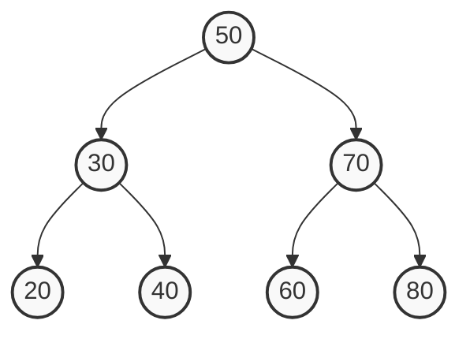

# 04. Trees & Binary Search Tree (BST)

## Learning Objectives
- Tree ডেটা স্ট্রাকচারের বেসিক টার্মিনোলজি (Root, Node, Leaf, Height, Depth) ক্লিয়ার করা।
- Binary Tree এবং Binary Search Tree (BST) এর মধ্যে পার্থক্য বোঝা।
- Tree Traversal (Inorder, Preorder, Postorder) সম্পর্কে ধারণা নেওয়া।
- BST এর Time Complexity এবং Worst-case scenario ($O(n)$) সম্পর্কে জানা।

## Core Concept

### Tree (ট্রি)
Tree হলো একটি নন-লিনিয়ার (Non-linear) ডেটা স্ট্রাকচার, যা ডেটাকে হায়ারার্কিকাল (Hierarchical) বা ধাপে ধাপে সাজিয়ে রাখে। 
**অ্যানালজি:** আপনার কম্পিউটারের ফোল্ডার স্ট্রাকচারের কথা ভাবুন। একটি মূল ফোল্ডার (Root) থাকে, তার ভেতরে আরও সাব-ফোল্ডার (Children) থাকে, এবং সাব-ফোল্ডারের ভেতরে ফাইল (Leaves) থাকে। 

**বেসিক টার্মস:**
- **Root:** ট্রি-এর একদম ওপরের নোড।
- **Leaf:** যে নোডের কোনো চাইল্ড নেই।
- **Height:** Root থেকে একদম শেষের Leaf পর্যন্ত সবচেয়ে লম্বা পথের দূরত্ব।
- **Depth:** Root থেকে কোনো নির্দিষ্ট নোড পর্যন্ত দূরত্ব।

### Binary Tree & Binary Search Tree (BST)
**Binary Tree**-তে প্রতিটি নোডের সর্বোচ্চ দুটি চাইল্ড (Left এবং Right) থাকতে পারে।
আর **Binary Search Tree (BST)** হলো এমন একটি স্পেশাল Binary Tree যেখানে একটি নির্দিষ্ট নিয়ম মানা হয়:
১. লেফট চাইল্ড (Left child) এর ভ্যালু সবসময় প্যারেন্ট (Parent) এর চেয়ে **ছোট** হবে।
২. রাইট চাইল্ড (Right child) এর ভ্যালু সবসময় প্যারেন্ট এর চেয়ে **বড়** হবে।

> **Interview/MCQ Angle:** MCQ-তে প্রায়ই একটি ট্রি দিয়ে বলবে "এটি কি BST?" তখন শুধু প্যারেন্ট-চাইল্ড চেক করলেই হবে না, পুরো লেফট সাব-ট্রির সব ভ্যালু রুট থেকে ছোট এবং রাইট সাব-ট্রির সব ভ্যালু রুট থেকে বড় কিনা তা চেক করতে হয়।

## Deep Dive / Gotchas

- **Time Complexity:** একটি ব্যালেন্সড (Balanced) BST-তে Search, Insert, এবং Delete এর টাইম কমপ্লেক্সিটি হলো **$O(\log n)$**। কিন্তু ট্রিটি যদি আনব্যালেন্সড (Unbalanced) হয় (যেমন: 1, 2, 3, 4, 5 এভাবে একপাশে লম্বা লাইন হয়ে যায়), তখন এটি Linked List এর মতো আচরণ করে এবং কমপ্লেক্সিটি হয়ে যায় **$O(n)$**। এই সমস্যা সমাধানের জন্যই AVL Tree বা Red-Black Tree (যা সেলফ-ব্যালেন্সিং) ব্যবহার করা হয়।
- **Tree Traversals:**
  - **Inorder (Left -> Root -> Right):** BST তে Inorder ট্রাভার্স করলে ডেটাগুলো **সর্টেড (Sorted)** বা ছোট থেকে বড় আকারে পাওয়া যায়। ইন্টারভিউতে এটি প্রচুর আসে!
  - **Preorder (Root -> Left -> Right):** একটি ট্রির হুবহু কপি তৈরি করতে ব্যবহৃত হয়।
  - **Postorder (Left -> Right -> Root):** ট্রি বা ফোল্ডার ডিলিট করতে ব্যবহৃত হয় (আগে চাইল্ড ডিলিট, তারপর প্যারেন্ট)।
- **Successor / Predecessor:** BST-তে কোনো নোডের Inorder Successor (তার ঠিক পরের বড় ভ্যালু) বের করতে হলে, তার রাইট সাব-ট্রির সবচেয়ে লেফট (ছোট) নোডটি খুঁজে বের করতে হয়।

## Code Example(s)

জাভাতে একটি বেসিক Binary Search Tree (BST) এবং Inorder Traversal:

```java
class TreeNode {
    int val;
    TreeNode left;
    TreeNode right;

    public TreeNode(int val) {
        this.val = val;
        this.left = null;
        this.right = null;
    }
}

public class BSTExample {
    // BST তে নতুন ডেটা ইনসার্ট করা
    public static TreeNode insert(TreeNode root, int val) {
        if (root == null) {
            return new TreeNode(val);
        }
        if (val < root.val) {
            root.left = insert(root.left, val);
        } else if (val > root.val) {
            root.right = insert(root.right, val);
        }
        return root; // রুট রিটার্ন করবে
    }

    // Inorder Traversal (Left -> Root -> Right)
    public static void inorder(TreeNode root) {
        if (root != null) {
            inorder(root.left);
            System.out.print(root.val + " "); // ছোট থেকে বড় প্রিন্ট হবে
            inorder(root.right);
        }
    }

    public static void main(String[] args) {
        TreeNode root = null;
        // BST তৈরি: 50, 30, 70, 20, 40, 60, 80
        root = insert(root, 50);
        insert(root, 30);
        insert(root, 70);
        insert(root, 20);
        insert(root, 40);
        insert(root, 60);
        insert(root, 80);

        System.out.println("Inorder Traversal (Sorted Output):");
        inorder(root); // Output: 20 30 40 50 60 70 80
    }
}
```

## Diagram


*ওপরের ডায়াগ্রামটি একটি পারফেক্ট ব্যালেন্সড Binary Search Tree (BST)।*

## Quick Recap
- **Tree:** হায়ারার্কিকাল ডেটা স্ট্রাকচার।
- **BST:** Left < Root < Right.
- **Inorder Traversal:** BST তে সর্টেড আউটপুট দেয়।
- **Complexity:** Balanced হলে $O(\log n)$, আনব্যালেন্সড (Skewed) হলে $O(n)$।

## Practice MCQs (20 Questions)

**Q1. একটি ট্রির যে নোডগুলোর কোনো চাইল্ড (Child) থাকে না, তাদের কী বলা হয়?**
A) Root
B) Branch
C) Leaf
D) Parent

<details>
<summary>✅ Answer & Explanation</summary>

**Answer: C**

ব্যাখ্যা: ট্রির একদম শেষ প্রান্তের নোডগুলোকে Leaf node বলা হয়, কারণ সেখান থেকে ট্রি আর বাড়ে না।
</details>

---

**Q2. Binary Tree-তে প্রতিটি নোডের সর্বোচ্চ কয়টি চাইল্ড থাকতে পারে?**
A) 1
B) 2
C) 3
D) কোনো লিমিট নেই

<details>
<summary>✅ Answer & Explanation</summary>

**Answer: B**

ব্যাখ্যা: "Binary" মানে দুই। তাই বাইনারি ট্রিতে একটি নোডের সর্বোচ্চ 2 টি (Left এবং Right) চাইল্ড থাকতে পারে।
</details>

---

**Q3. Binary Search Tree (BST) এর মূল প্রপার্টি কোনটি?**
A) লেফট চাইল্ড > প্যারেন্ট > রাইট চাইল্ড
B) লেফট চাইল্ড < প্যারেন্ট < রাইট চাইল্ড
C) লেফট এবং রাইট চাইল্ড উভয়েই প্যারেন্টের চেয়ে ছোট
D) লেফট এবং রাইট চাইল্ড উভয়েই প্যারেন্টের চেয়ে বড়

<details>
<summary>✅ Answer & Explanation</summary>

**Answer: B**

ব্যাখ্যা: BST এর নিয়ম হলো প্যারেন্টের বাম দিকের সব ভ্যালু ছোট হবে এবং ডান দিকের সব ভ্যালু বড় হবে।
</details>

---

**Q4. একটি ব্যালেন্সড (Balanced) BST-তে ডেটা সার্চ করার টাইম কমপ্লেক্সিটি কত?**
A) $O(1)$
B) $O(\log n)$
C) $O(n)$
D) $O(n \log n)$

<details>
<summary>✅ Answer & Explanation</summary>

**Answer: B**

ব্যাখ্যা: প্রতি স্টেপে আমরা সার্চ স্পেস অর্ধেক করে ফেলি (হয় বামে যাব, না হয় ডানে)। তাই কমপ্লেক্সিটি $O(\log n)$ হয়।
</details>

---

**Q5. যদি আপনি 1, 2, 3, 4, 5 ভ্যালুগুলো দিয়ে ক্রমান্বয়ে একটি BST তৈরি করেন, তবে তার শেপ কেমন হবে এবং সার্চ টাইম কত হবে?**
A) Balanced, $O(\log n)$
B) Right-skewed (ডান দিকে লম্বা লাইন), $O(n)$
C) Left-skewed (বাম দিকে লম্বা লাইন), $O(n)$
D) Tree তৈরি হওয়া সম্ভব নয়

<details>
<summary>✅ Answer & Explanation</summary>

**Answer: B**

ব্যাখ্যা: যেহেতু প্রতিটি ভ্যালু আগেরটার চেয়ে বড়, তাই এরা সবাই রাইট চাইল্ড হিসেবে যুক্ত হবে। ট্রিটি দেখতে Linked List এর মতো হয়ে যাবে এবং সার্চ টাইম $O(n)$ এ নেমে আসবে (Worst case)।
</details>

---

**Q6. কোন ট্রি ট্রাভার্সাল (Traversal) একটি BST থেকে সর্টেড (ছোট থেকে বড়) ডেটা আউটপুট দেয়?**
A) Preorder
B) Inorder
C) Postorder
D) Level-order (BFS)

<details>
<summary>✅ Answer & Explanation</summary>

**Answer: B**

ব্যাখ্যা: Inorder ট্রাভার্সাল হলো (Left -> Root -> Right)। যেহেতু BST তে Left < Root < Right, তাই Inorder ট্রাভার্সাল অটোমেটিক সর্টেড আউটপুট দেয়। এটি খুবই কমন MCQ!
</details>

---

**Q7. একটি ট্রির সম্পূর্ণ কপি (Clone) তৈরি করার জন্য কোন ট্রাভার্সাল সবচেয়ে উপযুক্ত?**
A) Preorder
B) Inorder
C) Postorder
D) কোনোটিই নয়

<details>
<summary>✅ Answer & Explanation</summary>

**Answer: A**

ব্যাখ্যা: Preorder এ প্রথমে Root প্রসেস হয়। একটি ট্রি কপি করার সময় আগে রুট নোডটি তৈরি করে তারপর তার চাইল্ডগুলো তৈরি করা সহজ।
</details>

---

**Q8. একটি ট্রি মেমোরি থেকে সম্পূর্ণ ডিলিট করার জন্য কোন ট্রাভার্সাল পদ্ধতি ব্যবহার করা লজিক্যাল?**
A) Preorder
B) Inorder
C) Postorder
D) Random

<details>
<summary>✅ Answer & Explanation</summary>

**Answer: C**

ব্যাখ্যা: Postorder এ আগে Left এবং Right চাইল্ড ডিলিট হয়, তারপর Root ডিলিট হয়। প্যারেন্টকে আগে ডিলিট করে দিলে চাইল্ডগুলোর রেফারেন্স হারিয়ে যাবে!
</details>

---

**Q9. লেভেল-অর্ডার (Level-order) ট্রাভার্সাল ইমপ্লিমেন্ট করতে ইন্টার্নালি কোন ডেটা স্ট্রাকচার ব্যবহৃত হয়?**
A) Stack
B) Queue
C) Priority Queue
D) Array

<details>
<summary>✅ Answer & Explanation</summary>

**Answer: B**

ব্যাখ্যা: Level-order ট্রাভার্সাল মূলত BFS (Breadth-First Search), আর BFS ইমপ্লিমেন্ট করতে Queue লাগে।
</details>

---

**Q10. একটি BST থেকে সবচেয়ে ছোট (Minimum) ভ্যালু খুঁজে পাওয়ার নিয়ম কী?**
A) রুট নোডটিই মিনিমাম
B) একদম ডানদিকের (Rightmost) লিফ নোডটি
C) একদম বামদিকের (Leftmost) লিফ বা নোডটি
D) Inorder ট্রাভার্স করে চেক করতে হবে

<details>
<summary>✅ Answer & Explanation</summary>

**Answer: C**

ব্যাখ্যা: BST এর প্রপার্টি অনুযায়ী ছোট ভ্যালু সবসময় বামে থাকে। তাই `root.left` ধরে ধরে একদম শেষ প্রান্তে পৌঁছালেই মিনিমাম ভ্যালু পাওয়া যায়।
</details>

---

**Q11. একটি BST-তে কোনো নোড ডিলিট করার সময় যদি সেই নোডের দুটোই চাইল্ড (Left ও Right) থাকে, তখন তাকে কার দিয়ে রিপ্লেস করা হয়?**
A) তার প্যারেন্ট নোড দিয়ে
B) তার লেফট সাব-ট্রির ম্যাক্সিমাম ভ্যালু (Inorder Predecessor) অথবা রাইট সাব-ট্রির মিনিমাম ভ্যালু (Inorder Successor) দিয়ে
C) যেকোনো চাইল্ড দিয়ে
D) ডিলিট করা সম্ভব নয়

<details>
<summary>✅ Answer & Explanation</summary>

**Answer: B**

ব্যাখ্যা: দুটি চাইল্ড থাকলে সরাসরি ডিলিট করা যায় না। তখন Inorder Successor বা Predecessor এর ভ্যালু কপি করে এনে আসল নোডে বসানো হয় এবং Successor/Predecessor নোডটিকে ডিলিট করা হয়।
</details>

---

**Q12. "Height of a Tree" বলতে কী বোঝায়?**
A) ট্রি-তে মোট নোডের সংখ্যা
B) Root থেকে একদম নিচের Leaf পর্যন্ত সবচেয়ে লম্বা পাথের (Path) এজের (Edge) সংখ্যা
C) Root থেকে Leaf পর্যন্ত পাথের যোগফল
D) শুধু Root থেকে Left Leaf এর দূরত্ব

<details>
<summary>✅ Answer & Explanation</summary>

**Answer: B**

ব্যাখ্যা: Root থেকে গভীরতম Leaf পর্যন্ত যেতে যতগুলো এজ পার হতে হয়, সেটিই Height. (যেমন: শুধুমাত্র ১টি নোড থাকলে Height ০ বা ১ ধরা হয়, কনভেনশন অনুযায়ী)।
</details>

---

**Q13. AVL Tree কী?**
A) এটি এক ধরণের Graph
B) এটি একটি Self-balancing Binary Search Tree
C) এটি শুধুমাত্র স্ট্রিং ডেটা স্টোর করার ট্রি
D) এটি একটি Array এর সিনোনিম

<details>
<summary>✅ Answer & Explanation</summary>

**Answer: B**

ব্যাখ্যা: AVL Tree হলো প্রথম আবিষ্কৃত Self-balancing BST। এটি নিশ্চিত করে যে লেফট এবং রাইট সাব-ট্রির হাইট ডিফারেন্স (Balance Factor) ১-এর বেশি হবে, ফলে সার্চ টাইম সবসময় $O(\log n)$ থাকে।
</details>

---

**Q14. সম্পূর্ণ বা ফুল (Full) Binary Tree বলতে কী বোঝায়?**
A) প্রতিটি লিফ একই লেভেলে থাকবে
B) প্রতিটি নোডের হয় 0 টি অথবা ঠিক 2 টি চাইল্ড থাকবে
C) সব লেভেল পুরোপুরি ভর্তি থাকবে
D) শুধু লেফট চাইল্ড থাকবে

<details>
<summary>✅ Answer & Explanation</summary>

**Answer: B**

ব্যাখ্যা: Full Binary Tree তে কোনো নোডের ১টি চাইল্ড থাকতে পারবে না। হয় কোনো চাইল্ড থাকবে না (Leaf), অথবা ২টি চাইল্ড থাকবে।
</details>

---

**Q15. কমপ্লিট (Complete) Binary Tree এর একটি বড় অ্যাপ্লিকেশন কোথায় দেখা যায়?**
A) Linked List তৈরিতে
B) Heap ডেটা স্ট্রাকচার (যেমন Priority Queue) ইমপ্লিমেন্টেশনে
C) String Reversing এ
D) Stack এ

<details>
<summary>✅ Answer & Explanation</summary>

**Answer: B**

ব্যাখ্যা: Heap সাধারণত Complete Binary Tree আকারে থাকে এবং এটি Array দিয়ে খুব সহজে এবং মেমরি-এফিশিয়েন্ট ভাবে ইমপ্লিমেন্ট করা যায়।
</details>

---

**Q16. [Tricky] একটি ট্রিতে $N$ টি নোড থাকলে, তাতে মোট কয়টি এজ (Edges/কানেকশন) থাকবে?**
A) $N$
B) $N + 1$
C) $N - 1$
D) $N / 2$

<details>
<summary>✅ Answer & Explanation</summary>

**Answer: C**

ব্যাখ্যা: Root ছাড়া বাকি প্রতিটি নোডের ঠিক একটি প্যারেন্ট থাকে, অর্থাৎ একটি করে এজ বা কানেকশন থাকে। তাই মোট এজ সংখ্যা $N - 1$.
</details>

---

**Q17. নিচের কোন ট্রি-তে Inorder এবং Preorder ট্রাভার্সালের আউটপুট একই হবে?**
A) যদি ট্রিতে কোনো Left Child না থাকে (Right-skewed)
B) যদি ট্রিতে কোনো Right Child না থাকে (Left-skewed)
C) যদি এটি একটি কমপ্লিট বাইনারি ট্রি হয়
D) কখনোই একই হওয়া সম্ভব নয়

<details>
<summary>✅ Answer & Explanation</summary>

**Answer: A**

ব্যাখ্যা: Preorder হলো (Root, Left, Right) এবং Inorder হলো (Left, Root, Right)। যদি Left না থাকে, তবে দুটিই (Root, Right) হয়ে যায়। তাই একটি Right-skewed ট্রিতে এদের আউটপুট সমান হয়।
</details>

---

**Q18. [Code Output] `root = null; insert(root, 10);` এই কোডটি জাভাতে এক্সিকিউট করলে কী সমস্যা হতে পারে? (ওপরের কোড এক্সাম্পলের আলোকে)**
A) Compilation error হবে
B) ট্রি তৈরি হবে না, root এর মান `null` ই থেকে যাবে
C) সঠিকভাবে 10 ভ্যালুর ট্রি তৈরি হবে
D) StackOverflow exception দেবে

<details>
<summary>✅ Answer & Explanation</summary>

**Answer: B**

ব্যাখ্যা: জাভাতে অবজেক্ট রেফারেন্স "pass-by-value" কাজ করে। মেথডের ভেতরে নতুন নোড তৈরি হলেও, বাইরের `root` ভেরিয়েবলটি আপডেট হবে না যদি না আপনি রিটার্ন ভ্যালু রিসিভ করেন। সঠিক কোড: `root = insert(root, 10);`
</details>

---

**Q19. $O(n)$ টাইমের আনব্যালেন্সড BST প্রবলেম সলভ করার জন্য আধুনিক জাভা `HashMap` ইন্টার্নালি কোন ট্রি ব্যবহার করে (কলিশন হ্যান্ডলিংয়ে)?**
A) AVL Tree
B) Red-Black Tree
C) B-Tree
D) Trie

<details>
<summary>✅ Answer & Explanation</summary>

**Answer: B**

ব্যাখ্যা: Java 8 থেকে HashMap এর একটি বাকেটে অনেক বেশি ইলিমেন্ট পড়লে (কলিশন), সেটি Linked List থেকে Red-Black Tree তে কনভার্ট হয়ে যায়, যা একটি Self-balancing BST।
</details>

---

**Q20. Trie (Prefix Tree) সাধারণত কোন ধরনের ডেটা নিয়ে কাজ করতে সবচেয়ে বেশি ব্যবহৃত হয়?**
A) Integer Numbers
B) Floating point values
C) Strings (যেমন Dictionary বা Autocomplete)
D) Boolean logic

<details>
<summary>✅ Answer & Explanation</summary>

**Answer: C**

ব্যাখ্যা: Trie ডেটা স্ট্রাকচার স্ট্রিং সার্চিং (যেমন গুগলের অটো-সাজেস্ট, ডিকশনারি সার্চ) খুব ফাস্ট করার জন্য ব্যবহার করা হয়।
</details>
