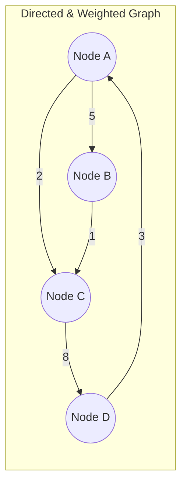

# 05. Graphs

## Learning Objectives
- Graph এর বেসিক আর্কিটেকচার (Vertices, Edges, Directed, Undirected, Weighted) বোঝা।
- Adjacency Matrix এবং Adjacency List এর মধ্যে পার্থক্য এবং মেমরি/টাইম ট্রেড-অফ ক্লিয়ার করা।
- Tree এবং Graph এর মূল পার্থক্য বোঝা।
- সফটওয়্যার ইঞ্জিনিয়ারিং ইন্টারভিউতে গ্রাফ রিলেটেড কমপ্লেক্সিটি এবং রিয়েল-লাইফ অ্যাপ্লিকেশন সম্পর্কে বিস্তারিত জানা।

## Core Concept

**Graph** হলো এমন একটি নন-লিনিয়ার (Non-linear) ডেটা স্ট্রাকচার যা কিছু নোড (যাদের **Vertices** বলা হয়) এবং তাদের কানেকশন (যাদের **Edges** বলা হয়) নিয়ে গঠিত। 
সহজ কথায়: $Graph = Vertices + Edges$

**অ্যানালজি:** ফেসবুক বা লিংকডইন-এর মিউচুয়াল ফ্রেন্ড নেটওয়ার্কের কথা ভাবুন। এখানে প্রতিটি মানুষ হলো একটি Node (Vertex), আর তাদের ফ্রেন্ডশিপ হলো একটি Edge।
- ফেসবুকে ফ্রেন্ডশিপ সাধারণত **Undirected** (আপনি আমার ফ্রেন্ড হলে আমিও আপনার ফ্রেন্ড)।
- টুইটারে ফলো করাটা হলো **Directed** (আমি আপনাকে ফলো করতে পারি, কিন্তু আপনি আমাকে নাও করতে পারেন)।
- গুগল ম্যাপে দুটি শহরের রাস্তার দূরত্ব হলো **Weighted Edge** (কানেকশনের একটি ভ্যালু বা ওজন আছে)।

**Graph Representation (গ্রাফ মেমোরিতে রাখার উপায়):**
১. **Adjacency Matrix:** এটি একটি 2D Array ($V \times V$)। নোড 0 থেকে 1 এ এজ থাকলে `matrix[0][1] = 1` হয়।
২. **Adjacency List:** এটি Array of Linked Lists (বা Java তে Array of ArrayLists/HashMaps)। প্রতিটি নোডের একটি লিস্ট থাকে, যেখানে শুধু তার সাথে কানেক্টেড নোডগুলো রাখা হয়।

> **Interview/MCQ Angle:** ইন্টারভিউতে সবচেয়ে বেশি জানতে চায়, "কখন Matrix আর কখন List ব্যবহার করব?" 
> উত্তর: যদি গ্রাফে অনেক বেশি কানেকশন থাকে (Dense graph), তখন Matrix বেস্ট ($O(1)$ টাইমে এজ চেক করা যায়)। আর কানেকশন কম থাকলে (Sparse graph), List বেস্ট (স্পেস বাঁচে, Space: $O(V+E)$)। রিয়েল লাইফে সোশ্যাল নেটওয়ার্ক Sparse হয়, তাই Adjacency List বেশি ব্যবহৃত হয়।

## Deep Dive / Gotchas

- **Tree vs Graph:** সব Tree-ই হলো Graph (যাতে কোনো সাইকেল বা লুপ নেই এবং সবাই কানেক্টেড), কিন্তু সব Graph Tree নয়।
- **Complete Graph:** যে গ্রাফে প্রতিটি নোড অন্য প্রতিটি নোডের সাথে কানেক্টেড থাকে। এখানে এজ সংখ্যা হয় $N(N-1)/2$। 
- **Bipartite Graph:** এমন একটি গ্রাফ যার নোডগুলোকে দুটি আলাদা সেটে ভাগ করা যায়, যেন কোনো একই সেটের দুটি নোডের মধ্যে এজ না থাকে। (Odd length cycle থাকলে গ্রাফ Bipartite হতে পারে না)।
- **Directed Acyclic Graph (DAG):** এমন একটি ডিরেক্টেড গ্রাফ যেখানে কোনো সাইকেল (লুপ) নেই। ടাস্ক শিডিউলিং বা ডিপেন্ডেন্সি ম্যানেজমেন্ট (যেমন npm packages) DAG দিয়ে রিপ্রেজেন্ট করা হয় এবং এখানে Topological Sorting ব্যবহার করা হয়।
- **Degree:** একটি নোডের সাথে যুক্ত এজের সংখ্যা। Directed গ্রাফে In-degree (ভেতরে আসা এজ) এবং Out-degree (বের হয়ে যাওয়া এজ) আলাদা হয়।

## Code Example(s)

জাভাতে Adjacency List ব্যবহার করে একটি বেসিক Undirected Graph তৈরি করার কোড:

```java
import java.util.*;

public class GraphExample {
    // Adjacency List এর জন্য Map ব্যবহার (নোড নাম স্ট্রিং হতে পারে তাই)
    private Map<Integer, List<Integer>> adjList;

    public GraphExample() {
        adjList = new HashMap<>();
    }

    // নতুন ভার্টেক্স (নোড) এড করা
    public void addVertex(int v) {
        adjList.putIfAbsent(v, new ArrayList<>());
    }

    // দুটি ভার্টেক্সের মধ্যে এজ (কানেকশন) তৈরি করা
    public void addEdge(int source, int destination) {
        addVertex(source);
        addVertex(destination);
        // Undirected গ্রাফ, তাই দুই দিকেই কানেকশন এড হবে
        adjList.get(source).add(destination);
        adjList.get(destination).add(source);
    }

    // গ্রাফ প্রিন্ট করা
    public void printGraph() {
        for (int vertex : adjList.keySet()) {
            System.out.print("Vertex " + vertex + " is connected to: ");
            for (int neighbor : adjList.get(vertex)) {
                System.out.print(neighbor + " ");
            }
            System.out.println();
        }
    }

    public static void main(String[] args) {
        GraphExample graph = new GraphExample();
        
        // 0-1, 0-2, 1-2, 2-3 এজগুলো এড করছি
        graph.addEdge(0, 1);
        graph.addEdge(0, 2);
        graph.addEdge(1, 2);
        graph.addEdge(2, 3);
        
        graph.printGraph();
        /* Output:
           Vertex 0 is connected to: 1 2 
           Vertex 1 is connected to: 0 2 
           Vertex 2 is connected to: 0 1 3 
           Vertex 3 is connected to: 2 
        */
    }
}
```

## Diagram


*ওপরের ডায়াগ্রামটি একটি Directed (তীর চিহ্ন দেওয়া) এবং Weighted (কানেকশনের ভ্যালু আছে) গ্রাফ। এতে একটি সাইকেলও আছে (A -> C -> D -> A).*

## Quick Recap
- **Graph:** Vertices এবং Edges এর কালেকশন।
- **Types:** Directed/Undirected, Weighted/Unweighted, Cyclic/Acyclic.
- **Representation:** Adjacency List (Sparse গ্রাফের জন্য বেস্ট, রিয়েল ওয়ার্ল্ডে বেশি চলে), Adjacency Matrix (Dense গ্রাফের জন্য)।
- **Special Graphs:** DAG (ডিপেন্ডেন্সি রেজোলিউশনে লাগে), Bipartite (Odd cycle থাকে না)।

## Practice MCQs (31 Questions)

**Q1. Graph এবং Tree এর মধ্যে সবচেয়ে ফান্ডামেন্টাল পার্থক্য কোনটি?**
A) Graph এ সব সময় লেফট এবং রাইট চাইল্ড থাকে, Tree তে থাকে না
B) Tree তে কোনো Cycle (লুপ) থাকতে পারে না, কিন্তু Graph এ থাকতে পারে
C) Graph এ রুট (Root) থাকা বাধ্যতামূলক, Tree তে নয়
D) Tree শুধুমাত্র মেমোরিতে contiguous ব্লকে থাকে

<details>
<summary>✅ Answer & Explanation</summary>

**Answer: B**

ব্যাখ্যা: Tree হলো Graph এর একটি স্পেশাল ফর্ম (Connected and Acyclic)। Graph-এ যেকোনো নোড যেকোনো নোডের সাথে যুক্ত হয়ে লুপ বা সাইকেল তৈরি করতে পারে, কিন্তু Tree-তে এটি সম্পূর্ণ নিষিদ্ধ।
</details>

---

**Q2. ফেসবুকের (Facebook) ফ্রেন্ডশিপ নেটওয়ার্ক এবং টুইটারের (X) ফলোয়ার নেটওয়ার্ক যথাক্রমে কোন ধরনের গ্রাফ?**
A) দুটিই Directed Graph
B) Facebook: Directed, Twitter: Undirected
C) Facebook: Undirected, Twitter: Directed
D) দুটিই Undirected Graph

<details>
<summary>✅ Answer & Explanation</summary>

**Answer: C**

ব্যাখ্যা: ফেসবুকে কেউ ফ্রেন্ড রিকোয়েস্ট এক্সেপ্ট করলে দুইজনেই ফ্রেন্ড হয় (উভয়মুখী/Undirected)। কিন্তু টুইটারে আপনি কাউকে ফলো করলেও সে আপনাকে ফলো করতে বাধ্য নয় (একমুখী/Directed)।
</details>

---

**Q3. গুগল ম্যাপে দুটি শহরের রাস্তার দূরত্ব বের করার জন্য গ্রাফের কোন প্রপার্টিটি অবশ্যই প্রয়োজন?**
A) গ্রাফটি Undirected হতে হবে
B) গ্রাফটি Acyclic হতে হবে
C) গ্রাফটি Weighted হতে হবে
D) গ্রাফটি Bipartite হতে হবে

<details>
<summary>✅ Answer & Explanation</summary>

**Answer: C**

ব্যাখ্যা: দূরত্বের পরিমাপ (Distance/Cost/Time) রাখার জন্য এজগুলোর একটি ওয়েট (Weight) বা ওজন থাকতে হয়।
</details>

---

**Q4. একটি Sparse Graph (যেখানে এজ সংখ্যা নোড সংখ্যার তুলনায় অনেক কম) মেমোরিতে স্টোর করার সবচেয়ে স্পেস-এফিশিয়েন্ট উপায় কোনটি?**
A) Adjacency Matrix
B) Adjacency List
C) 2D Array
D) Hash Map এর ভেতরে Array

<details>
<summary>✅ Answer & Explanation</summary>

**Answer: B**

ব্যাখ্যা: Adjacency Matrix এ সব সময় $V \times V$ স্পেস লাগে, যেখানে এজ না থাকলেও 0 স্টোর হয় (অনেক মেমরি নষ্ট হয়)। Adjacency List এ শুধু যে কানেকশনগুলো আছে, সেগুলোই স্টোর হয়। স্পেস লাগে $O(V+E)$।
</details>

---

**Q5. একটি Dense Graph (যেখানে এজ সংখ্যা অনেক বেশি) এর ক্ষেত্রে দুটি নির্দিষ্ট নোডের মধ্যে এজ আছে কিনা তা $O(1)$ টাইমে চেক করার জন্য কোনটি বেস্ট?**
A) Adjacency List
B) Edge List
C) Adjacency Matrix
D) Priority Queue

<details>
<summary>✅ Answer & Explanation</summary>

**Answer: C**

ব্যাখ্যা: Adjacency Matrix এ `matrix[u][v] == 1` কিনা তা চেক করতে ঠিক $O(1)$ সময় লাগে। Adjacency List এ লিস্ট ধরে ট্রাভার্স করতে হয়।
</details>

---

**Q6. Adjacency Matrix ব্যবহার করে $V$ ভার্টেক্স এবং $E$ এজের একটি গ্রাফ স্টোর করতে Space Complexity কত?**
A) $O(V + E)$
B) $O(E^2)$
C) $O(V^2)$
D) $O(V \times E)$

<details>
<summary>✅ Answer & Explanation</summary>

**Answer: C**

ব্যাখ্যা: $V$ সংখ্যক ভার্টেক্সের জন্য একটি $V \times V$ সাইজের 2D Array বা Matrix তৈরি করতে হয়, তাই স্পেস $O(V^2)$ লাগে।
</details>

---

**Q7. Adjacency List ব্যবহার করে একটি Undirected গ্রাফে Space Complexity কত?**
A) $O(V)$
B) $O(V + E)$
C) $O(V^2)$
D) $O(E)$

<details>
<summary>✅ Answer & Explanation</summary>

**Answer: B**

ব্যাখ্যা: প্রতিটি ভার্টেক্সের জন্য একটি লিস্ট থাকে ($V$) এবং প্রতিটি এজ দুবার (উভয় লিস্টে) স্টোর হয় ($2E$), তাই ওভারঅল স্পেস $O(V + E)$।
</details>

---

**Q8. একটি Complete Undirected Graph-এ যদি $N$ টি নোড থাকে, তবে মোট এজ সংখ্যা কত হবে?**
A) $N$
B) $N^2$
C) $N(N-1)$
D) $N(N-1) / 2$

<details>
<summary>✅ Answer & Explanation</summary>

**Answer: D**

ব্যাখ্যা: Complete গ্রাফে প্রতিটি নোড বাকি সব $(N-1)$ নোডের সাথে যুক্ত থাকে। মোট কানেকশন $N \times (N-1)$। কিন্তু এটি Undirected হওয়ায় প্রতিটি এজ দুইবার কাউন্ট হয়, তাই ২ দিয়ে ভাগ করতে হয়।
</details>

---

**Q9. [SWE Logic] একটি Directed Acyclic Graph (DAG) সাধারণত কোন রিয়েল-লাইফ সিস্টেমে ব্যবহৃত হয়?**
A) প্যাকেজ ডিপেন্ডেন্সি রেজোলিউশন (যেমন npm বা maven)
B) রাউটিং প্রটোকল
C) সোশ্যাল নেটওয়ার্কিং মিউচুয়াল ফ্রেন্ড সাজেশন
D) সার্কুলার বাফার

<details>
<summary>✅ Answer & Explanation</summary>

**Answer: A**

ব্যাখ্যা: একটি টাস্ক কমপ্লিট হওয়ার আগে অন্য কোন টাস্কগুলো শেষ করতে হবে, এমন ডিপেন্ডেন্সি ম্যানেজ করতে DAG ব্যবহার করা হয়। (যেমন টাস্ক A এর আগে B শেষ করতে হবে। এখানে A->A কোনো সাইকেল থাকা যাবে না)।
</details>

---

**Q10. npm বা pip যখন প্যাকেজ ইন্সটল করে, তখন ডিপেন্ডেন্সিগুলোর সঠিক এক্সিকিউশন অর্ডার বের করতে কোন অ্যালগরিদম ব্যবহৃত হয়?**
A) Dijkstra's Algorithm
B) Topological Sorting
C) Kruskal's Algorithm
D) Bellman-Ford

<details>
<summary>✅ Answer & Explanation</summary>

**Answer: B**

ব্যাখ্যা: Topological Sort শুধুমাত্র DAG তেই সম্ভব। এটি এমনভাবে নোডগুলোকে সাজায় যাতে ప్రతి $u \to v$ এজের জন্য $u$ সবসময় $v$ এর আগে আসে (নির্ভরশীলতা সমাধান)।
</details>

---

**Q11. একটি Undirected গ্রাফে কোনো সাইকেল (Cycle) আছে কিনা তা বের করতে নিচের কোনটি ব্যবহার করা যায়?**
A) শুধুমাত্র DFS (Depth-First Search)
B) শুধুমাত্র BFS (Breadth-First Search)
C) DFS অথবা BFS যেকোনোটি
D) Topological Sort

<details>
<summary>✅ Answer & Explanation</summary>

**Answer: C**

ব্যাখ্যা: DFS বা BFS চালানোর সময় যদি আমরা এমন কোনো ভিজিটেড (visited) নোডে পৌঁছাই যা বর্তমান নোডের প্যারেন্ট (parent) নয়, তবে বুঝতে হবে গ্রাফে একটি সাইকেল আছে।
</details>

---

**Q12. একটি Bipartite Graph-এর মূল শর্ত কোনটি?**
A) এতে কোনো এজ থাকা যাবে না
B) এতে শুধুমাত্র জোড় (Even) লেংথের সাইকেল থাকতে পারে, বিজোড় (Odd) লেংথের সাইকেল থাকা যাবে না
C) এটি একটি কমপ্লিট গ্রাফ হতে হবে
D) এটি অবশ্যই Directed হতে হবে

<details>
<summary>✅ Answer & Explanation</summary>

**Answer: B**

ব্যাখ্যা: Bipartite গ্রাফকে দুটি সেটে (বা রঙে) ভাগ করা যায়। Odd-length (বিজোড় লেংথ যেমন 3, 5) সাইকেল থাকলে, সাইকেলটি সম্পূর্ণ করতে গিয়ে একই রঙের দুটি নোডের মধ্যে এজ তৈরি হয়ে যায়, যা Bipartite গ্রাফের শর্ত ভঙ্গ করে।
</details>

---

**Q13. গ্রাফ কালারিং (Graph Coloring) প্রবলেমে Bipartite গ্রাফ কতটি কালার (রঙ) দিয়ে কালার করা সম্ভব? (যেন পাশাপাশি দুটি নোডের রঙ এক না হয়)**
A) 1
B) 2
C) 3
D) $V$ (নোড সংখ্যার সমান)

<details>
<summary>✅ Answer & Explanation</summary>

**Answer: B**

ব্যাখ্যা: Bipartite মানেই হলো দুটি সেট। তাই ঠিক ২ টি রঙ ব্যবহার করেই এর সব নোড কালার করা সম্ভব যেন সংযুক্ত কোনো দুটি নোড একই রঙের না হয়।
</details>

---

**Q14. একটি Undirected গ্রাফের সব নোডের ডিগ্রি (Degree) যোগ করলে যোগফল কত হবে?**
A) এজের সংখ্যার সমান
B) এজের সংখ্যার অর্ধেক
C) এজের সংখ্যার দ্বিগুণ
D) নোড সংখ্যার দ্বিগুণ

<details>
<summary>✅ Answer & Explanation</summary>

**Answer: C**

ব্যাখ্যা: Handshaking Lemma অনুযায়ী, প্রতিটি এজ দুটি নোডকে যুক্ত করে, অর্থাৎ একটি এজ দুটি ডিগ্রি কন্ট্রিবিউট করে। তাই মোট ডিগ্রি = $2 \times Edges$.
</details>

---

**Q15. একটি Tree-তে $N$ টি নোড থাকলে তার এজ সংখ্যা সব সময় কত হয়?**
A) $N$
B) $N+1$
C) $N-1$
D) $N^2$

<details>
<summary>✅ Answer & Explanation</summary>

**Answer: C**

ব্যাখ্যা: Tree হলো এমন একটি Connected গ্রাফ যার কোনো সাইকেল নেই। $N$ টি নোডকে কানেক্ট করতে ঠিক $N-1$ টি এজ লাগে। এর চেয়ে একটি বেশি দিলে সাইকেল হয়ে যাবে, কম দিলে ডিসকানেক্টেড হয়ে যাবে।
</details>

---

**Q16. [Tricky] একটি Directed গ্রাফে একটি নোড থেকে অন্য নোডে যাওয়ার শর্টেস্ট পাথ (সবচেয়ে কম এজের পাথ) বের করতে কোন অ্যালগরিদমটি সবচেয়ে এফিশিয়েন্ট (যদি ওয়েট না থাকে বা ওয়েট সমান হয়)?**
A) DFS (Depth-First Search)
B) BFS (Breadth-First Search)
C) Dijkstra's Algorithm
D) Prim's Algorithm

<details>
<summary>✅ Answer & Explanation</summary>

**Answer: B**

ব্যাখ্যা: Unweighted গ্রাফে শর্টেস্ট পাথের জন্য BFS সবচেয়ে ভালো। কারণ BFS লেভেল-বাই-লেভেল ট্রাভার্স করে, তাই প্রথমবার যখন টার্গেটে পৌঁছাবে, সেটিই শর্টেস্ট পাথ। (Dijkstra এখানে ওভারকিল এবং স্লো হতে পারে)।
</details>

---

**Q17. Weighted Graph-এ সিঙ্গেল-সোর্স শর্টেস্ট পাথ বের করতে কোনটি ব্যবহৃত হয়? (যদি নেগেটিভ ওয়েট না থাকে)**
A) BFS
B) Kruskal
C) Dijkstra's Algorithm
D) Bellman-Ford (শুধুমাত্র)

<details>
<summary>✅ Answer & Explanation</summary>

**Answer: C**

ব্যাখ্যা: Dijkstra-এর অ্যালগরিদম নন-নেগেটিভ ওয়েটেড গ্রাফে শর্টেস্ট পাথ বের করার জন্য সবচেয়ে পপুলার ও ফাস্টেস্ট অপশন (Priority Queue বা Min-Heap এর সাহায্যে)।
</details>

---

**Q18. Dijkstra's Algorithm নিচের কোনটিতে ফেল করে (ভুল উত্তর দেয়)?**
A) Directed Graphs
B) Cyclic Graphs
C) Negative Weight Edges
D) Disconnected Graphs

<details>
<summary>✅ Answer & Explanation</summary>

**Answer: C**

ব্যাখ্যা: Dijkstra's algorithm কাজ করে এই অনুমানের ওপর যে একবার কোনো নোড ভিজিট করা হলে সেটাই তার মিনিমাম ডিসট্যান্স (Greedy approach)। কিন্তু নেগেটিভ ওয়েট থাকলে পরে অন্য পথ দিয়ে আরও কম খরচে আসা যেতে পারে, যা Dijkstra ধরতে পারে না। এর জন্য Bellman-Ford লাগে।
</details>

---

**Q19. Adjacency List ব্যবহার করে BFS (Breadth-First Search) চালালে টাইম কমপ্লেক্সিটি কত হয়?**
A) $O(V^2)$
B) $O(V \log E)$
C) $O(V + E)$
D) $O(E)$

<details>
<summary>✅ Answer & Explanation</summary>

**Answer: C**

ব্যাখ্যা: BFS-এ আমরা প্রতিটি ভার্টেক্স (V) একবার করে Queue তে ঢোকাই এবং তার সবগুলো এজ (E) একবার করে ট্রাভার্স করি। তাই মোট সময় $O(V + E)$। (Adjacency Matrix হলে $O(V^2)$ লাগতো)।
</details>

---

**Q20. DFS (Depth-First Search) ইন্টার্নালি কোন ডেটা স্ট্রাকচার ব্যবহার করে কাজ করে?**
A) Queue
B) Priority Queue
C) Stack (অথবা Recursion Call Stack)
D) Linked List

<details>
<summary>✅ Answer & Explanation</summary>

**Answer: C**

ব্যাখ্যা: DFS যত গভীরে যাওয়া যায় তত গভীরে যায়। আগের স্টেট মনে রাখতে এটি Stack ব্যবহার করে (রিকার্সন লিখলে OS এর কল স্ট্যাক ব্যবহৃত হয়)।
</details>

---

**Q21. [SWE Depth] আপনি একটি সোর্স কোড ফাইলের ফোল্ডার স্ক্যান করছেন, যেখানে ফোল্ডারের ভেতরে ফোল্ডার থাকতে পারে। এই ট্রাভার্সিং লজিকটি সাধারণত কোনটির সাথে মিলে যায়?**
A) BFS
B) DFS
C) Dijkstra
D) Topological Sort

<details>
<summary>✅ Answer & Explanation</summary>

**Answer: B**

ব্যাখ্যা: ফোল্ডারের ভেতরে ফোল্ডার খোঁজা মানে হলো ডেপথে (Depth) যাওয়া। এটি রিকার্সন বা DFS এর একটি ক্লাসিক উদাহরণ।
</details>

---

**Q22. "Connected Components" বের করার কনসেপ্টটি কোন গ্রাফে অ্যাপ্লাই হয়?**
A) শুধুমাত্র Directed Graph
B) শুধুমাত্র Undirected Graph
C) শুধুমাত্র Bipartite Graph
D) শুধুমাত্র Trees

<details>
<summary>✅ Answer & Explanation</summary>

**Answer: B**

ব্যাখ্যা: Undirected গ্রাফে যদি কিছু নোড একসাথে যুক্ত থাকে এবং বাকিগুলো আলাদা থাকে, তবে প্রতিটি বিচ্ছিন্ন অংশকে একটি Connected Component বলে। Directed গ্রাফের ক্ষেত্রে একে "Strongly Connected Component" বলা হয়।
</details>

---

**Q23. একটি Directed গ্রাফের "Strongly Connected Component (SCC)" বলতে কী বোঝায়?**
A) এমন একটি সাবগ্রাফ যেখানে যেকোনো নোড $u$ থেকে $v$ তে যাওয়ার এবং $v$ থেকে $u$ তে ফিরে আসার পাথ আছে
B) এমন সাবগ্রাফ যেখানে সব নোডের ইন-ডিগ্রি সমান
C) এমন সাবগ্রাফ যার কোনো সাইকেল নেই
D) এমন গ্রাফ যার সব এজের ওয়েট সমান

<details>
<summary>✅ Answer & Explanation</summary>

**Answer: A**

ব্যাখ্যা: SCC এর মূল শর্তই হলো এর ভেতরের প্রতিটি নোড একে অপরের কাছে পৌঁছাতে পারবে (উভয় দিক থেকেই পাথ থাকতে হবে)।
</details>

---

**Q24. Kosaraju's Algorithm বা Tarjan's Algorithm কী কাজে ব্যবহৃত হয়?**
A) শর্টেস্ট পাথ বের করতে
B) Minimum Spanning Tree বানাতে
C) Strongly Connected Components (SCC) বের করতে
D) Topological Sort করতে

<details>
<summary>✅ Answer & Explanation</summary>

**Answer: C**

ব্যাখ্যা: একটি ডিরেক্টেড গ্রাফে কতগুলো SCC আছে তা বের করতে এই বিখ্যাত অ্যালগরিদমগুলো ব্যবহৃত হয়।
</details>

---

**Q25. Minimum Spanning Tree (MST) বের করার জন্য পপুলার দুটি অ্যালগরিদম কী কী?**
A) Dijkstra & Bellman-Ford
B) DFS & BFS
C) Kruskal's & Prim's Algorithm
D) Floyd-Warshall & Tarjan's

<details>
<summary>✅ Answer & Explanation</summary>

**Answer: C**

ব্যাখ্যা: Kruskal (Edges সর্ট করে Union-Find দিয়ে কাজ করে) এবং Prim (Priority Queue দিয়ে কাজ করে) হলো MST বের করার স্ট্যান্ডার্ড অ্যালগরিদম।
</details>

---

**Q26. [Interview Logic] Minimum Spanning Tree (MST) এর মূল প্রপার্টি কী?**
A) এটি সব নোডকে কানেক্ট করবে এবং এর মধ্যে একটিও সাইকেল (Cycle) থাকবে না
B) মোট এজের ওয়েট (Weight) সবচেয়ে কম (Minimum) হবে
C) এর এজ সংখ্যা হবে $V - 1$
D) উপরের সবগুলো

<details>
<summary>✅ Answer & Explanation</summary>

**Answer: D**

ব্যাখ্যা: Spanning Tree মানেই হলো সাইকেল থাকবে না এবং সব নোড যুক্ত থাকবে ($V-1$ এজ দিয়ে)। আর Minimum Spanning Tree মানে হলো সেই এজগুলোর ওয়েটের যোগফল সবচেয়ে কম হতে হবে।
</details>

---

**Q27. একটি গ্রাফকে Adjacency List এর বদলে Edge List (শুধু এজের তালিকা, যেমন: [ [0,1], [1,2] ]) দিয়ে স্টোর করলে, নোড $U$ এর সব নেইবার (Neighbor) খুঁজে পেতে টাইম কমপ্লেক্সিটি কত হবে?**
A) $O(1)$
B) $O(V)$
C) $O(E)$
D) $O(\log E)$

<details>
<summary>✅ Answer & Explanation</summary>

**Answer: C**

ব্যাখ্যা: Edge List-এ সব এজ এলোমেলোভাবে থাকতে পারে। নোড $U$ এর কানেকশন খুঁজতে হলে পুরো Edge List শুরু থেকে শেষ পর্যন্ত স্ক্যান করতে হবে, যার সাইজ $E$।
</details>

---

**Q28. "Union-Find" বা "Disjoint Set" ডেটা স্ট্রাকচার গ্রাফের কোন অ্যালগরিদমে সবচেয়ে বেশি ব্যবহৃত হয়?**
A) Kruskal's MST Algorithm (সাইকেল চেক করতে)
B) Dijkstra's Algorithm
C) BFS
D) Floyd-Warshall

<details>
<summary>✅ Answer & Explanation</summary>

**Answer: A**

ব্যাখ্যা: Kruskal's অ্যালগরিদমে ছোট ছোট এজগুলোকে জোড়া লাগানোর সময় সাইকেল তৈরি হচ্ছে কিনা, তা অত্যন্ত দ্রুত (প্রায় $O(1)$ টাইমে) চেক করার জন্য Union-Find ডেটা স্ট্রাকচার (Path compression সহ) ব্যবহার করা হয়।
</details>

---

**Q29. [Code Logic] Adjacency Matrix (`int[][] graph`) এ `graph[i][i] == 1` থাকার অর্থ কী?**
A) গ্রাফটি Undirected
B) নোড $i$-তে একটি Self-loop (নিজের সাথে নিজের এজ) আছে
C) নোড $i$ একটি Leaf node
D) গ্রাফে কোনো সাইকেল নেই

<details>
<summary>✅ Answer & Explanation</summary>

**Answer: B**

ব্যাখ্যা: রো এবং কলাম ইনডেক্স সমান হওয়ার মানে হলো, নোডটি নিজের থেকেই শুরু হয়ে নিজের কাছেই ফিরে এসেছে, যাকে Self-loop বলা হয়।
</details>

---

**Q30. Floyd-Warshall Algorithm কোন ধরনের প্রবলেম সলভ করে?**
A) Single-Source Shortest Path
B) Minimum Spanning Tree
C) All-Pairs Shortest Path
D) Topological Sort

<details>
<summary>✅ Answer & Explanation</summary>

**Answer: C**

ব্যাখ্যা: গ্রাফের প্রতিটি নোড থেকে অন্য প্রতিটি নোডের শর্টেস্ট পাথ বের করতে (All-Pairs Shortest Path) ডাইনামিক প্রোগ্রামিং বেসড Floyd-Warshall ব্যবহার করা হয়। এর টাইম কমপ্লেক্সিটি $O(V^3)$।
</details>

---

**Q31. [SWE System Design] ওয়েব ক্রলার (Web Crawler) ইন্টারনেট স্ক্যান করার সময় মূলত কোন ডেটা স্ট্রাকচার এবং অ্যালগরিদম ব্যবহার করে?**
A) Tree এবং Inorder Traversal
B) Graph এবং BFS (Breadth-First Search)
C) Linked List এবং Linear Search
D) Stack এবং DFS

<details>
<summary>✅ Answer & Explanation</summary>

**Answer: B**

ব্যাখ্যা: পুরো ওয়েব (WWW) হলো একটি বিশাল Directed Graph (লিঙ্কগুলো হলো এজ)। ওয়েব ক্রলার সাধারণত BFS ব্যবহার করে লেভেল-বাই-লেভেল লিংক ভিজিট করে, কারণ DFS অনেক বেশি গভীরে (ডেড-এন্ড লিংকে) আটকে যেতে পারে।
</details>
