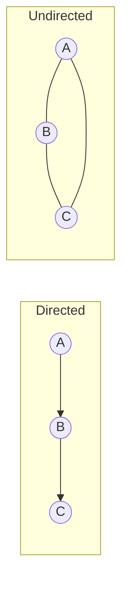
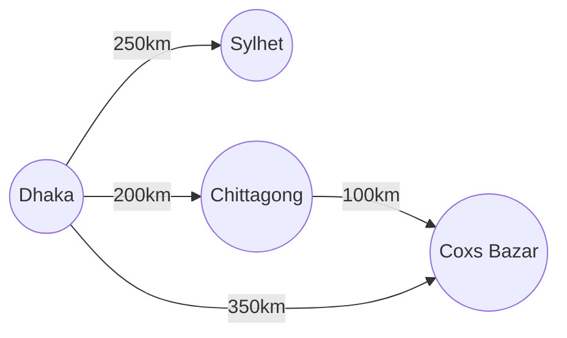
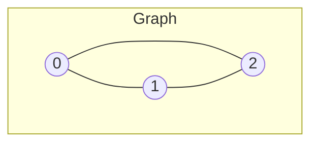

  # 05. Graphs (Knowledge & Theory)

## Learning Objectives
- Graph ডেটা স্ট্রাকচারের কোর কনসেপ্ট এবং রিয়েল ওয়ার্ল্ড ইউজ কেস বুঝতে পারা।
- বিভিন্ন ধরনের গ্রাফ (Directed, Undirected, Weighted, Cyclic) চেনা।
- Graph রিপ্রেজেন্টেশন (Adjacency Matrix বনাম Adjacency List) এবং তাদের Time-Space ট্রেড-অফ ক্লিয়ার করা।

## Core Concept
গ্রাফ (Graph) হলো এমন একটি নন-লিনিয়ার (Non-linear) ডেটা স্ট্রাকচার যা একাধিক নোড (যাদের **Vertices** বলা হয়) এবং তাদের কানেকশন (যাদের **Edges** বলা হয়) দিয়ে তৈরি। 
Tree ডেটা স্ট্রাকচার মূলত গ্রাফেরই একটি স্পেশাল রূপ (যেখানে কোনো সাইকেল বা লুপ থাকে না)।

**রিয়েল ওয়ার্ল্ড অ্যানালজি:**
- **ফেসবুক (Undirected Graph):** আপনি আর আপনার বন্ধু দুজনেই যুক্ত। এটা মিউচুয়াল (Two-way)।
- **টুইটার/ইন্সটাগ্রাম (Directed Graph):** আপনি কাউকে ফলো করলেও সে আপনাকে ফলো নাও করতে পারে (One-way)।
- **গুগল ম্যাপস (Weighted Graph):** বিভিন্ন শহর হলো নোড, আর তাদের মাঝের রাস্তা হলো এজ। রাস্তার দূরত্ব বা সময় হলো ওই এজের ওজন (Weight)।

## Types of Graphs
১. **Directed Graph (Digraph):** এজে ডিরেকশন (তীর চিহ্ন) দেওয়া থাকে। A থেকে B তে যাওয়া গেলেও B থেকে A তে যাওয়া নাও যেতে পারে।
২. **Undirected Graph:** এজে কোনো ডিরেকশন থাকে না। কানেকশন বাই-ডিরেকশনাল (Bi-directional)।
৩. **Weighted Graph:** প্রতিটি কানেকশনের একটি কস্ট (Cost) বা ওজন থাকে। যেমন- দুই শহরের দূরত্ব।
৪. **Cyclic vs Acyclic Graph:** যে গ্রাফে ঘুরে আবার আগের জায়গায় আসা যায়, তাকে সাইক্লিক বলে। না যাওয়া গেলে অ্যাসাইক্লিক (যেমন- DAG: Directed Acyclic Graph)।

## Deep Dive / Gotchas: Graph Representation
গ্রাফকে মেমোরিতে সাধারণত দুইভাবে স্টোর করা হয়:

### ১. Adjacency Matrix
এটি একটি 2D Array ($V \times V$ সাইজের, যেখানে $V$ হলো ভার্টেক্স সংখ্যা)। যদি i থেকে j তে কানেকশন থাকে, তবে `matrix[i][j] = 1`, নাহলে `0`।
- **সুবিধা (Pros):** কোনো এজ আছে কি না তা $O(1)$ টাইমে চেক করা যায়।
- **অসুবিধা (Cons):** প্রচুর স্পেস নষ্ট হয়। স্পেস কমপ্লেক্সিটি $O(V^2)$।
- **কখন ব্যবহার করবেন?** যখন গ্রাফটি খুব ঘন বা **Dense** হয় (অর্থাৎ প্রায় সব নোড সবার সাথে কানেক্টেড)।

### ২. Adjacency List
এখানে প্রতিটি নোডের জন্য একটি লিস্ট (বা Array/LinkedList) রাখা হয়, যেখানে শুধু তার সাথে যুক্ত প্রতিবেশীদের (Neighbors) নাম থাকে।
- **সুবিধা (Pros):** স্পেস বাঁচে। স্পেস কমপ্লেক্সিটি $O(V + E)$ (যেখানে $E$ হলো এজের সংখ্যা)।
- **অসুবিধা (Cons):** কোনো নির্দিষ্ট কানেকশন চেক করতে $O(V)$ সময় লাগতে পারে (তবে হ্যাশম্যাপ ব্যবহার করলে এটি $O(1)$ করা যায়)।
- **কখন ব্যবহার করবেন?** যখন গ্রাফটি **Sparse** হয় (অর্থাৎ নোড অনেক, কিন্তু কানেকশন কম)। রিয়েল-ওয়ার্ল্ডের ৯৫% গ্রাফই Sparse (যেমন ফেসবুক: বিলিয়ন ইউজার, কিন্তু একজন মানুষের ফ্রেন্ড হয়তো ৫০০ জন)। তাই Adjacency List ই সবচেয়ে বেশি ব্যবহৃত হয়।

## Diagrams

### 1. Types of Graphs


### 2. Weighted Graph (Google Maps Analogy)


### 3. Representation Example

**Adjacency List for above:**
```text
0 -> [1, 2]
1 -> [0, 2]
2 -> [0, 1]
```
**Adjacency Matrix for above:**
```text
  0 1 2
0 0 1 1
1 1 0 1
2 1 1 0
```

## Quick Recap
- **Vertices/Nodes:** পয়েন্ট বা অবজেক্ট।
- **Edges:** নোডগুলোর মধ্যকার কানেকশন।
- **Matrix:** Dense গ্রাফের জন্য ভালো, স্পেস $O(V^2)$।
- **List:** Sparse গ্রাফের জন্য ভালো, স্পেস $O(V + E)$।
- **DAG:** Directed Acyclic Graph - যেখানে কোনো সাইকেল নেই (যেমন ടাস্ক ডিপেন্ডেন্সি বা কোর্স প্রিরিকুইজিট)।
