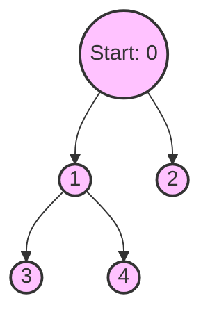

# 05. Graphs (Code & Algorithms)

এই ফাইলে আমরা জাভাতে গ্রাফের Adjacency List ইমপ্লিমেন্টেশন এবং বেসিক ট্রাভার্সাল (BFS/DFS) দেখবো। গ্রাফ অ্যালগরিদমগুলোর (Dijkstra, MST) বিস্তারিত `02-algorithms` মডিউলে আলোচনা করা হবে, তবে গ্রাফ ডেটা স্ট্রাকচার হিসেবে বুঝতে হলে এই বেসিক ইমপ্লিমেন্টেশনগুলো জানা জরুরি।

## 1. Graph Implementation (Adjacency List)
জাভাতে গ্রাফ তৈরি করার সবচেয়ে পপুলার উপায় হলো `ArrayList` এর একটি অ্যারে (Array of ArrayLists) অথবা `HashMap` ব্যবহার করা। এখানে আমরা ডাইনামিক `ArrayList` ব্যবহার করে একটি Undirected Graph ইমপ্লিমেন্ট করছি।

```java
import java.util.*;

public class GraphImplementation {
    // গ্রাফের ভার্টেক্স (নোড) সংখ্যা
    private int V;
    // Adjacency List
    private LinkedList<Integer>[] adj;

    // কনস্ট্রাক্টর
    @SuppressWarnings("unchecked")
    public GraphImplementation(int v) {
        V = v;
        adj = new LinkedList[v];
        for (int i = 0; i < v; ++i) {
            adj[i] = new LinkedList<>();
        }
    }

    // একটি এজ (Edge) অ্যাড করার মেথড (Undirected Graph)
    public void addEdge(int u, int v) {
        adj[u].add(v); // u থেকে v তে রাস্তা
        adj[v].add(u); // v থেকে u তে রাস্তা (Directed হলে এই লাইন বাদ যাবে)
    }

    // গ্রাফ প্রিন্ট করার মেথড
    public void printGraph() {
        for (int i = 0; i < V; i++) {
            System.out.print("Vertex " + i + " is connected to: ");
            for (int neighbor : adj[i]) {
                System.out.print(neighbor + " ");
            }
            System.out.println();
        }
    }

    public static void main(String[] args) {
        // ৫ টি নোডের একটি গ্রাফ (0 থেকে 4)
        GraphImplementation g = new GraphImplementation(5);

        g.addEdge(0, 1);
        g.addEdge(0, 4);
        g.addEdge(1, 2);
        g.addEdge(1, 3);
        g.addEdge(1, 4);
        g.addEdge(2, 3);
        g.addEdge(3, 4);

        g.printGraph();
    }
}
```

## 2. Graph Traversal (BFS & DFS)

ট্রাভার্সাল মানে হলো গ্রাফের প্রতিটি নোডে অন্তত একবার ভিজিট করা। গ্রাফে যেহেতু সাইকেল (লুপ) থাকতে পারে, তাই আমরা `visited` নামে একটি অ্যারে (বা Set) ব্যবহার করি, যাতে একই নোডে বারবার ঘুরে ইনফিনিট লুপে না পড়ি।

### A. Breadth-First Search (BFS)
BFS হলো ট্রির লেভেল-অর্ডার (Level-order) ট্রাভার্সালের মতো। এটি শর্টেস্ট পাথ (Shortest Path) বের করতে খুব কাজে দেয় (Unweighted গ্রাফের ক্ষেত্রে)।
- **ডেটা স্ট্রাকচার:** Queue (FIFO) ব্যবহৃত হয়।

```java
    // BFS ইমপ্লিমেন্টেশন (ওপরের ক্লাসের ভেতরেই বসবে)
    public void BFS(int startNode) {
        boolean[] visited = new boolean[V]; // ডিফল্টভাবে সব false
        Queue<Integer> queue = new LinkedList<>();

        visited[startNode] = true;
        queue.add(startNode);

        System.out.print("BFS Traversal: ");
        while (!queue.isEmpty()) {
            int current = queue.poll();
            System.out.print(current + " ");

            // current নোডের সব প্রতিবেশীদের চেক করা
            for (int neighbor : adj[current]) {
                if (!visited[neighbor]) {
                    visited[neighbor] = true;
                    queue.add(neighbor);
                }
            }
        }
        System.out.println();
    }
```

### B. Depth-First Search (DFS)
DFS কোনো একটা রাস্তা ধরে একদম শেষ প্রান্ত পর্যন্ত যায়, তারপর আর যাওয়ার জায়গা না থাকলে ব্যাকট্র্যাক (Backtrack) করে।
- **ডেটা স্ট্রাকচার:** Stack (LIFO) অথবা Recursion (যেটা ইন্টার্নালি Call Stack ব্যবহার করে)।

```java
    // DFS হেল্পার (রিকার্সিভ)
    private void DFSUtil(int v, boolean[] visited) {
        visited[v] = true;
        System.out.print(v + " ");

        // প্রতিবেশীদের রিকার্সিভলি ভিজিট করা
        for (int neighbor : adj[v]) {
            if (!visited[neighbor]) {
                DFSUtil(neighbor, visited);
            }
        }
    }

    // মেইন DFS মেথড
    public void DFS(int startNode) {
        boolean[] visited = new boolean[V];
        System.out.print("DFS Traversal: ");
        DFSUtil(startNode, visited);
        System.out.println();
    }
```

## 3. Deep Dive / Edge Cases: Disconnected Graphs

ইন্টারভিউতে একটি কমন ফাদ (Gotcha) হলো "Disconnected Graph"। ধরুন একটি গ্রাফে ১০টি নোড আছে, কিন্তু ১-৫ একসাথে কানেক্টেড এবং ৬-১০ একসাথে কানেক্টেড। মাঝখানে কোনো এজ নেই।

যদি আপনি উপরের কোডে `BFS(0)` বা `DFS(0)` কল করেন, তবে সেটি শুধু ০ থেকে ৫ পর্যন্ত ভিজিট করে থেমে যাবে! ৬-১০ ভিজিট হবে না।

**সমাধান:**
পুরো গ্রাফ ভিজিট করতে হলে `visited` অ্যারে চেক করে লুপ চালাতে হয়:

```java
    // ডিসকানেক্টেড গ্রাফের জন্য সম্পূর্ণ DFS
    public void fullDFS() {
        boolean[] visited = new boolean[V];
        for (int i = 0; i < V; i++) {
            if (!visited[i]) {
                DFSUtil(i, visited);
                // প্রতিটি লুপ একটি নতুন 'Connected Component' নির্দেশ করে!
            }
        }
    }
```
*ইন্টারভিউ পয়েন্ট:* আপনাকে যদি "Connected Components" এর সংখ্যা বের করতে বলে, তবে উপরের `for` লুপটি যতবার `if (!visited[i])` কন্ডিশনে ঢুকবে, কম্পোনেন্ট সংখ্যা ঠিক তত!

## Diagrams

**BFS (Queue-based) vs DFS (Stack-based) Visual Flow**


- **BFS (Level by Level):** 0 -> 1 -> 2 -> 3 -> 4
- **DFS (Go Deep First):** 0 -> 1 -> 3 -> 4 -> 2 (রাস্তা অনুযায়ী ভিন্ন হতে পারে, তবে মেইন কথা হলো আগে গভীরে যাওয়া)।
