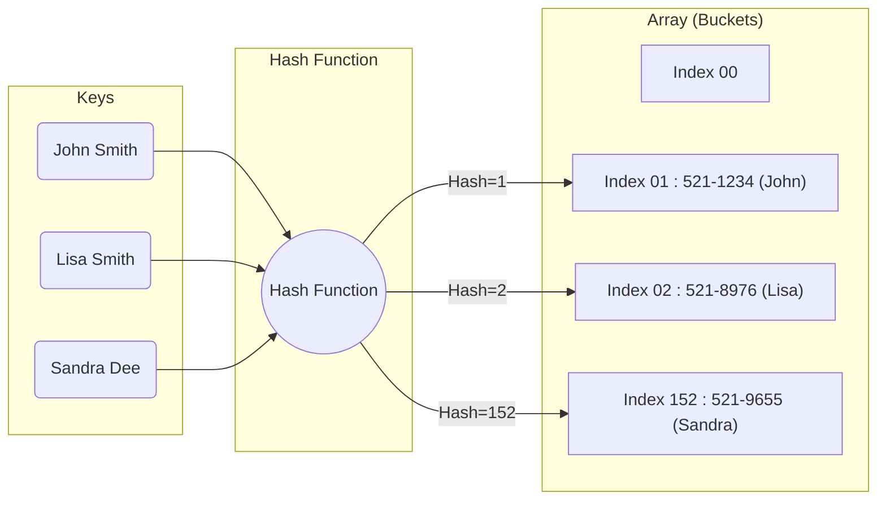
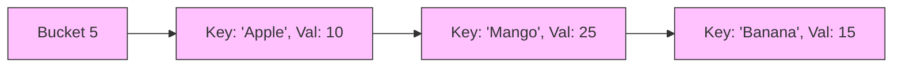

# 06. Hash Tables (Knowledge & Theory)

## Learning Objectives
- Hash Table কীভাবে $O(1)$ টাইমে ডেটা সেভ এবং সার্চ করে, তার ইন্টার্নাল মেকানিজম বোঝা।
- Hash Function, Collisions এবং Load Factor এর কনসেপ্ট ক্লিয়ার করা।
- কলিশন সামলানোর বিভিন্ন উপায় (Separate Chaining বনাম Open Addressing) এবং তাদের ট্রেড-অফ জানা।
- Java `HashMap` ইন্টার্নালি কীভাবে কাজ করে (Java 8 এর আপডেটসহ) তা ডিটেইলে বোঝা।

## Core Concept
Hash Table (বা Hash Map/Dictionary) হলো এমন একটি ডেটা স্ট্রাকচার যা **Key-Value** পেয়ারে ডেটা স্টোর করে। এর সবচেয়ে বড় ম্যাজিক হলো—লক্ষ কোটি ডেটা থাকলেও এটি যেকোনো ডেটা সাধারণত **$O(1)$** টাইমে খুঁজে দিতে পারে! 

**রিয়েল ওয়ার্ল্ড অ্যানালজি:**
- **ডিকশনারি / ফোনবুক:** আপনি কারো নাম (Key) দিয়ে তার নাম্বার (Value) খুঁজছেন।
- **লাইব্রেরির বই:** বইয়ের নাম বা আইডি দিয়ে সরাসরি নির্দিষ্ট শেলফে চলে যাওয়া।
- **ক্যাশিং (Caching):** Redis বা Memcached মূলত মেমোরিতে একটি বিশাল Hash Table হিসেবে কাজ করে।

### কীভাবে কাজ করে? (The Magic)
Hash Table ইন্টার্নালি একটি সাধারণ Array (অ্যারে) ব্যবহার করে।
১. আপনি যখন একটি Key দেন, তখন একটি **Hash Function** সেই Key টাকে একটি ইনটিজার নাম্বারে (Hash Code) কনভার্ট করে।
২. এরপর সেই নাম্বারটিকে অ্যারের সাইজ দিয়ে মডুলাস (`% array_size`) করে একটি ইনডেক্স (Index) বের করা হয়।
৩. ওই ইনডেক্সে গিয়ে Value টি সরাসরি বসিয়ে দেওয়া হয়।

## Deep Dive: Collisions and Resolution
**Collision (সংঘর্ষ) কী?**
"Pigeonhole Principle" অনুযায়ী, যদি আপনার কাছে ১০টি গর্ত থাকে এবং ১১টি কবুতর থাকে, তবে অন্তত একটি গর্তে ২টো কবুতর রাখতে হবে। ঠিক তেমনি, অ্যারের সাইজ লিমিটেড হওয়ায়, দুটো ভিন্ন Key এর জন্য Hash Function একই ইনডেক্স দিতে পারে। একেই Collision বলে। 

কলিশন হ্যান্ডেল করার প্রধান দুটি উপায় আছে:

### 1. Separate Chaining (Closed Addressing)
- **মেকানিজম:** অ্যারের প্রতিটি ইনডেক্সে সরাসরি ডেটা না রেখে একটি Linked List (বা Tree) রাখা হয়। যদি একাধিক Key একই ইনডেক্সে আসে, তবে তাদেরকে ওই Linked List এ যুক্ত করে দেওয়া হয়।
- **সুবিধা:** খুব সহজেই ইমপ্লিমেন্ট করা যায়। অ্যারে ফুল হয়ে যাওয়ার কোনো ভয় নেই (যেহেতু লিস্ট বড় হতে পারে)।
- **অসুবিধা:** মেমরি ওভারহেড বেশি (লিস্টের পয়েন্টারের জন্য)। ক্যাশ-ফ্রেন্ডলি নয়।

### 2. Open Addressing (Closed Hashing)
- **মেকানিজম:** এখানে কোনো Linked List থাকে না। সব ডেটা মেইন অ্যারেতেই থাকে। যদি কোনো ইনডেক্স ব্লকড (Collision) থাকে, তবে সে আশেপাশের ফাঁকা জায়গা খোঁজে।
  - **Linear Probing:** পরের ইনডেক্সটা চেক করে (i+1, i+2...)। সমস্যা হলো "Clustering" (ডেটা এক জায়গায় দলা পাকিয়ে যায়)।
  - **Quadratic Probing:** $1^2, 2^2, 3^2...$ ইনডেক্স দূরে দূরে চেক করে।
  - **Double Hashing:** ফাঁকা জায়গা খুঁজতে দ্বিতীয় আরেকটি হ্যাশ ফাংশন ব্যবহার করে (এটি বেস্ট)।
- **সুবিধা:** মেমরি বাঁচে, ক্যাশ পারফরম্যান্স ভালো।
- **অসুবিধা:** অ্যারে ফুল হয়ে গেলে আর ডেটা রাখা যায় না।

## Deep Dive / Gotchas: Load Factor & Rehashing
**Load Factor:** এটি পরিমাপ করে যে আপনার Hash Table কতটা ফুল হয়ে গেছে। `Load Factor = (Total Items) / (Array Size)`।
জাভাতে ডিফল্ট Load Factor হলো **0.75** (অর্থাৎ ৭৫% ভরে গেলে)।

**Rehashing:** যখন Load Factor 0.75 পার হয়ে যায়, তখন কলিশন রেট অনেক বেড়ে যায় এবং $O(1)$ পারফরম্যান্স ড্রপ করে। তাই, অ্যারের সাইজ **দ্বিগুণ** করা হয় এবং পুরোনো সব ডেটাকে নতুন অ্যারেতে আবার নতুন করে হ্যাশ (Rehash) করে বসানো হয়। এই অপারেশনটির কস্ট $O(n)$, কিন্তু এটি কালেভদ্রে হয় বলে Amortized Time $O(1)$ ই ধরা হয়।

## Java `HashMap` Internals (Very Important for Interviews!)
ইন্টারভিউতে প্রায়ই জিজ্ঞেস করে, "জাভাতে HashMap ইন্টার্নালি কীভাবে কাজ করে?"

1. **Before Java 8:** এটি Array of Linked Lists (Separate Chaining) ব্যবহার করতো। যদি অনেকগুলো কলিশন হতো, তবে লিস্ট অনেক লম্বা হয়ে যেত এবং টাইম কমপ্লেক্সিটি $O(n)$ হয়ে যেতো!
2. **Java 8 Update:** যখন একটি নির্দিষ্ট বাকেটে (ইনডেক্সে) এলিমেন্টের সংখ্যা **৮ (TREEIFY_THRESHOLD)** এর বেশি হয়ে যায়, তখন সেই Linked List টি অটোমেটিকভাবে একটি **Red-Black Tree** তে কনভার্ট হয়ে যায়! ফলে Worst Case টাইম কমপ্লেক্সিটি $O(n)$ থেকে কমে **$O(\log n)$** হয়ে যায়! আবার এলিমেন্ট মুছে ফেলতে ফেলতে সংখ্যা ৬ এ নেমে এলে এটি পুনরায় Linked List এ ফিরে যায়।

## Diagrams

### 1. Hash Table Mechanism & Separate Chaining

### 2. Collision Resolution (Separate Chaining)

*(এখানে 'Apple', 'Mango' এবং 'Banana' সবার হ্যাশ ভ্যালু ৫ আসায় তারা একই বাকেটে Linked List আকারে বসেছে)।*

## Quick Recap
- **Average Time:** Search, Insert, Delete সব $O(1)$।
- **Worst Time:** সব ডেটা একই ইনডেক্সে পড়লে $O(n)$ (বা জাভা ৮ অনুযায়ী $O(\log n)$)।
- **Hash Function:** ডিটারমিনিস্টিক হতে হবে (একই Key দিলে সবসময় একই আউটপুট আসবে)।
- **Collision:** অনিবার্য (Unavoidable)। Separate Chaining এবং Open Addressing দিয়ে সলভ করা হয়।
- **Rehashing:** অ্যারে দ্বিগুণ করা হয় পারফরম্যান্স ধরে রাখতে।
