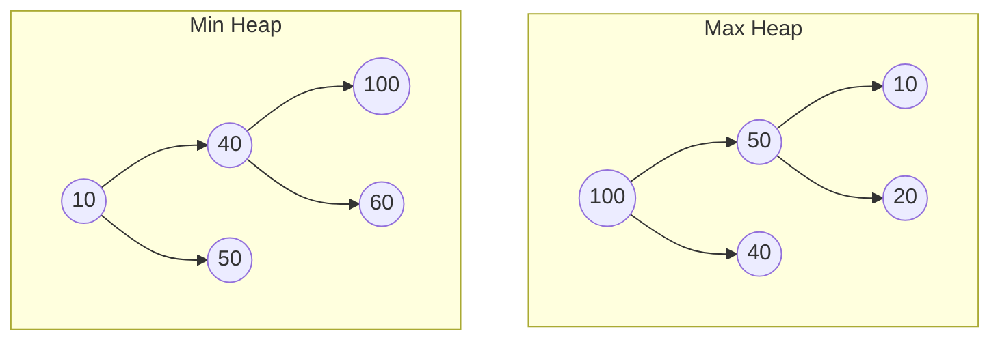
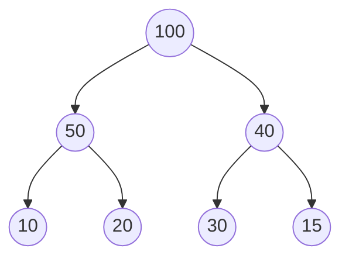

# 07. Heaps & Priority Queues (Knowledge & Theory)

## Learning Objectives
- Heap কী এবং এটি কেন ব্যবহার করা হয় তা বোঝা।
- Min Heap এবং Max Heap এর প্রপার্টি এবং পার্থক্য জানা।
- Heap কে কেন সবসময় Array তে রিপ্রেজেন্ট করা হয় এবং এর ম্যাথমেটিকাল ফর্মুলাগুলো শেখা।
- Priority Queue এর সাথে Heap এর সম্পর্ক ক্লিয়ার করা।

## Core Concept
**Heap** হলো একটি বিশেষ ধরনের Tree-based ডেটা স্ট্রাকচার। এটি মূলত একটি **Complete Binary Tree**, অর্থাৎ এর সব লেভেল পুরোপুরি ভর্তি থাকে এবং শেষের লেভেলটি যতটা সম্ভব বাম দিক থেকে ভর্তি হয়। 

**Priority Queue** হলো এমন একটি Queue (লাইন) যেখানে ফার্স্ট ইন ফার্স্ট আউট (FIFO) রুল ফলো না করে, বরং যার **প্রায়োরিটি (Priority)** বেশি, তাকে আগে বের করা হয়। আর এই Priority Queue ইমপ্লিমেন্ট করার সবচেয়ে বেস্ট ডেটা স্ট্রাকচার হলো Heap।

**রিয়েল ওয়ার্ল্ড অ্যানালজি:**
- **হাসপাতালের ইমার্জেন্সি রুম:** সিরিয়ালে যে আগে এসেছে সে চিকিৎসা পাবে না, বরং যার কন্ডিশন বেশি খারাপ (High Priority), সে আগে চিকিৎসা পাবে।
- **VIP লাইন:** ব্যাংকে বা এয়ারপোর্টে VIP কাস্টমাররা সাধারণ লাইনের পাশ কাটিয়ে আগে সার্ভিস পান।

## Types of Heaps
১. **Max Heap:**
- **রুল:** প্রতিটি প্যারেন্ট নোডের ভ্যালু তার চাইল্ড নোডগুলোর চেয়ে বড় (বা সমান) হবে।
- **ফলাফল:** রুট (Root) নোডে সবসময় সবচেয়ে **বড়** ভ্যালুটি থাকে।

২. **Min Heap:**
- **রুল:** প্রতিটি প্যারেন্ট নোডের ভ্যালু তার চাইল্ড নোডগুলোর চেয়ে ছোট (বা সমান) হবে।
- **ফলাফল:** রুট (Root) নোডে সবসময় সবচেয়ে **ছোট** ভ্যালুটি থাকে।

## Deep Dive / Gotchas: Array Representation
যেহেতু Heap একটি Complete Binary Tree, তাই একে পয়েন্টার (Left, Right) দিয়ে স্টোর না করে সরাসরি **Array** দিয়ে স্টোর করা হয়। এতে মেমোরি অনেক বাঁচে এবং ক্যাশ-পারফরম্যান্স ভালো হয়।

যদি রুট নোড ইনডেক্স `0` তে থাকে, তবে $i$ তম নোডের জন্য:
- **Left Child:** `2i + 1`
- **Right Child:** `2i + 2`
- **Parent:** `(i - 1) / 2`

**Gotcha (ইন্টারভিউ ট্র্যাপ):** 
একটি Heap এ সার্চ করা (যেমন: ৪৫ ভ্যালুটি আছে কি না) খুব স্লো। এর কমপ্লেক্সিটি $O(n)$। Heap ডেটা সর্ট করে রাখে না, এটি শুধু গ্যারান্টি দেয় যে ম্যাক্সিমাম বা মিনিমাম ভ্যালুটি রুটে থাকবে। তাই সার্চ করার জন্য Heap ব্যবহার করা বোকামি!

## Core Operations & Time Complexities
- **Find Max/Min (`peek`):** $O(1)$ (কারণ এটি রুটে থাকে)।
- **Insert (`add`):** $O(\log n)$ (নতুন ডেটা একদম শেষে বসিয়ে তারপর উপরে `Heapify Up` বা `Bubble Up` করা হয়)।
- **Delete Max/Min (`poll`):** $O(\log n)$ (রুট মুছে দিয়ে একদম শেষের ডেটা রুটে এনে তারপর নিচে `Heapify Down` বা `Bubble Down` করা হয়)।

## Diagrams

### 1. Max Heap vs Min Heap

*(খেয়াল করুন, Max Heap এর লেফট বা রাইট সাব-ট্রির মধ্যে কোনো অর্ডার নেই। শুধু প্যারেন্ট চাইল্ডের চেয়ে বড়, এটাই শর্ত)।*

### 2. Array Representation of Max Heap

**Array:** `[100, 50, 40, 10, 20, 30, 15]`
- Index 0: 100 (Root)
- Index 1: 50 (Left child of 0) -> `2*0 + 1 = 1`
- Index 2: 40 (Right child of 0) -> `2*0 + 2 = 2`

## Quick Recap
- **Complete Binary Tree:** Heap সবসময় Complete Tree হবে।
- **Array-based:** মেমোরি বাঁচানোর জন্য Array তে স্টোর করা হয়।
- **Best for:** সবচেয়ে বড় বা সবচেয়ে ছোট ভ্যালু বারবার (Frequent) খুঁজে বের করার জন্য (Priority Queue)।
- **Time Complexity:** Insert এবং Delete $O(\log n)$। Peek $O(1)$।
- **Search:** Heap এ স্পেসিফিক এলিমেন্ট খুঁজতে $O(n)$ সময় লাগে।
