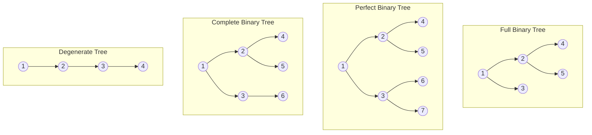

# 04.1 Types of Binary Trees

## Learning Objectives
- বিভিন্ন ধরনের Binary Tree (Full, Complete, Perfect, Degenerate, Balanced) এর মধ্যে পার্থক্য এবং শর্তগুলো ক্লিয়ার করা।
- কোন ধরনের ট্রি কোন কাজে ব্যবহৃত হয় (যেমন Complete Binary Tree দিয়ে Heap তৈরি করা) তা জানা।
- MCQ এবং ইন্টারভিউয়ের জন্য ট্রির প্রপার্টি (যেমন নোড সংখ্যা, হাইট, অ্যারে ইনডেক্স) ক্যালকুলেট করতে শেখা।

## Core Concept
Binary Tree-তে প্রতিটি নোডের সর্বোচ্চ দুটি চাইল্ড থাকে। কিন্তু এই চাইল্ডগুলো কীভাবে সাজানো আছে তার ওপর ভিত্তি করে Binary Tree-কে কয়েকটি স্পেশাল ক্যাটাগরিতে ভাগ করা যায়।

১. **Full Binary Tree (Strictly Binary Tree):**
প্রতিটি নোডের হয়তো ০টি (Leaf) অথবা ঠিক ২টি চাইল্ড থাকবে। কোনো নোডের ঠিক ১টি চাইল্ড থাকতে পারবে না। 
*অ্যানালজি:* ধরুন কোনো ক্লাবে সদস্য হতে হলে আপনাকে হয় দুজন নতুন সদস্য আনতে হবে, অথবা কাউকেই আনা যাবে না। একজন সদস্য আনা অ্যালাউড না।

২. **Complete Binary Tree:**
সবগুলো লেভেল পুরোপুরি নোড দিয়ে ভর্তি থাকবে, তবে একদম শেষের লেভেলটি পুরোপুরি ভর্তি না হলেও চলবে। শর্ত হলো, শেষের লেভেলের নোডগুলো যতটা সম্ভব বাম দিক (Left-aligned) ঘেঁষে পূরণ হতে হবে। 
*ইন্টারভিউ পয়েন্ট:* Heap ডেটা স্ট্রাকচার (যেমন Priority Queue) সম্পূর্ণ এই কনসেপ্টের ওপর দাঁড়িয়ে আছে।

৩. **Perfect Binary Tree:**
সবগুলো ইন্টারনাল (Internal) নোডের ঠিক ২টি করে চাইল্ড থাকবে এবং সবগুলো লিফ (Leaf) নোড ঠিক একই লেভেলে থাকবে। এটি দেখতে একদম নিখুঁত সমবাহু ত্রিভুজের মতো।

৪. **Degenerate (or Pathological) Tree:**
প্রতিটি ইন্টারনাল নোডের ঠিক ১টি করে চাইল্ড থাকে। এটি মূলত ট্রির ছদ্মবেশে একটি Linked List।

৫. **Balanced Binary Tree:**
যেকোনো নোডের লেফট এবং রাইট সাব-ট্রির হাইটের পার্থক্য (Balance Factor) সর্বোচ্চ ১ হতে পারে। $O(\log n)$ টাইম কমপ্লেক্সিটি নিশ্চিত করার জন্য এটি ব্যবহৃত হয় (যেমন: AVL Tree, Red-Black Tree)।

## Deep Dive / Gotchas
- **Node Calculation in Perfect Binary Tree:** হাইট যদি $h$ হয় (রুট এর লেভেল 0 ধরে), তবে মোট নোড সংখ্যা হবে $2^{h+1} - 1$। আর শুধু লিফ নোডের সংখ্যা হবে $2^h$। ইন্টারভিউতে এই ফর্মুলা প্রচুর জিজ্ঞেস করে।
- **Complete Tree Array Representation:** Complete Binary Tree-কে খুব সহজে এবং মেমোরি এফিশিয়েন্ট ভাবে Array তে রাখা যায় (কোনো পয়েন্টার লাগে না)। যদি কোনো নোডের ইনডেক্স $i$ হয় (0-indexed array), তবে:
  - Left child থাকবে $2i + 1$ ইনডেক্সে।
  - Right child থাকবে $2i + 2$ ইনডেক্সে।
  - Parent থাকবে $(i - 1) / 2$ ইনডেক্সে।
- **Gotcha:** একটি ট্রি একই সাথে Full এবং Complete হতে পারে (যেমন Perfect Binary Tree), কিন্তু সব Full Tree ই Complete Tree নয়।

## Code Example(s)

নিচে জাভাতে একটি মেথড দেখানো হলো যা চেক করে একটি ট্রি **Full Binary Tree** কি না:

```java
class TreeNode {
    int val;
    TreeNode left, right;
    public TreeNode(int val) {
        this.val = val;
        this.left = this.right = null;
    }
}

public class BinaryTreeTypes {
    // চেক করার মেথড: ট্রি Full Binary Tree কি না?
    public static boolean isFullBinaryTree(TreeNode node) {
        // ১. বেস কেস: যদি ট্রি খালি হয়, তবে তা Full Binary Tree ধরা যায়
        if (node == null) return true;

        // ২. যদি নোডের কোনো চাইল্ড না থাকে (Leaf node), তাহলেও True
        if (node.left == null && node.right == null) return true;

        // ৩. যদি ঠিক দুটি চাইল্ডই থাকে, তবে তাদের সাব-ট্রিও রিকার্সিভলি চেক করো
        if (node.left != null && node.right != null) {
            return isFullBinaryTree(node.left) && isFullBinaryTree(node.right);
        }

        // ৪. যদি একটি চাইল্ড থাকে আর অন্যটি না থাকে, তবে এটি Full Tree নয়
        return false;
    }

    public static void main(String[] args) {
        TreeNode root = new TreeNode(1);
        root.left = new TreeNode(2);
        root.right = new TreeNode(3);
        root.left.left = new TreeNode(4);
        root.left.right = new TreeNode(5);

        // ট্রি স্ট্রাকচার:
        //       1
        //     /   \
        //    2     3
        //   / \
        //  4   5
        
        System.out.println("Is Full Binary Tree? " + isFullBinaryTree(root)); // Output: true
    }
}
```

## Diagram


*(Complete Binary Tree তে শেষের লেভেলে (6) বাম দিক ঘেঁষে আছে, ডান দিক ফাঁকা থাকলেও এটি Complete।)*

## Quick Recap
- **Full (Strict):** 0 বা 2 চাইল্ড। 1 চাইল্ড অ্যালাউড না।
- **Complete:** সব লেভেল ভর্তি, শেষের লেভেল বাম দিক থেকে ভর্তি। (Array/Heap ইমপ্লিমেন্টেশনে বেস্ট)।
- **Perfect:** নিখুঁত ত্রিভুজ, সব লিফ একই লেভেলে।
- **Degenerate:** Linked List এর মতো, প্রতিটি নোডের ১টি চাইল্ড।
- **Balanced:** যেকোনো নোডে Left এবং Right সাব-ট্রির হাইট ডিফারেন্স সর্বোচ্চ ১।

## Practice MCQs (20 Questions)

**Q1. Full Binary Tree-তে একটি নোডের চাইল্ড সংখ্যা কত হতে পারে?**
A) 1 অথবা 2
B) 0 অথবা 2
C) শুধুমাত্র 2
D) 0, 1 অথবা 2

<details>
<summary>✅ Answer & Explanation</summary>

**Answer: B**

ব্যাখ্যা: Full Binary Tree (বা Strictly Binary Tree) এর নিয়মই হলো কোনো নোডের ঠিক ১টি চাইল্ড থাকতে পারবে না। হয় কোনো চাইল্ড থাকবে না (Leaf), অথবা ঠিক ২টি চাইল্ড থাকবে।
</details>

---

**Q2. নিচের কোন ডেটা স্ট্রাকচারটি ইমপ্লিমেন্ট করতে Complete Binary Tree এর কনসেপ্ট সরাসরি ব্যবহার করা হয়?**
A) Stack
B) Binary Search Tree (BST)
C) Heap
D) Hash Table

<details>
<summary>✅ Answer & Explanation</summary>

**Answer: C**

ব্যাখ্যা: Heap (Max Heap বা Min Heap) সবসময় একটি Complete Binary Tree মেইনটেইন করে, যার ফলে একে সহজেই Array তে স্টোর করা যায়।
</details>

---

**Q3. Perfect Binary Tree-এর ক্ষেত্রে কোন স্টেটমেন্টটি সঠিক?**
A) শেষের লেভেলের নোডগুলো শুধু বাম দিকে থাকে।
B) প্রতিটি নোডের ১টি চাইল্ড থাকে।
C) সব ইন্টারনাল নোডের ২টি চাইল্ড থাকে এবং সব লিফ নোড একই লেভেলে থাকে।
D) লেফট সাব-ট্রির হাইট রাইট সাব-ট্রির চেয়ে বড় হয়।

<details>
<summary>✅ Answer & Explanation</summary>

**Answer: C**

ব্যাখ্যা: Perfect Binary Tree দেখতে একদম নিখুঁত ত্রিভুজের মতো হয়। কোনো গ্যাপ থাকে না। সব লিফ একই ডেপথ (depth) বা লেভেলে থাকে।
</details>

---

**Q4. একটি Perfect Binary Tree-এর হাইট $h$ হলে, এর মোট নোড সংখ্যা কত হবে? (Root-এর লেভেল 0 ধরে)**
A) $2^h$
B) $2^{h+1} - 1$
C) $2^h - 1$
D) $2^{h-1}$

<details>
<summary>✅ Answer & Explanation</summary>

**Answer: B**

ব্যাখ্যা: রুট লেভেল 0 হলে, $h$ হাইটের পারফেক্ট ট্রিতে মোট নোড হয় $2^{h+1} - 1$। যেমন, হাইট ১ হলে মোট নোড হবে $2^2 - 1 = 3$ টি।
</details>

---

**Q5. Degenerate Tree-এর ক্ষেত্রে সার্চ করার Worst-case Time Complexity কত?**
A) $O(1)$
B) $O(\log n)$
C) $O(n)$
D) $O(n \log n)$

<details>
<summary>✅ Answer & Explanation</summary>

**Answer: C**

ব্যাখ্যা: Degenerate (বা Pathological) Tree-তে প্রতিটি নোডের ঠিক একটি চাইল্ড থাকে, তাই এটি পুরোপুরি Linked List-এর মতো কাজ করে। সার্চ করতে $O(n)$ সময় লাগে।
</details>

---

**Q6. Complete Binary Tree-কে একটি Array-তে রাখলে (0-indexed), $i$ তম ইনডেক্সের নোডের Left Child কোন ইনডেক্সে থাকবে?**
A) $2i$
B) $2i + 1$
C) $2i + 2$
D) $i / 2$

<details>
<summary>✅ Answer & Explanation</summary>

**Answer: B**

ব্যাখ্যা: 0-indexed অ্যারের ক্ষেত্রে লেফট চাইল্ড থাকে $2i + 1$ ইনডেক্সে এবং রাইট চাইল্ড থাকে $2i + 2$ ইনডেক্সে।
</details>

---

**Q7. একটি Complete Binary Tree-তে কোনো নোড $i$-এর Parent কোন ইনডেক্সে থাকে? (0-indexed Array)**
A) $i / 2$
B) $(i - 1) / 2$
C) $(i + 1) / 2$
D) $2i$

<details>
<summary>✅ Answer & Explanation</summary>

**Answer: B**

ব্যাখ্যা: যেকোনো চাইল্ড নোডের (লেফট বা রাইট) ইনডেক্স থেকে ১ বিয়োগ করে ২ দিয়ে ভাগ করলে (integer division) তার প্যারেন্ট পাওয়া যায়।
</details>

---

**Q8. Balanced Binary Tree-তে একটি নোডের Balance Factor (লেফট এবং রাইট সাব-ট্রির হাইট ডিফারেন্স) কত হতে পারে?**
A) শুধুমাত্র 0
B) -1, 0, অথবা +1
C) 0 থেকে 2 এর মধ্যে
D) যেকোনো ভ্যালু হতে পারে

<details>
<summary>✅ Answer & Explanation</summary>

**Answer: B**

ব্যাখ্যা: Balanced Tree (যেমন AVL Tree) এর ক্ষেত্রে লেফট এবং রাইট সাব-ট্রির হাইট ডিফারেন্স সর্বোচ্চ ১ হতে পারে। অর্থাৎ, $-1, 0,$ বা $+1$।
</details>

---

**Q9. লেভেল $L$-এ (যেখানে রুট লেভেল 0) সর্বোচ্চ কয়টি নোড থাকতে পারে?**
A) $L^2$
B) $2L$
C) $2^L$
D) $2^{L+1} - 1$

<details>
<summary>✅ Answer & Explanation</summary>

**Answer: C**

ব্যাখ্যা: যেকোনো বাইনারি ট্রিতে নির্দিষ্ট লেভেল $L$-এ সর্বোচ্চ $2^L$ সংখ্যক নোড থাকতে পারে। যেমন লেভেল ২-এ সর্বোচ্চ $2^2 = 4$ টি নোড থাকে।
</details>

---

**Q10. একটি ტ্রি Complete হবে না যদি:**
A) শেষের লেভেল পুরোপুরি ভর্তি না থাকে
B) শেষের লেভেলের ডান দিকে নোড আছে কিন্তু বাম দিক ফাঁকা থাকে
C) কিছু লিফ নোড হাইট $h-1$ এ থাকে
D) ট্রিতে বিজোড় সংখ্যক নোড থাকে

<details>
<summary>✅ Answer & Explanation</summary>

**Answer: B**

ব্যাখ্যা: Complete Binary Tree এর প্রধান শর্ত হলো লেভেলগুলো বাম থেকে ডান দিকে ভর্তি হতে হবে। বাম দিক ফাঁকা রেখে ডান দিকে নোড বসালে সেটি Complete Tree থাকে না।
</details>

---

**Q11. Perfect Binary Tree-তে যদি $L$ সংখ্যক লিফ (Leaf) নোড থাকে, তবে ইন্টারনাল নোড (Internal Nodes) কয়টি?**
A) $L$
B) $L - 1$
C) $L + 1$
D) $2L$

<details>
<summary>✅ Answer & Explanation</summary>

**Answer: B**

ব্যাখ্যা: Perfect (বা Full) Binary Tree তে লিফ নোড সংখ্যা ইন্টারনাল নোড সংখ্যার চেয়ে ১ বেশি হয়। তাই ইন্টারনাল নোড সংখ্যা $L - 1$.
</details>

---

**Q12. Left-skewed tree কোন ট্রির একটি উদাহরণ?**
A) Perfect Binary Tree
B) Balanced Binary Tree
C) Degenerate Tree
D) Full Binary Tree

<details>
<summary>✅ Answer & Explanation</summary>

**Answer: C**

ব্যাখ্যা: Skewed Tree (Left বা Right) মানে হলো সব নোডের একটি করে চাইল্ড আছে। এটি Degenerate বা Pathological Tree-এর একটি বিশেষ রূপ।
</details>

---

**Q13. AVL Tree এবং Red-Black Tree মূলত কোন ক্যাটাগরির ট্রির উদাহরণ?**
A) Degenerate Tree
B) Full Binary Tree
C) Balanced Binary Tree
D) Complete Binary Tree

<details>
<summary>✅ Answer & Explanation</summary>

**Answer: C**

ব্যাখ্যা: AVL এবং Red-Black Tree উভয়েই Self-balancing Binary Search Tree, যা সবসময় Balance Factor মেইনটেইন করে।
</details>

---

**Q14. একটি Complete Binary Tree-তে $N$ সংখ্যক নোড থাকলে তার হাইট (Height) কত হবে?**
A) $O(n)$
B) $O(\log n)$
C) $O(n \log n)$
D) $O(1)$

<details>
<summary>✅ Answer & Explanation</summary>

**Answer: B**

ব্যাখ্যা: Complete Binary Tree সব লেভেল ভর্তি করে নিচে নামে, তাই এর হাইট সবসময় $O(\log n)$ এর কাছাকাছি থাকে।
</details>

---

**Q15. যদি একটি ট্রির প্রতিটি নোডের ০টি বা ২টি চাইল্ড থাকে, তবে তাকে কী বলে?**
A) Strictly Binary Tree
B) Complete Binary Tree
C) AVL Tree
D) Pathological Tree

<details>
<summary>✅ Answer & Explanation</summary>

**Answer: A**

ব্যাখ্যা: একে Full Binary Tree বা Strictly Binary Tree বলা হয়।
</details>

---

**Q16. [Scenario] আপনি একটি ম্যাক্স-হিপ (Max-Heap) বানাচ্ছেন অ্যারে ব্যবহার করে। আপনি কি Perfect Binary Tree না হওয়া পর্যন্ত অপেক্ষা করবেন?**
A) হ্যাঁ, হিপ সবসময় Perfect হতে হয়।
B) না, হিপ শুধু Complete Binary Tree হলেই হয়।
C) হিপ Degenerate Tree ফলো করে।
D) হিপ অ্যারেতে রাখা যায় না।

<details>
<summary>✅ Answer & Explanation</summary>

**Answer: B**

ব্যাখ্যা: Heap-এর জন্য ট্রিকে Perfect হওয়া বাধ্যতামূলক নয়, শুধু Complete Binary Tree এর প্রপার্টি (বাম দিক থেকে ভর্তি হওয়া) মানলেই চলে।
</details>

---

**Q17. [Tricky] নিচের কোন স্টেটমেন্টটি সঠিক?**
A) সব Complete Tree ই Perfect Tree।
B) সব Perfect Tree ই Complete Tree।
C) কোনো Perfect Tree ই Complete Tree হতে পারে না।
D) Complete Tree এবং Perfect Tree এর মধ্যে কোনো সম্পর্ক নেই।

<details>
<summary>✅ Answer & Explanation</summary>

**Answer: B**

ব্যাখ্যা: একটি Perfect Tree-এর সব লেভেল পুরোপুরি ভর্তি থাকে, তাই এটি অটোমেটিকভাবে Complete Tree এর শর্তও (বাম থেকে ডান ভর্তি) পূরণ করে। কিন্তু উল্টোটা সত্য নয়।
</details>

---

**Q18. একটি Full Binary Tree-তে $I$ সংখ্যক ইন্টারনাল নোড থাকলে, লিফ নোডের সংখ্যা কত?**
A) $I + 1$
B) $2I$
C) $I - 1$
D) $I$

<details>
<summary>✅ Answer & Explanation</summary>

**Answer: A**

ব্যাখ্যা: যেকোনো Full (Strict) Binary Tree-তে লিফ নোডের সংখ্যা সবসময় ইন্টারনাল নোড সংখ্যার চেয়ে ১ বেশি হয় ($Leaf = Internal + 1$).
</details>

---

**Q19. $2i+1$ এবং $2i+2$ ফর্মুলাটি কোন ক্ষেত্রে কাজ করবে না? (যদি অ্যারে 1-indexed হয়)**
A) ফর্মুলা একই থাকবে।
B) লেফট চাইল্ড হবে $2i$ এবং রাইট চাইল্ড হবে $2i+1$।
C) লেফট চাইল্ড হবে $i/2$।
D) অ্যারে দিয়ে ট্রি বানানো যায় না।

<details>
<summary>✅ Answer & Explanation</summary>

**Answer: B**

ব্যাখ্যা: যদি অ্যারে 1-indexed (১ থেকে শুরু) হয়, তবে রুট থাকে 1 এ। তখন তার লেফট চাইল্ড হয় $2 \times 1 = 2$, এবং রাইট চাইল্ড হয় $2 \times 1 + 1 = 3$। অর্থাৎ ফর্মুলা দাঁড়ায় $2i$ এবং $2i+1$।
</details>

---

**Q20. [Code Output] ওপরের `isFullBinaryTree` ফাংশনে যদি শুধু রুট নোড পাস করা হয় (যার কোনো লেফট বা রাইট চাইল্ড নেই), তবে আউটপুট কী আসবে?**
A) false
B) NullPointerException খাবে
C) true
D) Compilation Error

<details>
<summary>✅ Answer & Explanation</summary>

**Answer: C**

ব্যাখ্যা: রুট নোডের যদি কোনো চাইল্ড না থাকে, তবে সেটি একটি Leaf নোড। Full Binary Tree-তে নোডের ০টি বা ২টি চাইল্ড থাকে। যেহেতু ০টি চাইল্ড আছে, তাই এটি একটি ভ্যালিড Full Binary Tree এবং আউটপুট `true` আসবে (কোডের ২য় বেস কেস `node.left == null && node.right == null` হিট করবে)।
</details>

---
