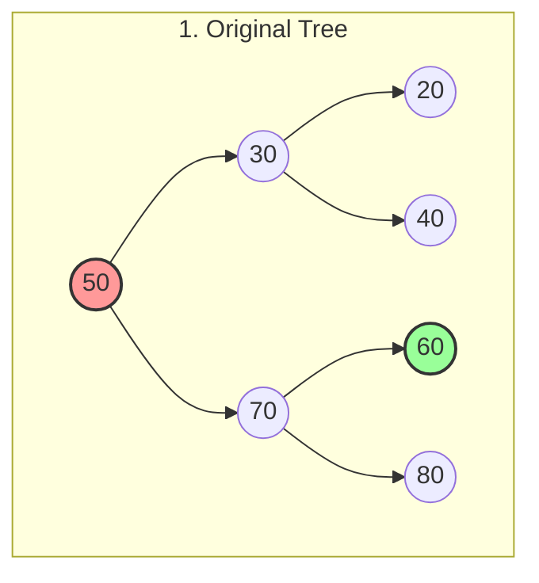
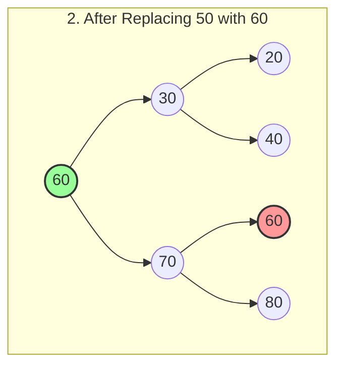
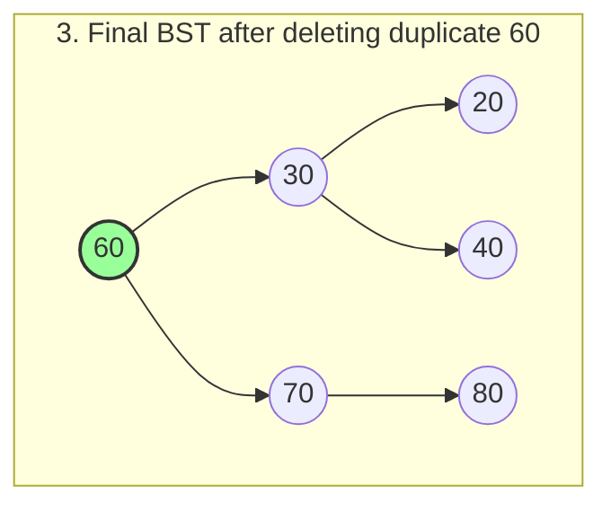

# BST (Binary Search Tree) তে নোড ডিলিট করা (২টি চাইল্ড থাকলে)

একটি BST থেকে কোনো নোড ডিলিট করার সময় যদি দেখা যায় যে সেই নোডটির **দুটোই চাইল্ড (Left এবং Right)** আছে, তখন তাকে সরাসরি ডিলিট করা যায় না। কারণ সরাসরি ডিলিট করলে এর নিচের ডালপালাগুলো (চাইল্ড নোডগুলো) কোথায় যুক্ত হবে তা নিয়ে সমস্যা তৈরি হয়।

এই সমস্যা সমাধানের জন্য ডিলিট হতে যাওয়া নোডটিকে নিচের যেকোনো একটি নোড দিয়ে **রিপ্লেস (Replace)** বা পরিবর্তন করা হয়:

১. **In-order Successor (ইন-অর্ডার সাক্সেসর):** ডান দিকের সাব-ট্রির (Right Sub-tree) সবচেয়ে ছোট ভ্যালু। (সাধারণত এটি সবচেয়ে বেশি ব্যবহার করা হয়)।
২. **In-order Predecessor (ইন-অর্ডার প্রিডিসেসর):** বাম দিকের সাব-ট্রির (Left Sub-tree) সবচেয়ে বড় ভ্যালু।

## কেন এদের দিয়ে রিপ্লেস করা হয়?
BST এর প্রধান নিয়ম হলো— রুটের বাম দিকের সব ভ্যালু রুট থেকে ছোট হতে হবে এবং ডান দিকের সব ভ্যালু রুট থেকে বড় হতে হবে। 
আমরা যদি **In-order Successor** (ডান দিকের সবচেয়ে ছোট ভ্যালু) দিয়ে রুটকে রিপ্লেস করি, তাহলে:
* নতুন রুটের ডান দিকের সবাই তার চেয়ে বড়ই থাকছে (কারণ সে ডান দিকের সবচেয়ে ছোটটি ছিল)।
* নতুন রুটের বাম দিকের সবাই তার চেয়ে ছোটই থাকছে (কারণ ডান দিকের যেকোনো ভ্যালু বাম দিকের সবার চেয়ে বড় হয়)।
ফলে BST এর রুলস একদম ঠিকঠাক থাকে!

---

## ভিজ্যুয়ালাইজেশন (Visualization)

ধরা যাক, আমরা নিচের ট্রি থেকে **50** ডিলিট করতে চাই। **50** এর দুটোই চাইল্ড আছে (Left=30, Right=70)। 
আমরা **50** কে এর **In-order Successor** (ডান দিকের সবচেয়ে ছোট নোড অর্থাৎ **60**) দিয়ে রিপ্লেস করবো।

**ধাপ ১:** ডান দিকের সাব-ট্রিতে (70 এর দিকে) গিয়ে সবচেয়ে ছোট নোডটি খুঁজবো। এখানে সেটি হলো **60**।
**ধাপ ২:** 50 এর জায়গায় 60 এর ভ্যালুটা কপি করে বসিয়ে দেবো।
**ধাপ ৩:** এবার অরিজিনাল 60 কে তার আগের জায়গা থেকে ডিলিট করে দেবো।

---

## কোডের সারসংক্ষেপ
যখন আমরা কোড লিখি, তখন মূলত ৩টি কেস বা পরিস্থিতি সামলাতে হয়:
1. **Case 1 (Leaf Node):** ডিলিট করা নোডের কোনো চাইল্ড নেই। (সরাসরি null করে দিলেই হয়)
2. **Case 2 (One Child):** ডিলিট করা নোডের একটি চাইল্ড আছে। (প্যারেন্টের সাথে ওই একমাত্র চাইল্ডকে সরাসরি জুড়ে দেওয়া হয়)
3. **Case 3 (Two Children):** ডিলিট করা নোডের দুটি চাইল্ড আছে। (এই ক্ষেত্রে আমরা In-order Successor খুঁজে বের করি, তার ভ্যালু কপি করে বসাই, এবং আসল Successor কে ডিলিট করে দিই)।
