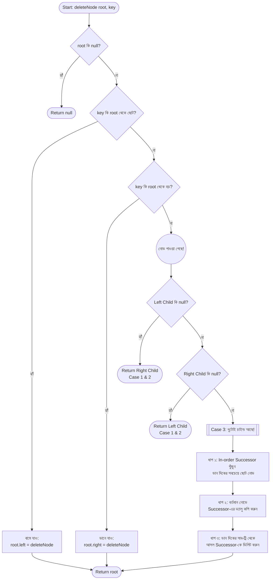

# BST Delete ফ্লো-চার্ট (Flowchart)

যখন আমরা একটি Binary Search Tree (BST) থেকে কোনো ডেটা ডিলিট করতে চাই, তখন কোডটি ঠিক কীভাবে সিদ্ধান্ত নেয়, তা নিচের ফ্লো-চার্টের মাধ্যমে ধাপে ধাপে দেখানো হলো:

## ফ্লো-চার্টটি কীভাবে পড়বেন?
১. **ডায়মন্ড আকৃতির বক্সগুলো (Rhombus):** এগুলো হলো কন্ডিশন বা শর্ত (if-else)। এখানে কোড চেক করে দেখছে কোনদিকে যেতে হবে।
২. **চারকোনা বক্সগুলো (Rectangle):** এগুলো হলো কাজ বা অ্যাকশন। 
৩. **গোলাকার বক্সগুলো (Oval/Circle):** এগুলো হলো রিটার্ন পয়েন্ট বা টার্মিনাল।

এই ফ্লো-চার্টটি মূলত আমাদের আগের লেখা জাভা কোডটিরই একটি ভিজ্যুয়াল বা গ্রাফিক্যাল রূপ। এটি দেখে আপনি খুব সহজেই বুঝতে পারবেন যে কোডটি কখন কোন ধাপে কাজ করছে!
