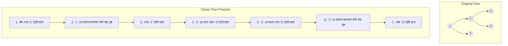

# ট্রির সম্পূর্ণ কপি (Clone) তৈরি করা

একটি ট্রির সম্পূর্ণ কপি বা ক্লোন তৈরি করার জন্য **Pre-order Traversal (প্রি-অর্ডার ট্রাভার্সাল)** সবচেয়ে উপযুক্ত।

## কেন Pre-order সবচেয়ে ভালো?

Pre-order ট্রাভার্সালের নিয়ম হলো: **Root -> Left -> Right** (আগে রুট, তারপর বাম দিক, তারপর ডান দিক)।

যখন আমরা একটি ট্রি কপি করতে চাই, তখন আমাদের প্রথমেই মূল নোড বা Root তৈরি করতে হবে। Root তৈরি না করে আমরা এর সাথে ডান বা বাম দিকের চাইল্ড (child) নোডগুলো যুক্ত করতে পারব না। 
তাই Pre-order পদ্ধতিতে প্রথমে Root তৈরি করা হয়, তারপর তার বাম দিকের অংশ কপি করে যুক্ত করা হয়, এবং সবশেষে ডান দিকের অংশ কপি করে যুক্ত করা হয়।

---

## কিভাবে কাজ করে? (একেবারে সহজ ভাষায়)

ধরা যাক, আপনার কাছে একটি অরিজিনাল ট্রি আছে। আপনি এর একটি হুবহু কপি বানাতে চান। 

১. আপনি প্রথমে অরিজিনাল ট্রির প্রধান নোড (Root) দেখলেন এবং নতুন ট্রিতে ঠিক একই মান দিয়ে একটি নতুন নোড তৈরি করলেন।
২. এবার আপনি অরিজিনাল ট্রির বাম দিকের ডালপালায় (Left Subtree) গেলেন এবং সেগুলোকে কপি করে নতুন ট্রির বাম দিকে যুক্ত করলেন।
৩. এরপর অরিজিনাল ট্রির ডান দিকের ডালপালায় (Right Subtree) গেলেন এবং সেগুলোকে কপি করে নতুন ট্রির ডান দিকে যুক্ত করলেন।

---

## ভিজ্যুয়ালাইজেশন (Visualization)

নিচের ডায়াগ্রামটি দেখুন, কিভাবে অরিজিনাল ট্রি থেকে ক্লোন বা কপি ট্রি তৈরি হচ্ছে:

---

## কোডের সারসংক্ষেপ:
* `cloneTree` ফাংশনটি মূলত একটি **Recursive (রিকার্সিভ)** ফাংশন (অর্থাৎ সে নিজেকে নিজে কল করে)।
* এটি বারবার নিজেকে কল করে ট্রির প্রতিটি নোডে যায়।
* প্রথমে নতুন নোড তৈরি করে, তারপর বাম দিকে যায়, তারপর ডান দিকে যায়। এটাই হলো **Pre-order Traversal** এর মূল কাজ।
