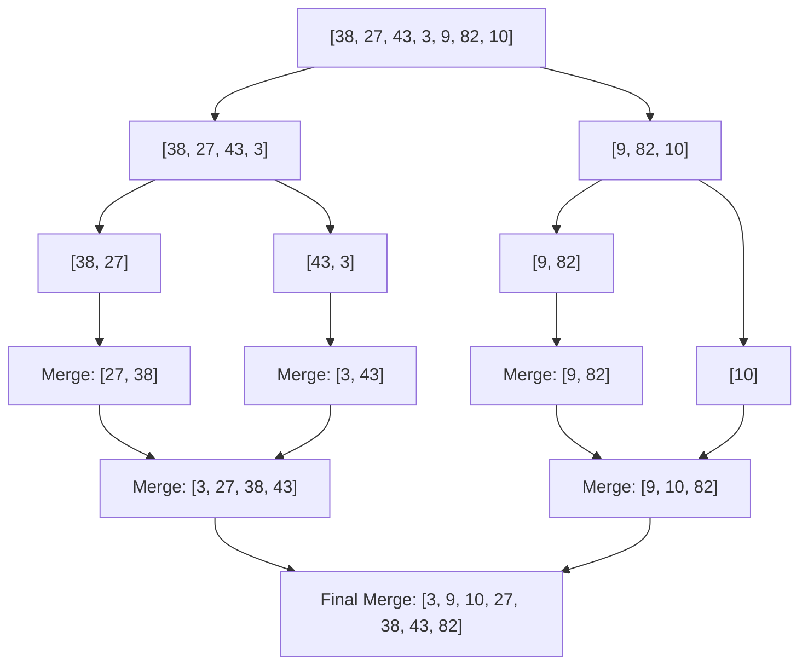

# Sorting Algorithms: Comprehensive Master Theory & Concepts

> **Module:** 02 - Data Structures & Algorithms (DSA)  
> **Chapter:** 02 - Algorithms  
> **Topic:** 01 - Sorting Algorithms  
> **Target Exam:** WellDev Trainee Software Engineer (Intermediate to Advanced Refresher)

---

## 🎯 Learning Objectives

এই নির্দেশিকাটি পড়ার পর তুমি যা স্পষ্টভাবে বুঝতে ও ব্যাখ্যা করতে পারবে:
1. **সব গুরুত্বপূর্ণ সর্টিং অ্যালগরিদমের ভেতরের মেকানিজম:** Comparison-based (Bubble, Selection, Insertion, Merge, Quick, Heap, Shell) এবং Non-comparison based (Counting, Radix, Bucket)।
2. **Complexity & Trade-offs:** প্রতিটি অ্যালগরিদমের Best, Average, Worst-case Time Complexity এবং Auxiliary Space Complexity।
3. **Stability & In-place Concept:** Stability কী, কেন এটি Multi-key sorting এ জরুরি, এবং কোন অ্যালগরিদমগুলো Stable/Unstable।
4. **Theoretical Limits:** Decision Tree Model ব্যবহার করে Comparison-based sorting এর lower bound $\Omega(n \log n)$ প্রূফ।
5. **Real-world Hybrid Sorts:** TimSort (Java `Arrays.sort()` for objects) এবং IntroSort (C++ `std::sort()`) কীভাবে কাজ করে।
6. **MCQ & Interview Gotchas:** পরীক্ষায় পরীক্ষকরা কীভাবে ঘুরিয়ে প্রশ্ন করেন (যেমন: Quick Sort worst case pivot, Merge sort space on linked list vs array)।

---

## 1. Master Comparison Matrix

পরীক্ষায় সরাসরি টাইম/স্পেস বা স্টেবিলিটি নিয়ে MCQ আসে। নিচের টেবিলটি মুখস্থ ও অনুধাবন করা বাধ্যতামূলক:

| Algorithm | Best Time | Avg Time | Worst Time | Aux Space | Stable? | In-Place? | Adaptive? |
| :--- | :--- | :--- | :--- | :--- | :--- | :--- | :--- |
| **Bubble Sort** | $\mathcal{O}(n)$ | $\mathcal{O}(n^2)$ | $\mathcal{O}(n^2)$ | $\mathcal{O}(1)$ | **Yes** | **Yes** | Yes (Optimized) |
| **Selection Sort** | $\mathcal{O}(n^2)$ | $\mathcal{O}(n^2)$ | $\mathcal{O}(n^2)$ | $\mathcal{O}(1)$ | **No** | **Yes** | No |
| **Insertion Sort** | $\mathcal{O}(n)$ | $\mathcal{O}(n^2)$ | $\mathcal{O}(n^2)$ | $\mathcal{O}(1)$ | **Yes** | **Yes** | **Yes** |
| **Merge Sort** | $\mathcal{O}(n \log n)$ | $\mathcal{O}(n \log n)$ | $\mathcal{O}(n \log n)$ | $\mathcal{O}(n)$ | **Yes** | **No** | No |
| **Quick Sort** | $\mathcal{O}(n \log n)$ | $\mathcal{O}(n \log n)$ | $\mathcal{O}(n^2)$ | $\mathcal{O}(\log n)$* | **No** | **Yes** | No |
| **Heap Sort** | $\mathcal{O}(n \log n)$ | $\mathcal{O}(n \log n)$ | $\mathcal{O}(n \log n)$ | $\mathcal{O}(1)$ | **No** | **Yes** | No |
| **Shell Sort** | $\mathcal{O}(n \log n)$ | $\mathcal{O}(n^{1.3})$ | $\mathcal{O}(n^2)$ | $\mathcal{O}(1)$ | **No** | **Yes** | Yes |
| **Counting Sort** | $\mathcal{O}(n + k)$ | $\mathcal{O}(n + k)$ | $\mathcal{O}(n + k)$ | $\mathcal{O}(k)$ | **Yes** | **No** | No |
| **Radix Sort** | $\mathcal{O}(d \cdot (n + k))$ | $\mathcal{O}(d \cdot (n + k))$ | $\mathcal{O}(d \cdot (n + k))$ | $\mathcal{O}(n + k)$ | **Yes** | **No** | No |
| **Bucket Sort** | $\mathcal{O}(n + k)$ | $\mathcal{O}(n + k)$ | $\mathcal{O}(n^2)$ | $\mathcal{O}(n)$ | **Yes** | **No** | Yes |
| **TimSort** | $\mathcal{O}(n)$ | $\mathcal{O}(n \log n)$ | $\mathcal{O}(n \log n)$ | $\mathcal{O}(n)$ | **Yes** | **No** | Yes |

*\*Note: Quick Sort-এর Auxiliary Space মূলত Call Stack-এর জন্য $\mathcal{O}(\log n)$ (Average Case) থেকে $\mathcal{O}(n)$ (Worst Case)।*

---

## 2. Core Concepts: Classification & Definitions

### 2.1 Stability in Sorting
- **Definition:** যদি কোনো অ্যালগরিদমে সমান কী (equal keys) বিশিষ্ট দুটি এলিমেন্টের অরিজিনাল আপেক্ষিক অর্ডার (relative order) সর্ট করার পরেও অপরিবর্তিত থাকে, তবে তাকে **Stable Sort** বলে।
- **Real-World Analogy:** একটি ই-কমার্স ওয়েবসাইটে প্রথমে `Price` দিয়ে প্রোডাক্ট সর্ট করা আছে। এখন যদি নতুন করে `Rating` দিয়ে সর্ট করো, তবে সমমানের Rating এর প্রোডাক্টগুলোর পূর্বের Price অর্ডার বজায় থাকা উচিত।
- **Stable Sorts:** Bubble, Insertion, Merge, Counting, Radix, Bucket, TimSort.
- **Unstable Sorts:** Selection, Quick, Heap, Shell.
  
> 💡 **Why is Selection Sort Unstable?**  
> ধরে নাও অ্যারে: `[4a, 4b, 2]`. Selection Sort ২ কে সবচেয়ে ছোট পেয়ে index 0 এর `4a` এর সাথে swap করবে। ফলে অ্যারে হবে `[2, 4b, 4a]`। লক্ষ করো, `4a` আগে ছিল, কিন্তু এখন `4b` এর পরে চলে গেছে!

### 2.2 In-place vs Out-of-place
- **In-place:** যে অ্যালগরিদম সর্ট করতে মূল ইনপুট অ্যারের বাইরে মাত্র Constant Extra Space $\mathcal{O}(1)$ বা Stack space ($\mathcal{O}(\log n)$) ব্যবহার করে। (যেমন: Quick Sort, Heap Sort, Insertion Sort)।
- **Out-of-place:** যে অ্যালগরিদম সর্ট করার জন্য মূল অ্যারের সমান বা আনুপাতিক অতিরিক্ত মেমোরি অ্যারে ব্যবহার করে। (যেমন: Merge Sort $\mathcal{O}(n)$, Counting Sort $\mathcal{O}(k)$)।

### 2.3 Adaptive Sorting
- **Adaptive:** যদি কোনো সর্টিং অ্যালগরিদমের পারফরম্যান্স ইনপুট অ্যারের পূর্বের সাজানো অবস্থার উপর নির্ভর করে দ্রুততর হয়। (যেমন: Insertion Sort অলরেডি সর্টেড থাকলে মাত্র $\mathcal{O}(n)$ সময় নেয়)।

---

## 3. Comparison-Based Sorting Algorithms

### 3.1 Bubble Sort (Sinking Sort)
* **Analogy:** পানিতে ভারী বুদ্বুদ বা হালকা বুদ্বুদ যেভাবে ভেসে উঠে, ঠিক তেমনি প্রতিটি পাস-এ সবচেয়ে বড় উপাদানটি ভাসতে ভাসতে ডানদিকে (শেষে) চলে যায়।
* **Mechanism:** পাশাপাশি দুটি এলিমেন্ট তুলনা করা হয় এবং বামেরটি বড় হলে Swap করা হয়।
* **Optimization:** একটি পাস-এ যদি কোনো Swap না হয়, তার মানে অ্যারে অলরেডি সর্টেড! `swapped` ফ্ল্যাগ ব্যবহার করে $O(n)$ বেস্ট কেস পাওয়া যায়।

```mermaid
flowchart TD
    A[Start Pass] --> B{Compare A[i] & A[i+1]}
    B -- A[i] > A[i+1] --> C[Swap Elements & Set swapped=true]
    B -- A[i] <= A[i+1] --> D[Move to Next Index]
    C --> D
    D --> E{End of Array?}
    E -- No --> B
    E -- Yes --> F{Was any element swapped?}
    F -- Yes --> A
    F -- No --> G[Array Sorted - End]
```

---

### 3.2 Selection Sort
* **Mechanism:** পুরো অ্যারে থেকে সবচেয়ে ছোট element খুঁজে এনে ১ম পজিশনে রাখা হয়, তারপর বাকি অংশ থেকে ২য় ছোট element এনে ২য় পজিশনে রাখা হয়... এভাবে চলে।
* **Key Trait:** এটি সর্বনিম্ন সংখ্যক Swap করে। মোট Swap সংখ্যা সর্বাবস্থায় $\mathcal{O}(n)$।
* **Gotcha:** ইনপুট যেমনই থাকুক (Sorted, Reverse Sorted, Random), কম্পারিজন সংখ্যা সবসময় $\frac{n(n-1)}{2} = \mathcal{O}(n^2)$। তাই এটি Non-adaptive।

---

### 3.3 Insertion Sort
* **Analogy:** তাসের কার্ড হাতে একটার পর একটা সাজানোর মতো।
* **Mechanism:** অ্যারে দুটি অংশে বিভক্ত—Sorted part & Unsorted part। Unsorted পার্ট থেকে একটি এলিমেন্ট নিয়ে Sorted পার্টের সঠিক পজিশনে ইনসার্ট করা হয়।
* **Why it shines:** 
  1. ছোট সাইজের ইনপুট ($n \le 30$) এর জন্য এটি খুব ফাস্ট (High locality of reference, minimal overhead)।
  2. **Nearly Sorted / Partially Sorted** ডেটার জন্য এটি সবচেয়ে কার্যকরী ($\mathcal{O}(n)$)।

---

### 3.4 Merge Sort
* **Concept:** Divide and Conquer কৌশল।
* **Steps:**
  1. **Divide:** অ্যারেকে মাঝখান থেকে দুটি সমদ্বিখণ্ডে ভাগ করো।
  2. **Conquer:** সাব-অ্যারেগুলোকে রিকার্সিভলি সর্ট করো।
  3. **Combine:** দুটি সর্টেড সাব-অ্যারেকে Merge করে একটি সর্টেড অ্যারে তৈরি করো।



> ⚠️ **Interview Gotcha (Linked List vs Array):**  
> Arrays-এর ক্ষেত্রে Merge Sort-এর Auxiliary Space $\mathcal{O}(n)$। কিন্তু **Singly Linked List** সর্ট করতে Merge Sort সেরা, কারণ এখানে নোড পয়েন্টার পরিবর্তন করেই $\mathcal{O}(1)$ Extra Auxiliary Space এ Merge করা সম্ভব!

---

### 3.5 Quick Sort
* **Concept:** Divide and Conquer + Partitioning।
* **Mechanism:** একটি **Pivot** এলিমেন্ট বেছে নেওয়া হয়। অ্যারেকে এমনভাবে 파টিশন করা হয় যেন Pivot-এর বামে সব ছোট এবং ডানে সব বড় উপাদান থাকে। এরপর বাম ও ডান অংশকে রিকার্সিভলি সর্ট করা হয়।
* **Partition Schemes:**
  1. **Lomuto Partition:** শেষ এলিমেন্টকে Pivot ধরে ১টি পয়েন্টার দিয়ে ট্র্যাক করা হয় (সহজ, কিন্তু Swap বেশি করে)।
  2. **Hoare Partition:** ১ম ও শেষ এলিমেন্টে দুটি পয়েন্টার রেখে মুখোমুখি এগিয়ে আনা হয় (Lomuto এর চেয়ে ৩ গুণ কম Swap করে)।
  3. **3-Way Partition (Dutch National Flag):** অ্যারেকে ৩ ভাগে ভাগ করে (< Pivot, == Pivot, > Pivot)। প্রচুর Duplicate Values থাকা অ্যারের ক্ষেত্রে $\mathcal{O}(n)$ সময়ে কাজ করে!

> ⚠️ **Worst-case Scenario & Prevention:**  
> যদি অ্যারে অলরেডি সর্টেড থাকে এবং প্রথম/শেষ এলিমেন্টকে সবসময় Pivot ধরা হয়, তবে রিকার্শন ডেপথ $n$ হয়ে যাবে এবং Time Complexity $\mathcal{O}(n^2)$ হবে!  
> **Solution:** Random Pivot বা **Median-of-Three** (প্রথম, মধ্যম ও শেষ এলিমেন্টের মিডিয়ান) Pivot বাছাই করা।

---

### 3.6 Heap Sort
* **Concept:** Binary Heap Data Structure ব্যবহার করে সর্টিং।
* **Steps:**
  1. প্রদত্ত অ্যারে থেকে একটি **Max-Heap** তৈরি করো (Time: $\mathcal{O}(n)$)।
  2. রুট নোড (সর্বোচ্চ মান) তুলে নিয়ে অ্যারের শেষ এলিমেন্টের সাথে Swap করো।
  3. Heap-এর সাইজ ১ কমাও এবং রুট নোডকে Heapify করো (Time: $\mathcal{O}(\log n)$)।
  4. প্রসেসটি $n$ বার পুনরাবৃত্তি করো।
* **Pros & Cons:** Guaranteed $\mathcal{O}(n \log n)$ worst case এবং $\mathcal{O}(1)$ auxiliary space। কিন্তু Cache Locality খারাপ হওয়ায় ব্যবহারিক ক্ষেত্রে Quick Sort-এর চেয়ে কিছুটা ধীরগতির।

---

### 3.7 Shell Sort (Diminishing Increment Sort)
* **Concept:** Insertion Sort এর একটি উন্নত সংস্করণ।
* **Mechanism:** দূরবর্তী উপাদানগুলোর মধ্যে তুলনা করে সর্ট করা হয়। নির্দিষ্ট **Gap Sequence** (যেমন: $n/2, n/4, \dots, 1$ অথবা Knuth Sequence: $3k + 1$) ব্যবহার করে দূরবর্তী Inversions দূর করা হয়। শেষে Gap 1 হলে এটি স্বাভাবিক Insertion Sort এ পরিণত হয়, তবে তখন অ্যারে প্রায় সর্টেড থাকে।

---

## 4. Non-Comparison Based Sorting Algorithms

Comparison-based sorting এর তাত্ত্বিক সীমাবদ্ধতা $\Omega(n \log n)$ অতিক্রম করতে কিছু শর্তসাপেক্ষে Non-comparison algorithms ব্যবহার করা হয়:

### 4.1 Counting Sort
* **Condition:** ইনপুট নাম্বারগুলো একটি নির্দিষ্ট ছোট রেঞ্জ $0$ থেকে $K$ এর মধ্যে হতে হবে।
* **Mechanism:** একটি Frequency Array (Size $K+1$) তৈরি করে প্রতিটি সংখ্যার গণনা রাখা হয়। তারপর Prefix Sum বা Cumulative Count হিসেব করে অরিজিনাল পজিশনে প্লেস করা হয়।
* **Complexity:** Time: $\mathcal{O}(n + k)$, Space: $\mathcal{O}(k)$।
* **Gotcha:** যদি $K = n^2$ হয়, তবে টাইম ও স্পেস কমপ্লেক্সিটি হয়ে যাবে $\mathcal{O}(n^2)$, যা খুব বাজে!

---

### 4.2 Radix Sort
* **Concept:** সংখ্যাগুলোকে তাদের Digit/Position (LSD - Least Significant Digit থেকে MSD - Most Significant Digit) অনুযায়ী পজিশন বাই পজিশন সর্ট করা হয়।
* **Mechanism:** প্রতি ডিজিট পজিশনের জন্য একটি **Stable** Inner Sorting Algorithm (সাধারণত Counting Sort) ব্যবহার করা হয়।
* **Complexity:** Time: $\mathcal{O}(d \cdot (n + k))$, যেখানে $d$ হলো সর্বোচ্চ ডিজিটের সংখ্যা।

---

### 4.3 Bucket Sort
* **Concept:** ইনপুট ভ্যালুগুলো যদি একটি নির্দিষ্ট রেঞ্জে সুষমভাবে (Uniformly Distributed) বিন্যস্ত থাকে।
* **Mechanism:** ইনপুটসমূহকে $K$ টি আলাদা Bucket-এ ভাগ করা হয়। প্রতিটি Bucket-কে আলাদাভাবে (Insertion Sort দিয়ে) সর্ট করে একত্রে জুড়ে দেওয়া হয়।
* **Average Time:** $\mathcal{O}(n + k)$। Worst case (সব এলিমেন্ট একই বাকেটে পড়লে): $\mathcal{O}(n^2)$।

---

## 5. Modern Hybrid Sorting Algorithms (Real-world Production Systems)

বাস্তব জগতের স্ট্যান্ডার্ড লাইব্রেরিগুলোতে কখনো একক সর্টিং ব্যবহার করা হয় না, বরং **Hybrid Algorithm** ব্যবহৃত হয়:

### 5.1 TimSort (Java `Arrays.sort()` for Objects, Python `list.sort()`)
* **Combination:** **Merge Sort + Insertion Sort**।
* **Mechanism:**
  1. ছোট ছোট সর্টেড অংশ খুঁজে বের করা হয় যাকে **Run** বলা হয় (সাধারণত সাইজ ৩২ বা ৬৪)।
  2. প্রতি Run-কে Insertion Sort দিয়ে সর্ট করা হয়।
  3. এরপর Run গুলোকে অ্যাডভান্সড Merge Sort (Galloping mode) দিয়ে মার্জ করা হয়।
* **Best Case:** $\mathcal{O}(n)$ (যদি অ্যারে অলরেডি সর্টেড বা প্রায় সর্টেড থাকে)।

### 5.2 IntroSort (C++ `std::sort()`)
* **Combination:** **Quick Sort + Heap Sort + Insertion Sort**।
* **Mechanism:**
  1. Quick Sort দিয়ে কাজ শুরু করে।
  2. যদি রিকার্শন ডেপথ $2 \times \log_2(n)$ অতিক্রম করে (Worst case $\mathcal{O}(n^2)$ এর ঝুঁকি থাকে), সাথে সাথে **Heap Sort** এ সুইচ করে!
  3. সাব-অ্যারের সাইজ ছোট ($n \le 16$) হয়ে গেলে **Insertion Sort** এ সুইচ করে।

---

## 6. Theoretical Limit: Lower Bound of Comparison Sorting

> ❓ **প্রশ্ন:** কেন যেকোনো Comparison-Based Sorting Algorithm এর Worst-case Time Complexity $\Omega(n \log n)$ এর চেয়ে কম হতে পারে না?

### Proof via Decision Tree Model:
1. $n$ টি ভিন্ন এলিমেন্টের মোট সম্ভাব্য Permutation বা সাজানোর সংখ্যা = $n!$।
2. প্রতিটি Comparison (যেমন: $a_i \le a_j$) একটি Binary Decision tree এর সাথে তুলনা করা যায়, যার পাতা (Leaves) সংখ্যা $L \ge n!$।
3. $h$ উচ্চতা (Height) বিশিষ্ট Binary Tree-র সর্বোচ্চ পাতা থাকতে পারে $2^h$ টি।
   $$\therefore 2^h \ge n! \implies h \ge \log_2(n!)$$
4. Stirling's Approximation অনুযায়ী, $\log_2(n!) \approx n \log_2 n - n \log_2 e = \Omega(n \log n)$।
5. গাছের উচ্চতা $h$-ই নির্দেশ করে Worst-case এ কয়টি Comparison করতে হবে। তাই Comparison-based sorting এর সর্বনিম্ন বাউন্ড **$\Omega(n \log n)$**।

---

## 💡 Important Interview & MCQ Callouts

> ⚠️ **Trap 1:** *"Merge Sort is always faster than Quick Sort."*  
> **Reality:** False! যদিও Merge Sort এর Worst Case $\mathcal{O}(n \log n)$, বাস্তবক্ষেত্রে Quick Sort এর Constant factor অনেক কম এবং এটি Cache Friendly (High Locality of Reference)। তাই রামডম ডেটাতে Quick Sort ই দ্রুত কাজ করে।

> ⚠️ **Trap 2:** *"Counting sort is an $\mathcal{O}(n)$ algorithm for any integer input."*  
> **Reality:** False! এটি $\mathcal{O}(n + k)$। যদি সর্বোচ্চ সংখ্যা $K = 10^9$ হয় আর $n = 5$, তবে এটি অত্যন্ত ধীরগতির ও বিশাল মেমোরি নষ্ট করবে।

> ⚠️ **Trap 3:** *"Quick sort takes $\mathcal{O}(1)$ auxiliary space."*  
> **Reality:** False! রিকার্সিভ ফাংশন কলের জন্য Call Stack মেমোরি প্রয়োজন হয়। Average case এ $\mathcal{O}(\log n)$ এবং Worst case এ $\mathcal{O}(n)$ স্পেস লাগে।

> ⚠️ **Trap 4:** *"Which algorithm minimizes memory writes (Swaps)?"*  
> **Answer:** **Selection Sort** (সর্বোচ্চ $n-1$ বা $\mathcal{O}(n)$ ওয়াট/সওয়াপ)। Flash memory (যেমন EEPROM/SD Card) যেখানে রাইট লাইফটাইম সীমিত, সেখানে এটি কার্যকর।
