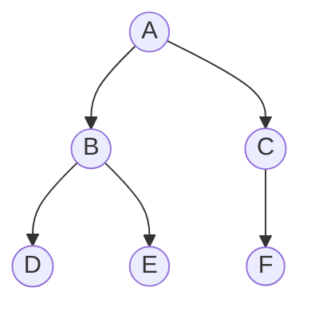

# 03. Graph Traversal: BFS & DFS (Knowledge & Theory)

## Learning Objectives
- Breadth-First Search (BFS) এবং Depth-First Search (DFS) কীভাবে কাজ করে তা ক্লিয়ার করা।
- কখন BFS আর কখন DFS ব্যবহার করতে হবে তার পার্থক্য (Trade-offs) বোঝা।
- BFS-এ Queue এবং DFS-এ Stack/Recursion এর ব্যবহার সম্পর্কে ক্লিয়ার কনসেপ্ট নেওয়া।
- সাইকেল (Cycle) ডিটেকশন এবং কানেক্টেড কম্পোনেন্ট (Connected Components) খোঁজার লজিক আয়ত্ত করা।

---

## 1. Breadth-First Search (BFS)
BFS হলো এমন একটি ট্রাভার্সাল টেকনিক যা একটি নোড থেকে শুরু করে প্রথমে তার **কাছের প্রতিবেশী (Neighbors)** গুলোকে ভিজিট করে। এরপর এক লেভেল দূরে যায়, তারপর আরও এক লেভেল দূরে যায়। অর্থাৎ এটি লেভেল-বাই-লেভেল (Level-by-Level) কাজ করে।

- **Data Structure:** BFS ইমপ্লিমেন্ট করার জন্য **Queue** (First In First Out) ব্যবহার করা হয়।
- **Time Complexity:** $O(V + E)$ (যেখানে $V$ = Vertices/Nodes এবং $E$ = Edges)।
- **Space Complexity:** $O(V)$ (Queue তে সর্বোচ্চ লেভেলের সব নোড একসাথে থাকতে পারে)।

### কখন ব্যবহার করবেন?
- **Shortest Path:** আনওয়েটেড (Unweighted) গ্রাফে সোর্স থেকে ডেস্টিনেশনের শর্টেস্ট পাথ বের করতে BFS হলো বেস্ট। কারণ এটি লেভেল বাই লেভেল যায়, তাই যে লেভেলে ডেস্টিনেশন পাওয়া যাবে, সেটাই সবচেয়ে কাছের রাস্তা।
- **Peer-to-Peer Networks:** টরেন্ট (Torrent) বা সোশ্যাল নেটওয়ার্কে ১ ডিগ্রি/২ ডিগ্রি ফ্রেন্ড খুঁজতে।
- **Web Crawlers:** সার্চ ইঞ্জিনের ক্রলারগুলো এক পেজের সব লিংক আগে ভিজিট করে (BFS) তারপর গভীরে যায়।

---

## 2. Depth-First Search (DFS)
DFS হলো এমন একটি টেকনিক যা একটি নোড থেকে শুরু করে যতটা গভীরে যাওয়া সম্ভব (যতক্ষণ না ডেড-এন্ডে পৌঁছায়) ততটা গভীরে যায়। এরপর ডেড-এন্ড পেলে সে এক স্টেপ পিছে (Backtrack) ফিরে এসে অন্য রাস্তায় যায়।

- **Data Structure:** DFS ইমপ্লিমেন্ট করার জন্য **Stack** (Last In First Out) ব্যবহার করা হয়। সাধারণত আমরা ম্যানুয়ালি Stack না বানিয়ে **Recursion** (Call Stack) ব্যবহার করি।
- **Time Complexity:** $O(V + E)$।
- **Space Complexity:** $O(V)$ (Recursion Call Stack এর কারণে স্কিউড ট্রিতে স্পেস $V$ হতে পারে)।

### কখন ব্যবহার করবেন?
- **Path Exists?** দুটি নোডের মধ্যে আদৌ কোনো রাস্তা আছে কি না তা দ্রুত চেক করতে (কারণে এটি শর্টেস্ট না হলেও যেকোনো একটা রাস্তা পেলেই হলো)।
- **Cycle Detection:** একটি গ্রাফে সাইকেল বা লুপ আছে কি না তা বের করতে।
- **Topological Sorting:** কাজের ডিপেন্ডেন্সি (যেমন: Course prerequisites) সলভ করতে।
- **Maze Solving:** পাজল বা গোলকধাঁধা সলভ করতে (যেখানে ব্যাকট্র্যাকিং লাগে)।

---

## 3. BFS vs DFS (The Ultimate Trade-off)

| ফিচার | BFS (Breadth-First Search) | DFS (Depth-First Search) |
| :--- | :--- | :--- |
| **অ্যাপ্রোচ** | লেভেল বাই লেভেল (Level by Level) | যতটা সম্ভব গভীরে যায় (Go deep) |
| **ডেটা স্ট্রাকচার** | Queue | Stack (বা Recursion) |
| **Shortest Path** | Unweighted গ্রাফে গ্যারান্টিড শর্টেস্ট পাথ দেয় | শর্টেস্ট পাথ দেয় না (যেকোনো পাথ দেয়) |
| **মেমোরি (Space)** | চওড়া (Wide) গ্রাফে অনেক মেমোরি লাগে | লম্বা (Deep) গ্রাফে অনেক মেমোরি লাগে |
| **ব্যাকট্র্যাকিং** | নেই | আছে (ডেড-এন্ড থেকে ফিরে আসে) |

---

## Diagrams

### 1. BFS vs DFS Execution Flow
ধরি একটি ট্রি বা গ্রাফ নিচে দেওয়া হলো:

**BFS Traversal Order:** 
প্রথমে লেভেল 0 (A), তারপর লেভেল 1 (B, C), তারপর লেভেল 2 (D, E, F)।
**অর্ডার:** `A -> B -> C -> D -> E -> F`

**DFS Traversal Order:**
প্রথমে বাম দিকে যতটা গভীরে যাওয়া যায় (A -> B -> D)। D এর নিচে কেউ নেই, তাই B তে ফিরে এসে E তে যাবে।
**অর্ডার:** `A -> B -> D -> E -> C -> F`

---

## 💡 Interview / MCQ Gotchas

1. **"Visited" Array (The Biggest Trap):**
   ট্রি-তে ভিজিটেড অ্যারে না লাগলেও **গ্রাফে ভিজিটেড অ্যারে মাস্ট!** তা না হলে ইনফিনিট লুপে (Infinite Loop) পড়ে যাবেন (কারণ গ্রাফে সাইকেল থাকতে পারে, A থেকে B তে গিয়ে আবার B থেকে A তে ফিরে আসতে পারেন)।
   
2. **Recursive vs Iterative DFS:**
   ইন্টারভিউয়ার অনেক সময় বলতে পারে "DFS লেখো কিন্তু Recursion ব্যবহার না করে!" তখন আপনাকে ম্যানুয়ালি একটি `Stack` অবজেক্ট বানিয়ে তার ভেতরে নোড পুশ/পপ করে লজিক লিখতে হবে।

3. **Time Complexity Trick:**
   টাইম কমপ্লেক্সিটি $O(V+E)$ বলার কারণ হলো, আমরা প্রতিটি নোড ($V$) একবার ভিজিট করি এবং প্রতিটি এজ ($E$) একবার (বা আনডিরেক্টেড গ্রাফে দুইবার) চেক করি। যদি গ্রাফটি Adjacency Matrix দিয়ে রিপ্রেজেন্ট করা থাকে, তবে টাইম কমপ্লেক্সিটি হয়ে যাবে **$O(V^2)$**। এটি ইন্টারভিউয়ের একটি ক্লাসিক ট্র্যাপ!

4. **Bi-directional BFS:**
   অ্যাডভান্সড ইন্টারভিউতে জিজ্ঞেস করতে পারে "সোশ্যাল নেটওয়ার্কে ২ জনের মধ্যে কানেকশন বের করার ফাস্টেস্ট উপায় কী?" উত্তর হলো **Bi-directional BFS**। অর্থাৎ সোর্স থেকে একটি BFS এবং ডেস্টিনেশন থেকে আরেকটি BFS একই সাথে চালানো। যখন তারা মাঝপথে মিট করবে, সেটাই শর্টেস্ট পাথ! এতে সার্চ স্পেস (Search space) ড্রাস্টিক্যালি কমে যায়।
