# 04. Greedy Algorithms (Knowledge & Theory)

## Learning Objectives
- Greedy Algorithm কী এবং এটি কীভাবে কাজ করে তা বোঝা।
- Greedy Algorithms এর শর্ত (Greedy Choice Property এবং Optimal Substructure) সম্পর্কে ক্লিয়ার কনসেপ্ট নেওয়া।
- এটি কখন কাজ করে এবং কখন **ব্যর্থ (Fail)** হয় তা অ্যানালাইসিস করা।
- ফেমাস কিছু Greedy প্রবলেম (Activity Selection, Fractional Knapsack, Huffman Coding) এর লজিক শেখা।

---

## 1. What is a Greedy Algorithm?
Greedy Algorithm হলো এমন একটি প্রবলেম-সলভিং অ্যাপ্রোচ, যা প্রতি ধাপে ওই মুহূর্তের জন্য সবচেয়ে ভালো (Locally Optimal) অপশনটি বেছে নেয়, এই আশায় যে শেষ পর্যন্ত এটি পুরো প্রবলেমের সবচেয়ে ভালো সমাধান (Globally Optimal) দেবে। 

এটি ভবিষ্যতের কথা চিন্তা করে না বা অতীতে ফিরে যায় না (No Backtracking)। চোখের সামনে যা সবচেয়ে লোভনীয় (Greedy) মনে হয়, সেটিই নিয়ে নেয়!

**রিয়েল ওয়ার্ল্ড অ্যানালজি:**
- **কয়েন চেঞ্জ (Coin Change):** আপনাকে ৯৯ টাকা ভাঙতি দিতে হবে। আপনি সবচেয়ে বড় কয়েনগুলো আগে বাছবেন (৫০ টাকা, তারপর ২০, ২০, ৫, ২, ২)। এটি একটি Greedy অ্যাপ্রোচ।
- **রাস্তায় জ্যাম:** গুগল ম্যাপস যদি শুধু পরের মোড়টি খালি দেখে সেদিকে টার্ন নিতে বলে (সামনে বড় জ্যাম আছে কি না চেক না করে), তবে সেটি Greedy। (যদিও রিয়েল ম্যাপস পুরো রাস্তার হিসাব করে, যা ডাইনামিক প্রোগ্রামিং/A* এর মতো কাজ করে)।

---

## 2. Properties of a Greedy Algorithm
একটি প্রবলেম Greedy দিয়ে সলভ করা যাবে কি না, তা বুঝতে দুটি প্রপার্টি চেক করতে হয়:
1. **Greedy Choice Property:** আমরা লোকাল বেস্ট চয়েস নিলে গ্লোবাল বেস্ট রেজাল্ট পাবো। (অর্থাৎ বর্তমানের লোভনীয় সিদ্ধান্ত ভবিষ্যতে কোনো ক্ষতি করবে না)।
2. **Optimal Substructure:** একটি বড় প্রবলেমের বেস্ট সলিউশনের ভেতরে ছোট প্রবলেমগুলোর বেস্ট সলিউশন লুকিয়ে থাকে।

---

## 3. When Greedy FAILS (The Gotcha!)
সব প্রবলেমে Greedy কাজ করে না। বিশেষ করে যেখানে বর্তমানের ভালো সিদ্ধান্ত ভবিষ্যতে বড় লস করাতে পারে, সেখানে Greedy ফেইল করে এবং আমাদের **Dynamic Programming (DP)** ব্যবহার করতে হয়।

**উদাহরণ: 0/1 Knapsack Problem**
আপনার ব্যাগের ক্যাপাসিটি ৫০ কেজি।
- আইটেম ১: ওজন ১০ কেজি, দাম ৬০ টাকা (রেশিও ৬)
- আইটেম ২: ওজন ২০ কেজি, দাম ১০০ টাকা (রেশিও ৫)
- আইটেম ৩: ওজন ৩০ কেজি, দাম ১২০ টাকা (রেশিও ৪)

Greedy রেশিও (দাম/ওজন) অনুযায়ী প্রথমে আইটেম ১ নেবে। বাকি থাকবে ৪০ কেজি। তারপর আইটেম ২ নেবে (বাকি ২০ কেজি)। এরপর আর জায়গা নেই। মোট দাম: ১৬০ টাকা।
কিন্তু **Optimal (DP) সলিউশন** হলো: আইটেম ২ এবং ৩ নেওয়া। মোট ওজন ৫০ কেজি, দাম: ২২০ টাকা! এখানে Greedy ফেইল করেছে।

*(তবে Fractional Knapsack অর্থাৎ জিনিস ভেঙে নেওয়া গেলে Greedy পারফেক্ট কাজ করে!)*

---

## 4. Famous Greedy Algorithms

### A. Activity Selection / Interval Scheduling
- **প্রবলেম:** অনেকগুলো মিটিংয়ের Start এবং End টাইম দেওয়া আছে। একজন মানুষ সর্বোচ্চ কয়টি মিটিং অ্যাটেন্ড করতে পারবে? (দুটি মিটিং ওভারল্যাপ করতে পারবে না)।
- **Greedy Logic:** মিটিংগুলোকে তাদের **End Time** অনুযায়ী ছোট থেকে বড় সর্ট করুন। এরপর যে মিটিং আগে শেষ হবে, সেটি পিক করুন। (কারণ এটি তাড়াতাড়ি শেষ হয়ে বাকি মিটিংয়ের জন্য সময় বাঁচাবে)।
- **Time Complexity:** $O(n \log n)$ (সর্টিংয়ের জন্য)।

### B. Fractional Knapsack
- **প্রবলেম:** ব্যাগে মালপত্র ভরতে হবে যাতে ম্যাক্সিমাম প্রফিট হয়। মালপত্র ভেঙে (Fraction) নেওয়া যাবে (যেমন চাল, ডাল)।
- **Greedy Logic:** প্রতিটি আইটেমের `Profit / Weight` রেশিও বের করে বড় থেকে ছোট সাজান। রেশিও অনুযায়ী ব্যাগে ভরুন। ব্যাগ ফুল হয়ে গেলে শেষের আইটেমটি যতটুকু ধরে ততটুকু ভেঙে ঢুকিয়ে দিন।
- **Time Complexity:** $O(n \log n)$।

### C. Huffman Coding (Data Compression)
- **প্রবলেম:** একটি টেক্সট ফাইলের সাইজ কমানো (ZIP করার মতো)।
- **Greedy Logic:** যে ক্যারেক্টারগুলো বেশিবার আসে, তাদের জন্য ছোট বাইনারি কোড (যেমন `0` বা `10`) বরাদ্দ করা এবং যেগুলো কম আসে তাদের জন্য বড় কোড দেওয়া। এটি Min-Priority Queue দিয়ে করা হয়।

### D. Graph Algorithms (They are Greedy too!)
- **Dijkstra's Shortest Path:** সবসময় সবচেয়ে কাছের আনভিজিটেড নোডটি পিক করে।
- **Kruskal's MST:** সবসময় সবচেয়ে ছোট এজটি আগে নেয়।
- **Prim's MST:** কানেক্টেড নেটওয়ার্কের সবচেয়ে কাছের নোডটি পিক করে।

---

## Diagrams

### 1. Activity Selection Logic

```mermaid
gantt
    title Activity Selection (Sorted by End Time)
    dateFormat  HH:mm
    axisFormat  %H:%M
    
    section Activities
    Act 1 (Picked)      :active, a1, 01:00, 2h
    Act 2 (Overlap!)    :crit, a2, 02:00, 2h
    Act 3 (Picked)      :active, a3, 03:00, 2h
    Act 4 (Overlap!)    :crit, a4, 04:00, 3h
```

*এখানে Act 2 এবং Act 4 বাদ দেওয়া হয়েছে কারণ তারা আগের সিলেক্টেড মিটিংয়ের সাথে ওভারল্যাপ করছে।*

---

## 💡 Interview / MCQ Angle
1. **"Does Greedy always work?"** ইন্টারভিউয়ারের এই প্রশ্নের উত্তর হলো—"না, যদি প্রবলেমে Overlapping Subproblems থাকে এবং লোকাল চয়েস গ্লোবাল রেজাল্ট গ্যারান্টি না দেয়, তবে Greedy ফেইল করে। তখন DP লাগে।"
2. **Sorting is the Heart:** ৯৯% Greedy প্রবলেম শুরুই হয় Array বা List কে কোনো নির্দিষ্ট কন্ডিশনে `Sort` করার মাধ্যমে। তাই Greedy প্রবলেমগুলোর টাইম কমপ্লেক্সিটি প্রায় সবসময় $O(n \log n)$ হয়।
3. **Coin Change Trap:** দেশের কারেন্সি সিস্টেম (যেমন 1, 2, 5, 10, 50, 100) এমনভাবে ডিজাইন করা যে Greedy কাজ করবে। কিন্তু যদি কাল্পনিক কারেন্সি (যেমন 1, 3, 4) দেওয়া হয় এবং আপনাকে 6 টাকা মেলাতে বলা হয়, তবে Greedy নেবে 4, 1, 1 (৩টি কয়েন)। কিন্তু আসল উত্তর হলো 3, 3 (২টি কয়েন)। এখানেও Greedy ফেইল করে!
