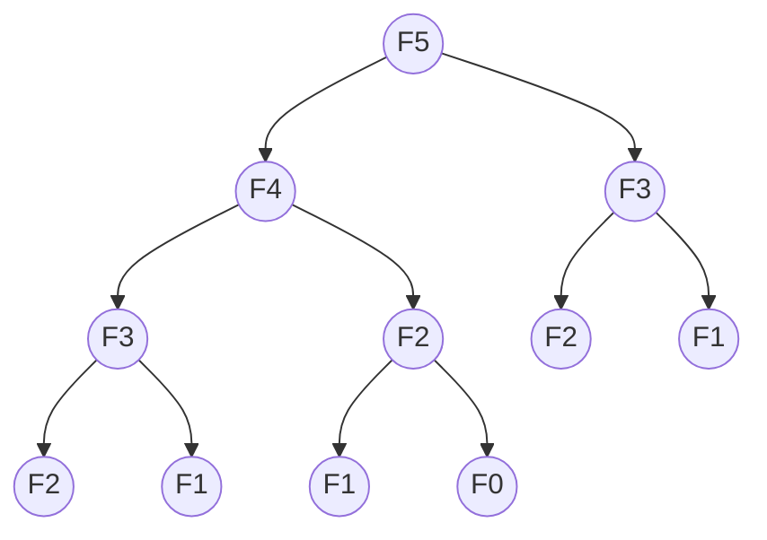

# 05. Dynamic Programming Intro (Knowledge & Theory)

## Learning Objectives
- Dynamic Programming (DP) এর বেসিক কনসেপ্ট এবং এটি কেন দরকার তা ক্লিয়ার করা।
- DP এর দুটি মূল শর্ত: **Overlapping Subproblems** এবং **Optimal Substructure** বোঝা।
- **Memoization (Top-Down)** এবং **Tabulation (Bottom-Up)** এর পার্থক্য ও ব্যবহার শেখা।
- একটি প্রবলেম দেখে কীভাবে বুঝবেন যে এটি DP দিয়ে সলভ করতে হবে (How to identify DP)।

---

## 1. What is Dynamic Programming?
Dynamic Programming (DP) হলো একটি অপ্টিমাইজেশন টেকনিক। সহজ কথায়, এটি "অতীতে করা কাজের রেজাল্ট মনে রাখে, যাতে একই কাজ বারবার করতে না হয়।"

**রিয়েল ওয়ার্ল্ড অ্যানালজি:**
ধরা যাক, কেউ আপনাকে জিজ্ঞেস করলো $1 + 1 + 1 + 1 + 1 + 1 + 1 + 1$ কত? আপনি গুনে বললেন "8"।
এরপর সে যদি শেষে আরও একটি $ + 1$ যোগ করে জিজ্ঞেস করে এখন কত? আপনি কি আবার প্রথম থেকে গুনবেন? না! আপনি আগের "8" এর সাথে "1" যোগ করে বলবেন "9"।
এই যে আগের হিসাবটা মনে রেখে (Remembering the past) নতুন কাজ দ্রুত করে ফেলা—এটাই হলো DP!

---

## 2. When to use DP? (Two Key Properties)
একটি প্রবলেম DP দিয়ে সলভ করা যাবে কি না, তা বুঝতে দুটি প্রপার্টি চেক করতে হয়:

### A. Overlapping Subproblems
যখন একটি বড় প্রবলেম সলভ করার সময় একই ছোট প্রবলেম (Subproblem) বারবার সলভ করতে হয়।
যেমন: $Fibonacci(5)$ বের করতে $Fibonacci(3)$ একাধিকবার কল হয়। এই বারবার কল হওয়া ঠেকানোর জন্যই DP ব্যবহার করে রেজাল্ট সেভ করে রাখা হয়। (Divide & Conquer যেমন Merge Sort এ সাব-প্রবলেমগুলো ইউনিক হয়, ওভারল্যাপ করে না)।

### B. Optimal Substructure
যখন একটি বড় প্রবলেমের বেস্ট (Optimal) সলিউশন, তার ছোট প্রবলেমগুলোর বেস্ট সলিউশনের ওপর ভিত্তি করে তৈরি হয়। (Greedy তেও এটি থাকে, তবে DP তে ওভারল্যাপিংয়ের কারণে সব অপশন চেক করে বেস্টটা নেওয়া হয়)।

---

## 3. The Two Approaches of DP

### A. Memoization (Top-Down Approach)
- **কীভাবে কাজ করে?** এটি মূলত Recursion। তবে রিকার্সন কল করার আগে আমরা চেক করি যে এই প্রবলেমের রেজাল্ট আগে থেকেই সেভ (Cache/Memo) করা আছে কি না। থাকলে সরাসরি রিটার্ন করি, না থাকলে হিসাব করে সেভ করে রাখি।
- **সুবিধা:** কোড লেখা সহজ (নরমাল রিকার্সনে শুধু ২-৩ লাইন কোড যোগ করতে হয়)। শুধু যেসব সাব-প্রবলেম আসলেই দরকার, সেগুলোই ক্যালকুলেট হয়।
- **অসুবিধা:** Recursion এর কারণে Call Stack মেমোরি লাগে। অনেক গভীর রিকার্সন হলে `StackOverflow` হতে পারে।

### B. Tabulation (Bottom-Up Approach)
- **কীভাবে কাজ করে?** এটি Iteration (লুপ)। এখানে কোনো রিকার্সন নেই। একদম ছোট প্রবলেম (Base case) থেকে শুরু করে লুপ চালিয়ে বড় প্রবলেমের দিকে যাওয়া হয় এবং রেজাল্ট একটি Array বা Table এ সেভ করা হয়।
- **সুবিধা:** Recursion নেই, তাই ফাংশন কলের ওভারহেড বা StackOverflow এর ভয় নেই। এটি সাধারণত Memoization এর চেয়ে সামান্য ফাস্ট হয়।
- **অসুবিধা:** মাঝে মাঝে এমন সাব-প্রবলেমও ক্যালকুলেট হয়ে যায়, যেগুলো হয়তো মেইন প্রবলেমের জন্য দরকারই ছিল না।

---

## Diagrams

### 1. Fibonacci Tree (Why DP is needed)
Fibonacci $F(5)$ বের করার রিকার্সন ট্রি:

*এখানে লক্ষ্য করুন, $F(3)$ দুইবার এবং $F(2)$ তিনবার ক্যালকুলেট হচ্ছে! $N$ বড় হলে এটি এক্সপোনেনশিয়াল $O(2^n)$ টাইমে চলে যায়। DP ব্যবহার করলে এটি মাত্র $O(n)$ টাইমে নেমে আসে।*

---

## 💡 How to Identify a DP Problem? (Interview Trick)

ইন্টারভিউতে একটি প্রবলেম দেখে বুঝবেন কীভাবে যে এটা DP এর প্রবলেম? নিচের লক্ষণগুলো খুঁজবেন:

1. **"Max", "Min", "Longest", "Shortest", "Total Ways"**
   প্রবলেমে যদি ম্যাক্সিমাম প্রফিট, মিনিমাম কস্ট, লংগেস্ট পাথ বা কাজ করার টোটাল কতগুলো উপায় (Ways) আছে—এগুলো বের করতে বলে।
   
2. **"Choices" বা অপশন থাকা**
   প্রতি ধাপে আপনার কাছে একাধিক অপশন আছে (যেমন: আইটেম নেবো কি নেবো না, ১ স্টেপ লাফ দিবো নাকি ২ স্টেপ লাফ দিবো) এবং আপনাকে সব অপশন ট্রাই করে বেস্টটা বেছে নিতে হবে।
   
3. **Future depends on the Past**
   ভবিষ্যতের কোনো সিদ্ধান্ত আগের কোনো কাজের ওপর নির্ভর করে।

**DP vs Greedy:** যদি দেখেন বর্তমানের লোভনীয় চয়েসটি নিলে পরে গিয়ে লস হচ্ছে (অর্থাৎ সব পসিবল কম্বিনেশন চেক না করলে বেস্ট রেজাল্ট পাওয়া যাচ্ছে না), তখন নিশ্চিতভাবে বুঝবেন এটা Greedy নয়, DP!
