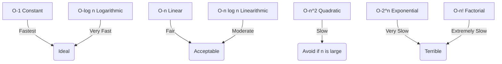

# Big-O Notation

## Learning Objectives
- Big-O Notation কী এবং কেন আমরা এটি ব্যবহার করি তা বোঝা।
- টাইম এবং স্পেস কমপ্লেক্সিটি (Time & Space Complexity) কিভাবে পরিমাপ করতে হয় তা জানা।
- সাধারণ Big-O কমপ্লেক্সিটিগুলোর (O(1), O(log n), O(n), O(n log n), O(n^2)) মধ্যে পার্থক্য এবং তুলনামূলক ধারণা লাভ।
- Best case, Average case এবং Worst case এনালাইসিসের পার্থক্য বুঝতে পারা।

## Core Concept
সফটওয়্যার ইঞ্জিনিয়ারিং-এ একটি অ্যালগরিদম কতটা "ভালো" বা "দ্রুত" তা শুধুমাত্র সেকেন্ড বা মিলি-সেকেন্ড দিয়ে মাপা যায় না। কারণ, একেক কম্পিউটারের স্পিড একেক রকম। তাই আমরা **Big-O Notation** ব্যবহার করি। 
Big-O Notation মূলত গাণিতিকভাবে প্রকাশ করে যে, ইনপুট সাইজ ($n$) বাড়ার সাথে সাথে একটি অ্যালগরিদমের রানটাইম (টাইম) বা মেমরি স্পেস (স্পেস) কীভাবে বৃদ্ধি পায়।

**অ্যানালজি (Analogy):** ধরুন আপনাকে আপনার বন্ধুর কাছে একটি 1TB মুভির হার্ডডিস্ক পাঠাতে হবে।
- **O(1) - Constant Time:** আপনি নিজে গাড়িতে করে হার্ডডিস্কটা বন্ধুর বাসায় দিয়ে আসলেন। হার্ডডিস্কের সাইজ 1TB হোক বা 100TB, আপনার যেতে একই সময় (ধরি ৩০ মিনিট) লাগবে।
- **O(n) - Linear Time:** আপনি ইন্টারনেটে ফাইলগুলো সেন্ড করছেন। 1TB সেন্ড করতে যে সময় লাগবে, 2TB সেন্ড করতে তার দ্বিগুণ সময় লাগবে। ইনপুট সাইজের সাথে সাথে সময় সমানুপাতিক হারে বাড়বে।

> **Interview/MCQ Angle:** ইন্টারভিউতে সরাসরি Big-O এর সংজ্ঞা জিজ্ঞেস করবে না। আপনাকে একটি কোড স্নাইপেট (loop-এর ভেতর loop) দিয়ে বলবে এর কমপ্লেক্সিটি কত। বিশেষ করে লুপের ইনক্রিমেন্ট যদি $i = i * 2$ হয়, তখন অনেকেই ভুল করে $O(n)$ বলে ফেলে, যদিও সেটা $O(\log n)$ হবে।

## Deep Dive / Gotchas

### ১. Constants Drop করা
Big-O হিসাব করার সময় কনস্ট্যান্ট ভ্যালু বা ছোট টার্মগুলো বাদ দিতে হয়। কারণ যখন $n$ এর মান কোটি কোটি হবে, তখন কনস্ট্যান্টগুলোর প্রভাব খুবই সামান্য থাকে।
- $O(2n + 5)$ কে লিখতে হবে $O(n)$
- $O(n^2 + 50n + 1000)$ কে লিখতে হবে $O(n^2)$

### ২. Worst-case, Best-case এবং Average-case
- **Best-case (Big-Omega, $\Omega$):** সবচেয়ে কম সময়। (যেমন: লিনিয়ার সার্চে প্রথম এলিমেন্টেই আইটেম পেয়ে যাওয়া)।
- **Average-case (Big-Theta, $\Theta$):** সাধারণ বা গড় সময়।
- **Worst-case (Big-O, $O$):** সবচেয়ে খারাপ অবস্থা। (যেমন: লিনিয়ার সার্চে আইটেমটি একদম শেষে থাকা)।

আমরা সাধারণত ইন্ডাস্ট্রিতে **Worst-case (Big-O)** নিয়েই বেশি মাথা ঘামাই, কারণ আমাদের জানতে হবে সিস্টেমটা সবচেয়ে খারাপ অবস্থায় কতটা স্লো হতে পারে।

> **Interview/MCQ Angle:** MCQ তে অনেক সময় "QuickSort এর worst-case টাইম কমপ্লেক্সিটি কত?" জিজ্ঞেস করা হয়। সবাই $O(n \log n)$ বলে ভুল করে, কিন্তু আসল উত্তর $O(n^2)$। Average case হলো $O(n \log n)$।

## Code Example(s)

```java
// O(1) - Constant Time
// ইনপুট অ্যারের সাইজ যাই হোক না কেন, প্রথম এলিমেন্ট রিটার্ন করতে একই সময় লাগবে।
int getFirstElement(int[] arr) {
    return arr[0];
}

// O(n) - Linear Time
// অ্যারের প্রতিটি এলিমেন্ট একবার করে ভিজিট করতে হবে। n বাড়লে সময়ও লিনিয়ারলি বাড়বে।
boolean linearSearch(int[] arr, int target) {
    for (int num : arr) {
        if (num == target) return true;
    }
    return false;
}

// O(n^2) - Quadratic Time
// Nested loop. প্রতিটি n এর জন্য ভেতরের লুপটিও n বার চলে। 
void printAllPairs(int[] arr) {
    for (int i : arr) {
        for (int j : arr) {
            System.out.println(i + ", " + j);
        }
    }
}

// O(log n) - Logarithmic Time
// প্রতি ধাপে ইনপুট সাইজ অর্ধেক হয়ে যায়।
boolean binarySearch(int[] arr, int target) {
    int left = 0, right = arr.length - 1;
    while (left <= right) {
        int mid = left + (right - left) / 2;
        if (arr[mid] == target) return true;
        else if (arr[mid] < target) left = mid + 1;
        else right = mid - 1;
    }
    return false;
}
```

## Diagram



## Quick Recap
- **Big-O** অ্যালগরিদমের worst-case রানিং টাইম এবং মেমরি স্পেস পরিমাপ করে।
- কমপ্লেক্সিটি হিসাবের সময় কনস্ট্যান্ট এবং ছোট টার্মগুলো ইগনোর করতে হয়।
- লুপের ভেতর লুপ থাকলে সাধারণত $O(n^2)$ হয়, আর প্রতি ধাপে ইনপুট অর্ধেক হলে $O(\log n)$ হয়।
- রিয়েল-ওয়ার্ল্ড সিস্টেম ডিজাইনে সব সময় worst-case এর জন্য অপ্টিমাইজ করা উচিত।

## Practice MCQs (20 Questions)

**Q1. Big-O notation প্রধানত কী প্রকাশ করে?**
A) একটি প্রোগ্রাম রান হতে কত সেকেন্ড সময় লাগবে
B) ইনপুট সাইজ বৃদ্ধির সাথে অ্যালগরিদমের টাইম বা স্পেস কীভাবে বৃদ্ধি পায়
C) মেমরিতে একটি প্রোগ্রাম ঠিক কত বাইট জায়গা নিবে
D) কোডের লাইন সংখ্যা

<details>
<summary>✅ Answer & Explanation</summary>

**Answer: B**

ব্যাখ্যা: Big-O গাণিতিকভাবে দেখায় যে ইনপুট $n$ বড় হওয়ার সাথে সাথে অ্যালগরিদমের গ্রোথ রেট (Growth rate) কেমন হবে। এটি কোনো নির্দিষ্ট সেকেন্ড বা মেমরি বাইট হিসাব করে না।
⚠️ Common trap: অনেকেই A অপশন বেছে নেন, কিন্তু কম্পিউটারের হার্ডওয়্যার অনুযায়ী সেকেন্ডের হিসাব ভিন্ন হতে পারে।
</details>

---

**Q2. নিচের কোন কমপ্লেক্সিটিটি সবচেয়ে ফাস্ট বা এফিশিয়েন্ট?**
A) $O(n)$
B) $O(\log n)$
C) $O(1)$
D) $O(n \log n)$

<details>
<summary>✅ Answer & Explanation</summary>

**Answer: C**

ব্যাখ্যা: $O(1)$ বা কনস্ট্যান্ট টাইম সবচেয়ে ফাস্ট, কারণ ইনপুট যতই বড় হোক না কেন, এর রানটাইম পরিবর্তন হয় না।
</details>

---

**Q3. একটি অ্যারের সব জোড় সংখ্যা (pairs) প্রিন্ট করতে হলে টাইম কমপ্লেক্সিটি কত হবে?**
A) $O(n)$
B) $O(n \log n)$
C) $O(n^2)$
D) $O(2^n)$

<details>
<summary>✅ Answer & Explanation</summary>

**Answer: C**

ব্যাখ্যা: সব জোড় প্রিন্ট করার জন্য দুইটি নেস্টেড লুপ (nested loops) চালাতে হয়। তাই $n \times n = O(n^2)$।
</details>

---

**Q4. $O(2n + 50)$ কে Big-O notation এ কীভাবে লেখা যায়?**
A) $O(2n)$
B) $O(n)$
C) $O(50)$
D) $O(n^2)$

<details>
<summary>✅ Answer & Explanation</summary>

**Answer: B**

ব্যাখ্যা: Big-O তে আমরা সবসময় কনস্ট্যান্ট ভ্যালু (যেমন 2 এবং 50) ইগনোর করি। তাই এটি হবে $O(n)$।
</details>

---

**Q5. Binary Search অ্যালগরিদমের worst-case টাইম কমপ্লেক্সিটি কত?**
A) $O(n)$
B) $O(\log n)$
C) $O(n \log n)$
D) $O(1)$

<details>
<summary>✅ Answer & Explanation</summary>

**Answer: B**

ব্যাখ্যা: Binary search প্রতি ধাপে ইনপুটকে অর্ধেক করে দেয়। তাই এর কমপ্লেক্সিটি $O(\log n)$।
</details>

---

**Q6. নিচের কোডের টাইম কমপ্লেক্সিটি কত?**
```java
for (int i = 0; i < n; i++) {
    for (int j = 0; j < 5; j++) {
        System.out.println(i + " " + j);
    }
}
```
A) $O(n)$
B) $O(n^2)$
C) $O(5n)$
D) $O(\log n)$

<details>
<summary>✅ Answer & Explanation</summary>

**Answer: A**

ব্যাখ্যা: ভেতরের লুপটি সবসময় ৫ বার চলে, যা একটি কনস্ট্যান্ট। তাই মোট রানটাইম $5 \times n$, যাকে Big-O তে $O(n)$ বলা হয়।
⚠️ Common trap: নেস্টেড লুপ দেখলেই অনেকেই $O(n^2)$ ভেবে নেন।
</details>

---

**Q7. Best case-কে গাণিতিকভাবে কোন নোটেশন দিয়ে প্রকাশ করা হয়?**
A) Big-O ($O$)
B) Big-Theta ($\Theta$)
C) Big-Omega ($\Omega$)
D) Little-o ($o$)

<details>
<summary>✅ Answer & Explanation</summary>

**Answer: C**

ব্যাখ্যা: Best case প্রকাশ করতে Big-Omega ($\Omega$) ব্যবহৃত হয়। Average case এর জন্য Big-Theta ($\Theta$) এবং Worst case এর জন্য Big-O ($O$) ব্যবহৃত হয়।
</details>

---

**Q8. নিচের কোডের টাইম কমপ্লেক্সিটি কত?**
```java
void example(int n) {
    int i = 1;
    while (i < n) {
        System.out.println(i);
        i = i * 2;
    }
}
```
A) $O(n)$
B) $O(n^2)$
C) $O(\log n)$
D) $O(1)$

<details>
<summary>✅ Answer & Explanation</summary>

**Answer: C**

ব্যাখ্যা: লুপ ভেরিয়েবল $i$ প্রতি ধাপে ২ গুণ করে বাড়ছে। তাই লুপটি মোট $\log_2 n$ বার চলবে।
</details>

---

**Q9. $O(n^2 + n \log n + 1000)$ এর প্রকৃত Big-O কত হবে?**
A) $O(n \log n)$
B) $O(n^2)$
C) $O(n^2 + n \log n)$
D) $O(n^3)$

<details>
<summary>✅ Answer & Explanation</summary>

**Answer: B**

ব্যাখ্যা: $n$ যখন অনেক বড় হবে, তখন $n^2$ এর মান $n \log n$ এবং $1000$ এর চেয়ে বহুগুণ বেশি হবে। Big-O তে আমরা শুধু সবচেয়ে বড় টার্মটি রাখি।
</details>

---

**Q10. একটি অ্যালগরিদম যদি প্রতিবার তার ইনপুট সাইজ এক-তৃতীয়াংশ (1/3) কমিয়ে ফেলে, তবে তার টাইম কমপ্লেক্সিটি কী হবে?**
A) $O(n)$
B) $O(n/3)$
C) $O(\log_3 n)$
D) $O(3n)$

<details>
<summary>✅ Answer & Explanation</summary>

**Answer: C**

ব্যাখ্যা: ইনপুট সাইজ যদি প্রতি ধাপে কোনো নির্দিষ্ট গুণিতক হারে কমে বা বাড়ে, তবে তার কমপ্লেক্সিটি লগারিদমিক (Logarithmic) হয়। এখানে বেইজ হবে 3। তবে Big-O তে বেইজ ইগনোর করে সাধারণভাবে $O(\log n)$ লেখা হয়।
</details>

---

**Q11. Space Complexity বলতে কী বোঝায়?**
A) কোড লেখার জন্য স্ক্রিনে কতটুকু জায়গা লাগে
B) প্রোগ্রাম রান হওয়ার সময় মেমোরিতে (RAM) সর্বোচ্চ কতটুকু জায়গা নেয়
C) কোডের ফাইল সাইজ কত মেগাবাইট
D) ডেটাবেসে কতটুকু জায়গা খরচ হবে

<details>
<summary>✅ Answer & Explanation</summary>

**Answer: B**

ব্যাখ্যা: Space complexity হলো একটি অ্যালগরিদম রান করার জন্য মেমোরিতে (অ্যালগরিদমের নিজস্ব ভেরিয়েবল, ডেটা স্ট্রাকচার এবং কল স্ট্যাকের জন্য) কতটুকু জায়গা প্রয়োজন হয় তার একটি পরিমাপ।
</details>

---

**Q12. নিচের কোডের স্পেস কমপ্লেক্সিটি কত?**
```java
ArrayList<Integer> createArray(int n) {
    ArrayList<Integer> arr = new ArrayList<>();
    for (int i = 0; i < n; i++) {
        arr.add(i);
    }
    return arr;
}
```
A) $O(1)$
B) $O(n)$
C) $O(n^2)$
D) $O(\log n)$

<details>
<summary>✅ Answer & Explanation</summary>

**Answer: B**

ব্যাখ্যা: কোডটি একটি নতুন অ্যারে তৈরি করছে এবং তাতে $n$ টি এলিমেন্ট যুক্ত করছে। তাই $n$ এর সাইজ অনুযায়ী মেমোরি প্রয়োজন হবে, যা $O(n)$।
</details>

---

**Q13. যদি দুটি ভিন্ন লুপ পরপর থাকে (নেস্টেড নয়), তবে টাইম কমপ্লেক্সিটি কেমন হবে?**
```java
for (int i = 0; i < n; i++) {
    System.out.println(i);
}
for (int j = 0; j < m; j++) {
    System.out.println(j);
}
```
A) $O(n \times m)$
B) $O(n^2)$
C) $O(n + m)$
D) $O(\max(n, m))$

<details>
<summary>✅ Answer & Explanation</summary>

**Answer: C**

ব্যাখ্যা: যেহেতু লুপ দুটি আলাদাভাবে এক্সিকিউট হচ্ছে, তাই তাদের রানটাইম যোগ হবে। অর্থাৎ $O(n + m)$। $n$ এবং $m$ যদি একই হয়, তবে $O(2n) = O(n)$ লেখা যায়।
</details>

---

**Q14. রিকার্সন (Recursion) এর স্পেস কমপ্লেক্সিটি হিসাব করার সময় কোনটি বিবেচনা করা গুরুত্বপূর্ণ?**
A) ইনপুট অ্যারের সাইজ
B) Call stack এর সর্বোচ্চ গভীরতা (Depth)
C) রিকার্সিভ ফাংশনের নামের দৈর্ঘ্য
D) রিটার্ন ভ্যালুর সাইজ

<details>
<summary>✅ Answer & Explanation</summary>

**Answer: B**

ব্যাখ্যা: রিকার্সনের ক্ষেত্রে প্রতিটি ফাংশন কলের জন্য মেমোরিতে একটি করে স্ট্যাক ফ্রেম (stack frame) তৈরি হয়। তাই call stack এর depth-ই মূলত স্পেস কমপ্লেক্সিটি নির্ধারণ করে।
</details>

---

**Q15. QuickSort এর worst-case টাইম কমপ্লেক্সিটি কত?**
A) $O(n)$
B) $O(n \log n)$
C) $O(n^2)$
D) $O(\log n)$

<details>
<summary>✅ Answer & Explanation</summary>

**Answer: C**

ব্যাখ্যা: QuickSort এর average case $O(n \log n)$ হলেও, worst case-এ (যেমন: অ্যারেটি যদি আগে থেকেই সর্ট করা থাকে এবং পিভট সিলেকশন খারাপ হয়) টাইম কমপ্লেক্সিটি $O(n^2)$ হয়।
⚠️ Common trap: অনেকেই QuickSort শুনলেই $O(n \log n)$ টিক দেন।
</details>

---

**Q16. Fibonacci সিরিজের সাধারণ রিকার্সিভ ইমপ্লিমেন্টেশনের (DP ছাড়া) টাইম কমপ্লেক্সিটি কত?**
A) $O(n)$
B) $O(n^2)$
C) $O(2^n)$
D) $O(n!)$

<details>
<summary>✅ Answer & Explanation</summary>

**Answer: C**

ব্যাখ্যা: সাধারণ রিকার্সিভ ফাংশন প্রতি ধাপে নিজেকে ২ বার কল করে ($fib(n-1)$ এবং $fib(n-2)$)। তাই এটি একটি ট্রি (tree) তৈরি করে যার নোড সংখ্যা এক্সপোনেনশিয়াল হারে বাড়ে, অর্থাৎ $O(2^n)$।
</details>

---

**Q17. একটি হ্যাশ টেবিলে (Hash Table) আইডিয়াল বা এভারেজ টাইম কমপ্লেক্সিটি (সার্চ বা ইনসার্ট) কত?**
A) $O(n)$
B) $O(\log n)$
C) $O(1)$
D) $O(n^2)$

<details>
<summary>✅ Answer & Explanation</summary>

**Answer: C**

ব্যাখ্যা: আইডিয়াল হ্যাশ ফাংশনের ক্ষেত্রে হ্যাশ টেবিলের অপারেশনগুলো $O(1)$ বা কনস্ট্যান্ট টাইমে সম্পন্ন হয়।
</details>

---

**Q18. নিচের কোডের টাইম কমপ্লেক্সিটি কত?**
```java
void mystery(int n) {
    for (int i = 0; i < n; i++) {
        int j = 1;
        while (j < n) {
            System.out.println(i + " " + j);
            j = j * 2;
        }
    }
}
```
A) $O(n)$
B) $O(n^2)$
C) $O(n \log n)$
D) $O(\log n)$

<details>
<summary>✅ Answer & Explanation</summary>

**Answer: C**

ব্যাখ্যা: বাইরের লুপটি $n$ বার চলছে। ভেতরের লুপটিতে $j$ ২ গুণ করে বাড়ছে, তাই সেটি $\log n$ বার চলবে। উভয়ে নেস্টেড হওয়ায় গুণফল হবে $O(n \log n)$।
</details>

---

**Q19. যদি আমরা একটি ডাটাবেস কোয়েরিতে এমন একটি কলাম ধরে সার্চ করি যাতে কোনো ইনডেক্সিং (indexing) করা নেই, তবে এর টাইম কমপ্লেক্সিটি কী হবে?**
A) $O(1)$
B) $O(\log n)$
C) $O(n)$
D) $O(n^2)$

<details>
<summary>✅ Answer & Explanation</summary>

**Answer: C**

ব্যাখ্যা: ইনডেক্স না থাকলে ডেটাবেসকে বাধ্য হয়ে লিনিয়ার সার্চ (Full Table Scan) করতে হয়। তাই টাইম কমপ্লেক্সিটি হবে $O(n)$।
</details>

---

**Q20. [Tricky] একটি অ্যালগরিদমের স্পেস কমপ্লেক্সিটি $O(1)$ মানে কী?**
A) অ্যালগরিদমটি কোনো মেমোরি ব্যবহার করবে না
B) এটি মেমোরিতে মাত্র ১ বাইট জায়গা নিবে
C) ইনপুট সাইজ যতই বড় হোক, এর জন্য অতিরিক্ত মেমোরির প্রয়োজন একটি নির্দিষ্ট সীমার মধ্যেই থাকবে
D) অ্যালগরিদমটি রান হতে ১ সেকেন্ড সময় লাগবে

<details>
<summary>✅ Answer & Explanation</summary>

**Answer: C**

ব্যাখ্যা: $O(1)$ বা কনস্ট্যান্ট স্পেস কমপ্লেক্সিটি মানে ইনপুট সাইজ ($n$) এর সাথে অ্যালগরিদমের মেমোরি কনজাম্পশন বাড়ে না। মেমোরি লাগতে পারে, কিন্তু তা ইনপুটের উপর নির্ভরশীল নয়।
</details>
