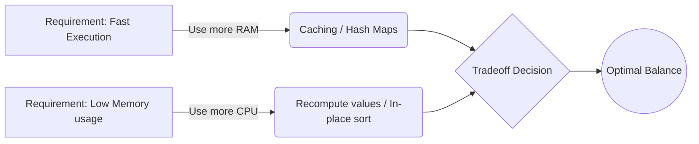

# Time-Space Tradeoffs

## Learning Objectives
- Time-Space Tradeoff এর মূল ধারণাটি পরিষ্কারভাবে বোঝা।
- কেন আমরা কখনো মেমোরি খরচ করে প্রোগ্রাম ফাস্ট করি, আবার কখনো মেমোরি বাঁচানোর জন্য প্রোগ্রাম স্লো করি।
- রিয়েল-ওয়ার্ল্ড ইঞ্জিনিয়ারিংয়ে এবং ইন্টারভিউতে এই ট্রেডঅফের ব্যবহার।
- Caching, Hashing এবং In-place vs Out-of-place অ্যালগরিদমের পার্থক্য।

## Core Concept
সফটওয়্যার ইঞ্জিনিয়ারিংয়ে **Time-Space Tradeoff** (বা Space-Time Tradeoff) বলতে বোঝায় এমন একটি পরিস্থিতি যেখানে আপনি রানটাইম (Time) কমানোর জন্য মেমোরি (Space) বেশি ব্যবহার করেন, অথবা মেমোরি বাঁচানোর জন্য রানটাইম বেশি নিতে বাধ্য হন। 

রিয়েল লাইফে আমাদের কম্পিউটারগুলোর স্পিড (CPU) এবং মেমোরি (RAM) দুটোই লিমিটেড। তাই সিস্টেম ডিজাইন করার সময় আমাদের ঠিক করতে হয় আমরা কোনটি স্যাক্রিফাইস করব।

**অ্যানালজি (Analogy):** ধরুন আপনি অনেকগুলো বইয়ের নাম মনে রাখতে চান।
- **Time Optimize (Space বেশি লাগবে):** আপনি সব বইয়ের নাম একটি খাতায় লিখে রাখলেন। যখনই নাম দরকার, খাতা খুলে সাথে সাথে দেখে নিলেন। (খাতা = মেমোরি/Space, দ্রুত দেখা = Time বাঁচে)। 
- **Space Optimize (Time বেশি লাগবে):** আপনি কোনো খাতায় লিখলেন না, শুধু মনে করার চেষ্টা করলেন বা প্রতিবার লাইব্রেরিতে গিয়ে চেক করে আসলেন। (খাতা লাগলো না = Space বাঁচলো, কিন্তু সময় লাগলো বেশি = Time নষ্ট)।

> **Interview/MCQ Angle:** "How can you optimize this algorithm from $O(n^2)$ to $O(n)$?" ইন্টারভিউতে এই প্রশ্ন করা হলে, প্রথম চিন্তাই হওয়া উচিত—"আমি কি একটি Hash Map বা Array ব্যবহার করে ডেটা স্টোর (Cache/Memoize) করতে পারি?" অর্থাৎ, স্পেস দিয়ে টাইম কেনা।

## Deep Dive / Gotchas

### ১. Caching & Memoization (Trading Space for Time)
Dynamic Programming (DP) এর সবচেয়ে বড় কনসেপ্ট হলো মেমোইজেশন। এখানে আমরা আগে হিসাব করা রেজাল্টগুলো একটি মেমোরিতে (যেমন ডিকশনারি বা অ্যারে) সেভ করে রাখি যাতে একই হিসাব বারবার করতে না হয়। এতে টাইম কমপ্লেক্সিটি এক্সপোনেনশিয়াল $O(2^n)$ থেকে লিনিয়ার $O(n)$ এ নেমে আসে, কিন্তু স্পেস কমপ্লেক্সিটি বাড়ে।

### ২. In-place vs Out-of-place Algorithms (Trading Time for Space)
কখনো কখনো আমাদের কাছে মেমোরি থাকে না (যেমন এমবেডেড সিস্টেমস)। তখন ইনপুট ডেটাকে কোনো নতুন মেমোরি অ্যালোকেট না করে পরিবর্তন করা হয়।
- **In-place:** কোনো অতিরিক্ত স্পেস নেয় না, $O(1)$ Space। (যেমন: Bubble Sort, Quick Sort)।
- **Out-of-place:** নতুন করে মেমোরি নেয়, $O(n)$ Space। (যেমন: Merge Sort)। Merge Sort ফাস্ট হলেও এর জন্য অতিরিক্ত মেমোরি লাগে।

### ৩. Lookup Tables (Hash Maps)
অ্যারেতে একটি ডেটা খুঁজতে $O(n)$ সময় লাগে, কিন্তু একটি Hash Map বা Dictionary ব্যবহার করলে আমরা তা $O(1)$ টাইমে পেয়ে যাই। এর জন্য Hash Map কে মেমোরিতে অতিরিক্ত জায়গা নিতে হয়।

## Code Example(s)

```java
// 1. Space Optimized, Time Heavy (No extra space)
// Fibonacci without Memoization
// Time: O(2^n), Space: O(n) due to recursion stack
int fibNaive(int n) {
    if (n <= 1) return n;
    return fibNaive(n - 1) + fibNaive(n - 2);
}

// 2. Time Optimized, Space Heavy
// Fibonacci with Memoization (Hash Map / Cache)
// Time: O(n), Space: O(n) for the dictionary + recursion stack
int fibMemoized(int n, HashMap<Integer, Integer> cache) {
    if (cache == null) cache = new HashMap<>();
    if (cache.containsKey(n)) return cache.get(n);
    if (n <= 1) return n;
    
    // Saving result in cache before returning
    int result = fibMemoized(n - 1, cache) + fibMemoized(n - 2, cache);
    cache.put(n, result);
    return result;
}
```

> **Note:** উপরের `fibMemoized` ফাংশনটি Space (ডিকশনারি) ব্যবহার করে Time বাঁচিয়েছে। এটিই Time-Space Tradeoff এর সবচেয়ে ক্লাসিক উদাহরণ।

## Diagram



## Quick Recap
- **Space-Time Tradeoff** হলো রানটাইম এবং মেমোরির মধ্যে একটি ব্যালেন্স করা।
- অতিরিক্ত স্পেস (RAM) ব্যবহার করে আমরা ডেটা ক্যাশ (Cache) করতে পারি, ফলে স্পিড (CPU) বাড়ে।
- মেমোরি কম থাকলে আমরা ক্যাশ না করে ভ্যালুগুলো রি-কম্পিউট করি বা ইন-প্লেস অপারেশন করি, এতে স্পিড কমে।
- ইন্টারভিউতে টাইম অপটিমাইজ করার সবচেয়ে কমন টেকনিক হলো Hash Map/Set ব্যবহার করা।

## Practice MCQs (20 Questions)

**Q1. Time-Space Tradeoff বলতে কী বোঝায়?**
A) একটি প্রোগ্রাম কত দ্রুত রান হয় এবং কত স্পেস নেয় তার যোগফল
B) মেমোরি ব্যবহারের বিনিময়ে এক্সিকিউশন টাইম কমানো, বা এর বিপরীত
C) সব সময় মেমোরি এবং টাইম দুটিই কমিয়ে আনা
D) সিপিইউ (CPU) এবং জিপিইউ (GPU) এর মধ্যে ব্যালেন্স করা

<details>
<summary>✅ Answer & Explanation</summary>

**Answer: B**

ব্যাখ্যা: Tradeoff মানেই একটির বিনিময়ে অন্যটি। টাইম কমাতে স্পেস বাড়ানো হয়, বা স্পেস বাঁচাতে টাইম বাড়ানো হয়।
</details>

---

**Q2. Dynamic Programming-এ 'Memoization' কোন ট্রেডঅফের উদাহরণ?**
A) Trading space for time
B) Trading time for space
C) Trading accuracy for speed
D) Trading security for time

<details>
<summary>✅ Answer & Explanation</summary>

**Answer: A**

ব্যাখ্যা: Memoization এ আগে হিসাব করা ফলাফলগুলো একটি ডেটা স্ট্রাকচারে (যেমন: অ্যারে বা ম্যাপে) জমা রাখা হয় (Space বাড়ে), যাতে পরবর্তীতে হিসাবটি আবার করতে না হয় (Time কমে)।
</details>

---

**Q3. নিচের কোন সর্টিং অ্যালগরিদমটি ইন-প্লেস (In-place) নয়, অর্থাৎ স্পেস-টাইম ট্রেডঅফে স্পেস স্যাক্রিফাইস করে ফাস্ট হতে চায়?**
A) Bubble Sort
B) Insertion Sort
C) Merge Sort
D) Selection Sort

<details>
<summary>✅ Answer & Explanation</summary>

**Answer: C**

ব্যাখ্যা: Merge Sort এ দুটো অর্ধেক অ্যারেকে মার্জ করার সময় অতিরিক্ত $O(n)$ স্পেস লাগে, কিন্তু এটি অনেক ফাস্ট ($O(n \log n)$) কাজ করে। বাকিগুলো ইন-প্লেস ($O(1)$ স্পেস)।
</details>

---

**Q4. একটি অ্যারে থেকে কোনো নির্দিষ্ট ভ্যালু লিনিয়ার সার্চ করে পেতে $O(n)$ সময় লাগে। এটিকে $O(1)$ টাইমে নামিয়ে আনতে হলে নিচের কোনটি সবচেয়ে ভালো উপায়?**
A) অ্যারেটিকে সর্ট করা
B) Hash Table বা Set ব্যবহার করা
C) অ্যারেটিকে রিভার্স করা
D) রিকার্সন ব্যবহার করা

<details>
<summary>✅ Answer & Explanation</summary>

**Answer: B**

ব্যাখ্যা: Hash Table/Set ডেটা স্টোর করতে অতিরিক্ত মেমোরি নিলেও, এদের লুকআপ (Lookup) টাইম গড়ে $O(1)$। এটি একটি ট্রেডঅফ।
</details>

---

**Q5. ক্যাশিং (Caching) সিস্টেম ডিজাইনের ক্ষেত্রে কোন ট্রেডঅফের ক্লাসিক উদাহরণ?**
A) Trading time for space
B) Trading space for time
C) Trading bandwidth for storage
D) Trading CPU for Network I/O

<details>
<summary>✅ Answer & Explanation</summary>

**Answer: B**

ব্যাখ্যা: ক্যাশিং এর মূল উদ্দেশ্যই হলো ডেটাબેস বা স্লো নেটওয়ার্ক কল থেকে বাঁচার জন্য মেমোরিতে (RAM) ডেটা স্টোর করে রাখা, যাতে খুব দ্রুত সার্ভ করা যায়।
</details>

---

**Q6. ইন-প্লেস (In-place) অ্যালগরিদমের স্পেস কমপ্লেক্সিটি সাধারণত কত হয়?**
A) $O(n)$
B) $O(\log n)$
C) $O(1)$
D) $O(n^2)$

<details>
<summary>✅ Answer & Explanation</summary>

**Answer: C**

ব্যাখ্যা: ইন-প্লেস অ্যালগরিদমগুলো ইনপুট ডেটার সাইজের উপর নির্ভর করে অতিরিক্ত স্পেস নেয় না। কিছু পয়েন্টার বা টেম্পোরারি ভ্যালুর জন্য শুধু $O(1)$ স্পেস নেয়।
</details>

---

**Q7. একটি এমবেডেড সিস্টেম (যেমন: স্মার্ট ওয়াচ) যেখানে মেমোরি খুবই সীমিত, সেখানে অ্যালগরিদম ডিজাইনের সময় কোনটিকে প্রাধান্য দেওয়া হয়?**
A) Time Complexity
B) Space Complexity
C) Code Readability
D) Network Latency

<details>
<summary>✅ Answer & Explanation</summary>

**Answer: B**

ব্যাখ্যা: যেহেতু RAM খুব লিমিটেড, তাই আমাদের এমন অ্যালগরিদম লিখতে হবে যা সবচেয়ে কম স্পেস ব্যবহার করে, এমনকি এর জন্য রানটাইম একটু বেশি হলেও সমস্যা নেই। (Trading Time for Space).
</details>

---

**Q8. একটি 2D অ্যারে বা ম্যাট্রিক্সে কোনো স্পার্স (Sparse) ডেটা (যার বেশিরভাগ সেল-এ 0 আছে) সেভ করার সময় স্পেস বাঁচাতে কী ব্যবহার করা ভালো?**
A) 일반 2D Array
B) Hash Map (কী হিসেবে কো-অর্ডিনেট)
C) 3D Array
D) Stack

<details>
<summary>✅ Answer & Explanation</summary>

**Answer: B**

ব্যাখ্যা: স্পার্স ম্যাট্রিক্সে শুধু নন-জিরো ভ্যালুগুলো একটি Hash Map এ (row, col) কী-পেয়ার হিসেবে রাখলে অনেক মেমোরি বেঁচে যায়। সাধারণ 2D array সবগুলো 0 স্টোর করার জন্য অনেক অপ্রয়োজনীয় মেমোরি দখল করে।
</details>

---

**Q9. [Tricky] আপনি একটি অ্যারেতে ডুপ্লিকেট এলিমেন্ট খুঁজতে চান। আপনার પાસે $O(1)$ স্পেসের বাধ্যবাধকতা আছে। নিচের কোন টেকনিকটি কাজ করবে (অ্যারের ডেটা মডিফাই করা গেলে)?**
A) Hash Set ব্যবহার করে চেক করা
B) পুরো অ্যারেকে কপি করা
C) অ্যারেকে সর্ট করে পরপর দুটো এলিমেন্ট চেক করা
D) রিকার্সন ব্যবহার করা

<details>
<summary>✅ Answer & Explanation</summary>

**Answer: C**

ব্যাখ্যা: Hash Set ব্যবহার করলে $O(n)$ স্পেস লাগবে। কিন্তু ইন-প্লেস সর্টিং (যেমন Heapsort) ব্যবহার করলে $O(1)$ স্পেসেই সর্ট করা যায়। এরপর লুপ চালিয়ে পাশাপাশি এলিমেন্ট চেক করলেই ডুপ্লিকেট পাওয়া যাবে। এখানে আমরা Time ($O(n \log n)$) স্যাক্রিফাইস করে Space বাঁচালাম।
</details>

---

**Q10. "Lookup Table" (লুকআপ টেবিল) বলতে কী বোঝায়?**
A) একটি টেবিল যেখানে ডেটাবেস এর রিলেশন থাকে
B) রানটাইম হিসাব বাঁচানোর জন্য আগে থেকে ক্যালকুলেট করা ভ্যালুগুলো একটি অ্যারে বা ম্যাপে স্টোর করে রাখা
C) একটি বিশেষ ধরনের ট্রি (Tree) ডেটা স্ট্রাকচার
D) ওএস (OS) এর ফাইল সিস্টেম টেবিল

<details>
<summary>✅ Answer & Explanation</summary>

**Answer: B**

ব্যাখ্যা: লুকআপ টেবিল হলো প্রি-কম্পিউটেড (Pre-computed) ভ্যালুর একটি কালেকশন। রানটাইমে জটিল হিসাব না করে সরাসরি টেবিল থেকে মান পড়া হয়। এটি Time বাঁচায়, Space খরচ করে।
</details>

---

**Q11. নিচের কোনটি "Trading Space for Time" এর উদাহরণ নয়?**
A) Memoization
B) Indexing in a Database
C) In-place QuickSort
D) Browser Cache

<details>
<summary>✅ Answer & Explanation</summary>

**Answer: C**

ব্যাখ্যা: In-place QuickSort কোনো অতিরিক্ত স্পেস নেয় না। এটি বরং স্পেস বাঁচানোর একটি টেকনিক। বাকিগুলো সবই এক্সট্রা স্পেস ব্যবহার করে পারফরম্যান্স বাড়ায়।
</details>

---

**Q12. ডেটাবেসে ইনডেক্সিং (Indexing) করার মূল কারণ কী?**
A) ডেটাবেস ফাইলের সাইজ কমানো
B) সিকিউরিটি বৃদ্ধি করা
C) সার্চ অপারেশন দ্রুত করা, যদিও এর জন্য অতিরিক্ত স্টোরেজ স্পেস প্রয়োজন হয়
D) টেবিলগুলোকে নরমালাইজ করা

<details>
<summary>✅ Answer & Explanation</summary>

**Answer: C**

ব্যাখ্যা: ইনডেক্সিং হলো ডেটাবেসের ট্রেডঅফ। এটি একটি আলাদা ডেটা স্ট্রাকচার (যেমন B-Tree) তৈরি করে ডিস্কে স্পেস খরচ করে, কিন্তু সার্চ কোয়েরি অনেক ফাস্ট করে দেয়।
</details>

---

**Q13. ব্রাউজার ক্যাশিং এ কোন ধরনের ট্রেডঅফ ঘটে?**
A) Storage Space এর বিনিময়ে Network Request Time কমানো
B) CPU Time এর বিনিময়ে Memory কমানো
C) Network Bandwidth এর বিনিময়ে CPU Time বাড়ানো
D) Security এর বিনিময়ে Space কমানো

<details>
<summary>✅ Answer & Explanation</summary>

**Answer: A**

ব্যাখ্যা: ব্রাউজার ইমেজ, সিএসএস (CSS) ইত্যাদি লোকাল হার্ডড্রাইভে (Space) সেভ করে রাখে যাতে পরবর্তীতে নেটওয়ার্ক কল করে সেগুলো আবার আনতে না হয় এবং ওয়েবসাইট দ্রুত (Time) লোড হয়।
</details>

---

**Q14. যদি কোনো অ্যালগরিদমে বারবার একই কাজ করতে হয় এবং সেই কাজের আউটপুট সবসময় একই থাকে, তবে অপটিমাইজেশনের জন্য বেস্ট অ্যাপ্রোচ কী?**
A) ইন-প্লেস সর্টিং
B) মাল্টিথ্রেডিং
C) ক্যাশিং বা মেমোইজেশন
D) রিকার্সন

<details>
<summary>✅ Answer & Explanation</summary>

**Answer: C**

ব্যাখ্যা: একই ইনপুটের জন্য একই আউটপুট দিলে (Pure functions), তাকে ক্যাশ করে রাখা সবচেয়ে বুদ্ধিমানের কাজ।
</details>

---

**Q15. একটি টেক্সট ফাইল কমপ্রেস (Zip) করে হার্ডডিস্কে রাখা হলো। এটি কিসের উদাহরণ?**
A) Trading Time for Space
B) Trading Space for Time
C) Both Time and Space optimized
D) None of the above

<details>
<summary>✅ Answer & Explanation</summary>

**Answer: A**

ব্যাখ্যা: ফাইলটি জিপ (Zip) করার ফলে হার্ডডিস্কের জায়গা (Space) বাঁচলো, কিন্তু যখনই ফাইলটি পড়তে হবে, তখন আনজিপ (Unzip) করতে CPU এর এক্সট্রা টাইম খরচ হবে।
</details>

---

**Q16. [Applied] আপনি একটি ওয়েবসাইটের ব্যাকএন্ড বানিয়েছেন যেখানে ইউজার প্রোফাইল ডাটাবেস থেকে ফেচ হতে ২ সেকেন্ড লাগে। আপনি Redis ব্যবহার করে রেসপন্স টাইম ২০ মিলি-সেকেন্ডে নিয়ে আসলেন। আপনি এখানে কী করলেন?**
A) Time Complexity কমালেন Space এর বিনিময়ে
B) ডাটাবেস নরমালাইজ করলেন
C) ইন-প্লেস অ্যালগরিদম ব্যবহার করলেন
D) Trading Space for Time

<details>
<summary>✅ Answer & Explanation</summary>

**Answer: D**

ব্যাখ্যা: Redis একটি ইন-মেমোরি ডেটাবেস। আপনি RAM (Space) ব্যবহার করে ডেটাবেসের স্লো ডিস্ক I/O কে বাইপাস করে রেসপন্স টাইম (Time) বাঁচিয়েছেন।
</details>

---

**Q17. নিচের কোনটি Time Complexity কমালেও Space Complexity বাড়িয়ে দেয়?**
A) Loop Unrolling
B) Using Hash Map for duplicate detection instead of nested loops
C) Bitwise Operations
D) Tail Call Optimization

<details>
<summary>✅ Answer & Explanation</summary>

**Answer: B**

ব্যাখ্যা: Nested loops ব্যবহার করলে স্পেস লাগে না ($O(1)$) কিন্তু টাইম লাগে $O(n^2)$। Hash map ব্যবহার করলে টাইম কমে $O(n)$ হয়, কিন্তু স্পেস বেড়ে $O(n)$ হয়।
</details>

---

**Q18. অ্যালগরিদম ডিজাইনে "Space-Time Tradeoff" এর মূল চ্যালেঞ্জ কী?**
A) দুটিই একসাথে কমানো অসম্ভব
B) মেমোরি সবসময় সস্তা হয় না
C) ইউজাররা স্পেসের চেয়ে স্পিড বেশি পছন্দ করে
D) সঠিক ব্যালেন্স খুঁজে বের করা যা প্রজেক্টের রিকোয়ারমেন্টের সাথে মিলে

<details>
<summary>✅ Answer & Explanation</summary>

**Answer: D**

ব্যাখ্যা: ইঞ্জিনিয়ারিংয়ে কোনো 'Perfect' সলিউশন নেই। প্রজেক্টের রিকোয়ারমেন্ট অনুযায়ী বুঝতে হয় যে মেমোরি বাঁচানো জরুরি নাকি রেসপন্স টাইম ফাস্ট করা জরুরি।
</details>

---

**Q19. $O(n!)$ টাইম কমপ্লেক্সিটিকে কি ট্রেডঅফ করে $O(1)$ করা সম্ভব?**
A) হ্যাঁ, মেমোইজেশন দিয়ে
B) না, এটি অ্যালগরিদমের মৌলিক নেচার
C) হ্যাঁ, যদি হ্যাশ ম্যাপ ব্যবহার করা হয়
D) হ্যাঁ, ইনডেক্সিং করে

<details>
<summary>✅ Answer & Explanation</summary>

**Answer: B**

ব্যাখ্যা: কিছু প্রবলেম (যেমন: Traveling Salesman Problem এর brute force) এর নেচারই এক্সপোনেনশিয়াল বা ফ্যাক্টরিয়াল। মেমোরি ব্যবহার করে হয়তো কিছুটা অপটিমাইজ (যেমন DP দিয়ে $O(n^2 2^n)$) করা যায়, কিন্তু $O(1)$ বা লিনিয়ার টাইমে আনা সম্ভব নয়।
</details>

---

**Q20. [Gotcha] মেমোইজেশন কি সবসময় রানিং টাইম কমায়?**
A) হ্যাঁ, সবসময়
B) না, যদি ক্যাশ মিস (Cache Miss) বেশি হয় এবং মেমোরি ওভারহেড বাড়ে
C) না, কারণ হ্যাশ ম্যাপ স্লো
D) হ্যাঁ, শুধুমাত্র পাইথনে

<details>
<summary>✅ Answer & Explanation</summary>

**Answer: B**

ব্যাখ্যা: ক্যাশ তৈরি করা এবং রিড/রাইট করার নিজস্ব একটি ওভারহেড আছে। যদি ডেটা বারবার রিপিট না হয় (Cache Miss), তাহলে মেমোইজেশন লাভের চেয়ে ক্ষতিই বেশি করতে পারে, কারণ তখন অকারণে মেমোরি দখল হবে এবং স্পিড কমবে।
</details>
