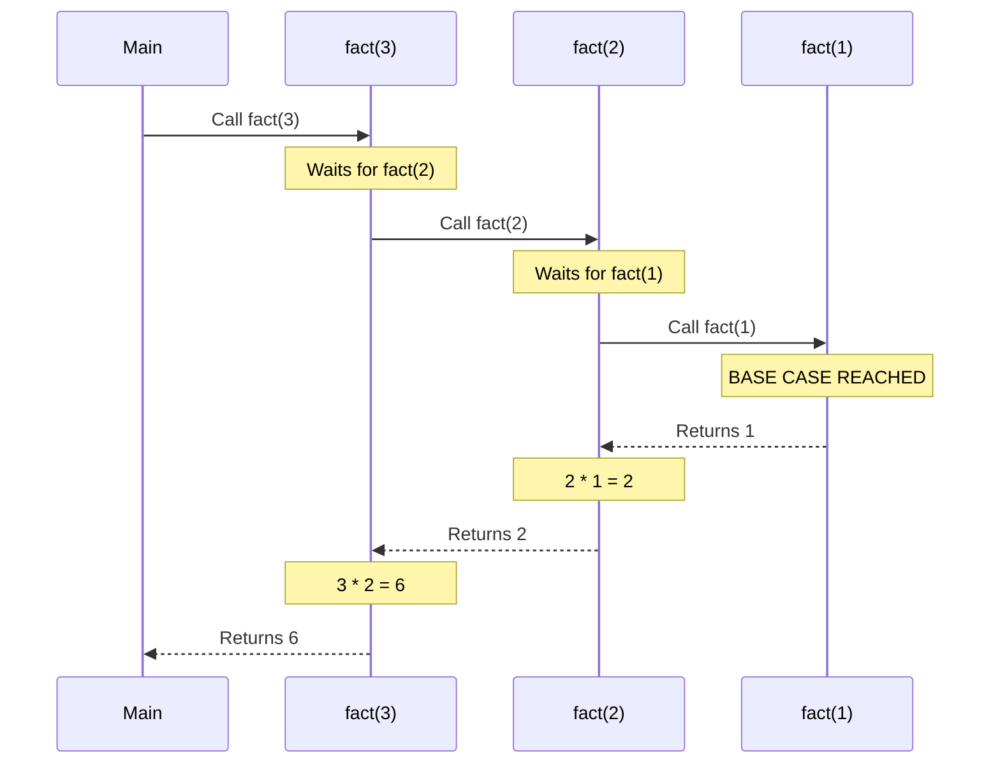

# 01. Recursion Basics (Knowledge & Theory)

## Learning Objectives
- Recursion (রিকার্সন) কী এবং এটি কীভাবে কাজ করে তা ক্লিয়ার করা।
- **Base Case** এবং **Recursive Case** এর পার্থক্য ও গুরুত্ব বোঝা।
- মেমোরিতে (Call Stack) রিকার্সন কীভাবে স্টোর হয় তা ভিজ্যুয়ালাইজ করা।
- **Tail Recursion** কী এবং কেন এটি সাধারণ রিকার্সনের চেয়ে ফাস্ট তা জানা।

---

## 1. What is Recursion?
Recursion হলো এমন একটি প্রসেস যেখানে একটি ফাংশন সরাসরি বা পরোক্ষভাবে নিজেকেই (Itself) কল করে, যতক্ষণ না একটি নির্দিষ্ট শর্ত পূরণ হয়।
সহজ কথায়, একটি বড় কাজকে ছোট ছোট একই রকম কাজে ভাগ করে ফেলা।

**রিয়েল ওয়ার্ল্ড অ্যানালজি:**
ধরা যাক, আপনি একটি সিনেমা হলে বসে আছেন এবং জানতে চান আপনি কত নম্বর সারিতে (Row) বসে আছেন। আপনি আপনার সামনের জনকে জিজ্ঞেস করলেন, "ভাই, আমরা কত নম্বর সারিতে আছি?" সেও জানে না, তাই সে তার সামনের জনকে জিজ্ঞেস করলো। এভাবে একদম প্রথম সারির মানুষ পর্যন্ত গেল। প্রথম সারির মানুষটি বললো "আমি ১ নম্বর সারিতে আছি"। তারপর দ্বিতীয় জন বললো "আমি ১+১ = ২ নম্বর", তৃতীয় জন বললো "আমি ২+১ = ৩ নম্বর"... এভাবে পেছনের দিকে আপনার কাছে উত্তর চলে এলো! 
এটিই রিকার্সন!

---

## 2. The Two Parts of Recursion
রিকার্সন ফাংশনে সবসময় দুটি অংশ থাকতে হয়। একটি মিস হলে প্রোগ্রাম ক্র্যাশ করবে।

### A. Base Case (থামার জায়গা)
যেখানে গিয়ে ফাংশন নিজেকে আর কল করবে না, বরং একটি ভ্যালু রিটার্ন করে পেছনের দিকে ফেরা শুরু করবে। (যেমন: সিনেমা হলের প্রথম সারির মানুষ)। Base Case না থাকলে ফাংশনটি ইনফিনিট লুপে পড়ে `StackOverflowError` দিবে।

### B. Recursive Case / Relation
যেখানে ফাংশনটি নিজেকে কল করে এবং প্রবলেমের সাইজ ছোট করে দেয়। (যেমন: `n` থেকে `n-1` এ যাওয়া)।

---

## 3. How Recursion uses Memory (Call Stack)
রিকার্সন কোনো যাদু নয়, এটি ইন্টার্নালি **Stack (Last In First Out)** মেমোরি ব্যবহার করে কাজ করে। যাকে বলা হয় **Call Stack**।

যখন একটি ফাংশন নিজেকে কল করে, তখন কারেন্ট ফাংশনের স্টেট (ভেরিয়েবল, ডেটা) মেমোরিতে পজ (Pause) অবস্থায় স্ট্যাকে জমা হয়। যখন Base Case হিট করে, তখন স্ট্যাকের একদম ওপরের ফাংশনটি (যেটা সবার শেষে কল হয়েছিল) এক্সিকিউট হওয়া শেষ করে এবং পপ (Pop) হয়ে যায়। তারপর তার নিচেরটা, তারপর তার নিচেরটা... এভাবে রুট ফাংশনে ফিরে আসে।

---

## 4. Tail Recursion (The Optimized Recursion)
রিকার্সনের সবচেয়ে বড় সমস্যা হলো এটি প্রচুর মেমোরি (Call Stack) খায়। কিন্তু যদি রিকার্সন কলটি ফাংশনের **একদম শেষ কাজ** হয় (অর্থাৎ রিকার্সন থেকে ফিরে আসার পর আর কোনো যোগ-বিয়োগের কাজ বাকি না থাকে), তখন তাকে **Tail Recursion** বলে। 

- **সুবিধা:** অনেক আধুনিক কম্পাইলার (যেমন C++, Scala) Tail Recursion কে অপ্টিমাইজ করে নরমাল `while` লুপে কনভার্ট করে ফেলে। ফলে কোনো এক্সট্রা Call Stack তৈরি হয় না! মেমোরি কমপ্লেক্সিটি $O(n)$ থেকে $O(1)$ হয়ে যায়।
- **দুঃখের বিষয়:** Java এবং Python বাই ডিফল্ট Tail Recursion অপ্টিমাইজ করে না (JVM এর কিছু সিকিউরিটি ও স্ট্যাক-ট্রেস রিজন আছে)। তবে কনসেপ্টটি ইন্টারভিউয়ের জন্য খুবই ইম্পর্ট্যান্ট।

---

## Diagrams

### 1. The Call Stack Visualization (Factorial 3)
কোড: `fact(n) = n * fact(n-1)`

*ডায়াগ্রামে দেখা যাচ্ছে কীভাবে ফাংশনগুলো অপেক্ষা (Wait) করছে এবং Base Case থেকে রেজাল্ট ব্যাক (Return) করছে।*

---

## 💡 Interview / MCQ Angle
1. **"What happens if there is no base case?"** 
   উত্তর: মেমোরিতে (Call Stack) ফাংশন জমা হতে হতে একসময় মেমোরি ফুল হয়ে যাবে এবং প্রোগ্রাম `StackOverflowError` দিয়ে ক্র্যাশ করবে।
2. **Direct vs Indirect Recursion:** 
   ফাংশন `A()` যদি সরাসরি `A()` কে কল করে, তবে সেটি Direct Recursion। আর যদি `A()` কল করে `B()` কে এবং `B()` আবার কল করে `A()` কে, তবে সেটি Indirect Recursion।
3. **Space Complexity:** 
   রিকার্সনের স্পেস কমপ্লেক্সিটি মানেই হলো রিকার্সন ট্রির সর্বোচ্চ গভীরতা (Maximum Depth of the Recursion Tree)। রিকার্সন ট্রি যতো লম্বা হবে, ততো বেশি মেমোরি লাগবে।
