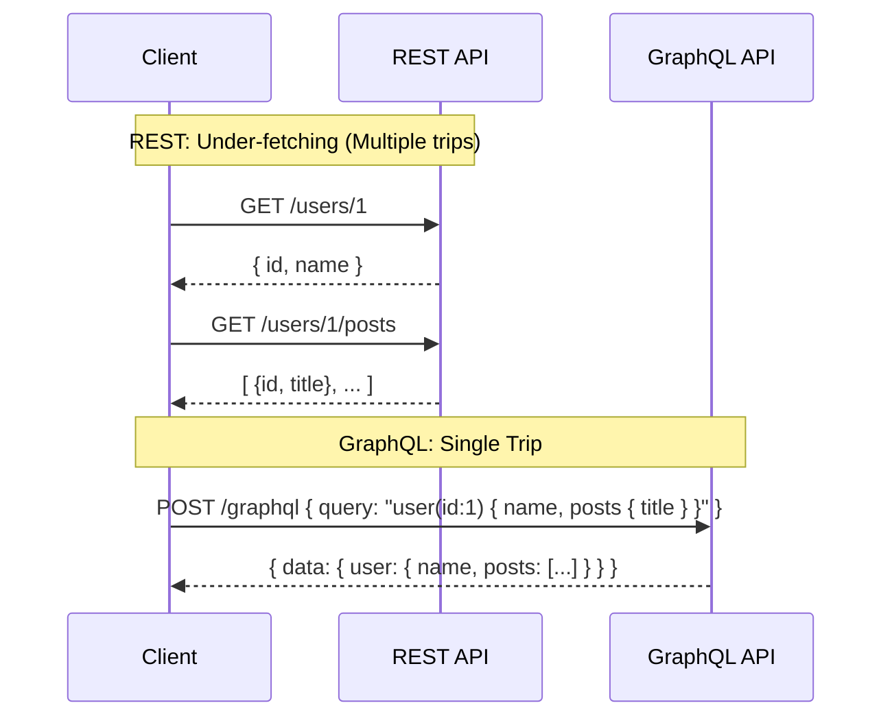

# REST vs GraphQL (Deep Dive)

**REST** (Representational State Transfer) এবং **GraphQL** (Graph Query Language)—দুটিই API ডিজাইন করার জনপ্রিয় উপায়। একজন Intermediate/Advanced ডেভেলপার হিসেবে শুধুমাত্র "REST resource-based আর GraphQL query-based"—এটুকু জানলেই হবে না। আপনাকে জানতে হবে এগুলোর ভেতরের trade-offs, performance issues (যেমন N+1 problem) এবং caching মেকানিজম।

---

## 1. Core Philosophy & Analogy

**REST (The Set Menu):**  
REST হলো রেস্টুরেন্টের "Set Menu"-এর মতো। আপনি যদি 'Burger Meal' অর্ডার করেন (যেমন: `GET /users/1`), আপনি বার্গার, ফ্রাইস এবং ড্রিংকস—সবই পাবেন। আপনার হয়তো ফ্রাইস দরকার ছিল না (Over-fetching), অথবা আপনার হয়তো এক্সট্রা সস দরকার ছিল যার জন্য আপনাকে আবার ওয়েটারকে ডাকতে হবে (Under-fetching)। 

**GraphQL (The Custom Buffet):**  
GraphQL হলো কাস্টম অর্ডারের মতো। আপনি ঠিক যা চাইবেন, ওয়েটার (API) ঠিক তা-ই এনে দিবে। আপনি বলতে পারেন, "আমার শুধু ইউজারের নাম এবং তার প্রথম ৩টা পোস্টের টাইটেল লাগবে।" সার্ভার ঠিক ততটুকুই রেসপন্স করবে।

---

## 2. The Biggest Problems GraphQL Solves

### A. Over-fetching
REST API-তে সাধারণত সার্ভার ঠিক করে দেয় রেসপন্সে কী কী ডেটা থাকবে। 
ধরা যাক, আমরা মোবাইল অ্যাপে শুধু ইউজারের নাম দেখাতে চাই। কিন্তু `GET /users/1` কল করলে সার্ভার নাম, ইমেইল, ঠিকানা, ফোন নাম্বার—সব পাঠিয়ে দেয়। এতে অযথা network bandwidth নষ্ট হয়, যা মোবাইলের জন্য ক্ষতিকর।
GraphQL-এ ক্লায়েন্ট বলে দেয় তার কী ডেটা লাগবে, তাই Over-fetching হয় না।

### B. Under-fetching (এবং N+1 Problem)
ধরা যাক, আমাদের ইউজারের ডিটেইলস এবং তার করা লাস্ট ৫টা পোস্ট দেখাতে হবে।
REST-এ সাধারণত:
1. `GET /users/1` (ইউজার ডেটা আনতে ১টা রিকোয়েস্ট)
2. `GET /users/1/posts` (পোস্ট আনতে আরেকটা রিকোয়েস্ট)
এভাবে মাল্টিপল রাউন্ড-ট্রিপ (Round-trip) করতে হয়। 

> ⚠️ **Interview/MCQ Angle:** N+1 Problem
> যখন লিস্টের প্রতিটা আইটেমের জন্য আলাদা আলাদা ডাটাবেজ/API কল করতে হয়, তখন তাকে N+1 problem বলে। REST-এ ক্লায়েন্ট থেকে সার্ভারে N+1 হতে পারে। GraphQL-এ ক্লায়েন্ট থেকে সার্ভারে ১টা রিকোয়েস্টেই কাজ হয়, কিন্তু সার্ভারের ভেতরে ডাটাবেজ লেভেলে N+1 problem হতে পারে (যা সলভ করতে `DataLoader` ব্যবহার করা হয়)।

---

## 3. Architecture & Flexibility

| Feature | REST | GraphQL |
| :--- | :--- | :--- |
| **Endpoints** | Multiple URLs (e.g., `/users`, `/posts`) | Single Endpoint (usually `/graphql`) |
| **Data Fetching** | Client requests URL, Server decides structure | Client requests specific structure |
| **HTTP Methods** | `GET`, `POST`, `PUT`, `DELETE` | Mostly `POST` (সব কোয়েরি/মিউটেশন POST দিয়ে যায়) |
| **Versioning** | `v1/users`, `v2/users` বানাতে হয় | Versionless (নতুন ফিল্ড যোগ করা যায়, পুরানো ফিল্ড deprecated করা যায়) |
| **Type System** | Strongly typed নয় (OpenAPI/Swagger দিয়ে করতে হয়) | Built-in Schema Definition Language (SDL) এবং Strongly Typed |

> ⚠️ **Interview/MCQ Angle:** GraphQL-এ HTTP Methods
> প্রায়ই জিজ্ঞেস করা হয়, "GraphQL দিয়ে ডেটা রিড করার সময় কোন HTTP method ইউজ হয়?" অনেকেই `GET` ভাবে, কিন্তু GraphQL সাধারণত সব রিকোয়েস্টের জন্যই (Query এবং Mutation) `POST` মেথড ব্যবহার করে, কারণ রিকোয়েস্ট বডিতে লম্বা কোয়েরি স্ট্রিং পাঠাতে হয়। (অবশ্য চাইলে GET দিয়েও করা যায়, কিন্তু স্ট্যান্ডার্ড হলো POST)।

---

## 4. Caching: REST's Biggest Advantage

Caching হলো এমন একটা জায়গা যেখানে REST সরাসরি GraphQL-কে হারিয়ে দেয়।

**REST Caching:**
REST HTTP-এর স্ট্যান্ডার্ড মেথড এবং URL ব্যবহার করে। তাই ব্রাউজার, CDN (যেমন Cloudflare), বা প্রক্সি সার্ভার সহজেই URL দেখে ডেটা ক্যাশ করতে পারে (e.g., `GET /users/123`). HTTP Headers (`ETag`, `Cache-Control`) খুব সুন্দরভাবে কাজ করে।

**GraphQL Caching:**
যেহেতু GraphQL-এর সব রিকোয়েস্ট একই URL (`POST /graphql`)-এ যায় এবং POST রিকোয়েস্ট বাই ডিফল্ট ক্যাশেবল না, তাই HTTP লেভেলের ক্যাশিং (CDN/Browser cache) কাজ করে না। 
GraphQL-এ ক্যাশিং করতে হলে ক্লায়েন্ট সাইডে (যেমন Apollo Client) অ্যাপ্লিকেশন লেভেলে ক্যাশিং করতে হয়, যা বেশ জটিল।

> ⚠️ **Interview/MCQ Angle:** Caching
> "Which API architecture utilizes HTTP caching out-of-the-box?" - উত্তর হবে REST. GraphQL-এ HTTP caching করা যায়বিধা হয় না, সেখানে Normalized In-Memory Cache (Apollo/Relay) ব্যবহার করতে হয়।

---

## 5. Security & Rate Limiting

**REST:** 
রেট লিমিটিং খুব সহজ। আপনি `GET /posts` এর উপর লিমিট বসাতে পারেন যে, এক মিনিটে ১০ বারের বেশি কল করা যাবে না।

**GraphQL:**
এখানে রেট লিমিটিং খুব কঠিন। একটিমাত্র `POST /graphql` রিকোয়েস্টের ভেতরে কেউ চাইলে ১০০টা নেস্টেড রিলেশন কল করে সার্ভার ডাউন করে দিতে পারে (e.g., User -> Posts -> Comments -> Author -> Posts ...)। একে **Denial of Service (DoS)** অ্যাটাক বলে।
**সমাধান:** GraphQL-এ "Query Depth Limiting" বা "Query Complexity Analysis" ইমপ্লিমেন্ট করতে হয়।

---

## 6. Quick Recap
- **REST** ভালো যখন আপনার অ্যাপ্লিকেশন সাধারণ, ক্যাশিং খুব গুরুত্বপূর্ণ, এবং আপনি স্ট্যান্ডার্ড HTTP কনভেনশন ফলো করতে চান।
- **GraphQL** ভালো যখন আপনার ক্লায়েন্ট অ্যাপ (যেমন মোবাইল অ্যাপ) অনেক ফ্লেক্সিবিলিটি চায়, ব্যান্ডউইথ বাঁচাতে চায় (No overfetching), এবং মাল্টিপল মাইক্রোসার্ভিস থেকে ডেটা একসাথে এগ্রিগেট করতে চায়।
